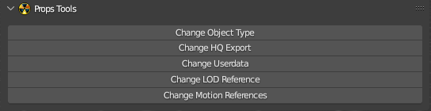

# Props Tools

___

## About

Allows quick editing of various model components

___

## Operators

- [Change Object Type](../addon-operators/operator-change-object-type.md)
- [Change HQ Export](../addon-operators/operator-change-hq-export.md)
- [Change Userdata](../addon-operators/operator-change-userdata.md)
- [Change LOD Reference](../addon-operators/operator-change-lod-reference.md)
- [Change Motions](../addon-operators/operator-change-motions.md)
- [Change Motion Reference](../addon-operators/operator-change-motion-references.md)

___

## Sources

[Blender X-Ray Addon Wiki on GitHub](https://github.com/PavelBlend/blender-xray/wiki/Panel-Props-Tools)
