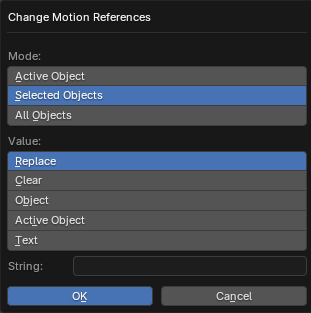

# Change Motion References Operator

___

## About

Modifies the items in the Motion Refs list from the X-Ray Engine: Object panel. To set multiple items in the list, you must use Text mode and specify a text data block in which each Motion Reference will be printed on a separate line.

### Mode

- `Active Object` - Active object
- `Selected Objects` - Selected objects
- `All Objects` - All objects from blend-file

### Value

- `Replace` - Replaces the parameter value with the text from the Value parameter below
- `Clear` - Deletes the parameter value
- `Object` - Sets the value of the parameter to the same as the object selected in the Object parameter below
- `Active Object` - sets the value of the parameter to the same as the active object. If this mode is selected, the name of the active object will be displayed below
- `Text` - sets the value of the parameter to the same as the content of the text data block, which is specified in the Text parameter below

### Object

Specifies the object from which to take the parameter value. Available in Object mode

### Text

Specifies the text block of data whose contents will be used as the value for the parameter. Available in Text mode

___

## Sources

[Blender X-Ray Addon Wiki on GitHub](https://github.com/PavelBlend/blender-xray/wiki/Panel-Props-Tools#change-motion-references)
