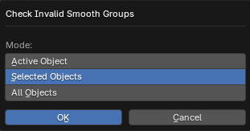

# Check Invalid Smooth Groups

___

## About

Checks if mesh objects have smoothing errors. If the object has smoothing errors, X-Ray SDK will print warning Invalid smooth group found in the log. These smoothing errors are not critical and compilation of the location will not cause errors. The operator checks the selected objects. If the object has no smoothing errors, it will be deselected. A smoothing error is when a split-normal has zero length. This can happen if the polygon area is zero, or if two smoothed and connected polygons have opposite normals, the sum of which gives zero. In edit mode, the problem vertices will be highlighted

### Mode

- `Active Object` - Active object
- `Selected Objects` - Selected objects
- `All Objects` - All objects from blend-file

___

## Sources

[Blender X-Ray Addon Wiki on GitHub](https://github.com/PavelBlend/blender-xray/wiki/Panel-Verify#check-invalid-smooth-groups)
