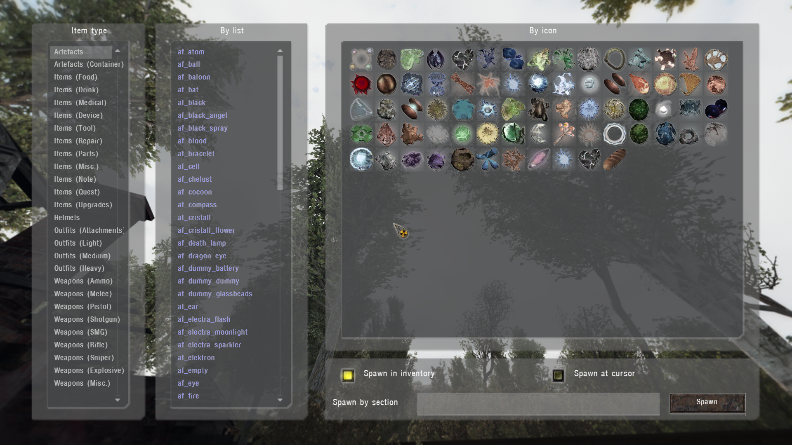

# Item Spawner

___

## About

In this spawner you can spawn all item sections for the player

In the left column, select the type of item

Further the item can be `selected in the list of sections` or `by clicking on the item icon`

Below there is a line with a choice of spawning: `in the inventory` or at the `place of the aiming cursor`

The item can also be spawned `by typing the name of the item's section` in the line

___

## Technical part

Items appear in the list because of the "`kind`" or `engine class` parameter in their [*.ltx](../../references/file-formats/conf-script/ltx.md) file. The spawner script can be found in the file "`ui_debug_main.script`"

| Name | Technical type (kind or Engine Class) name |
|---|---|
| Artifacts | i_arty i_arty_junk ARTEFACT SCRPTART |
| Artifacts (Container) | i_arty_cont |
| Items (Food) | i_mutant_cooked i_mutant_raw i_food II_FOOD S_FOOD |
| Items (Drink) | i_drink II_BOTTL |
| Items (Medical) | i_medical II_BANDG II_MEDKI II_ANTIR |
| Items (Device) | i_device DET_SIMP DET_ADVA DET_ELIT DET_SCIE |
| Items (Tools) | i_kit i_tool |
| Items (Repair) | i_repair |
| Items (Parts) | i_part |
| Items (Mics.) | i_mutant_part i_misc II_DOC EQ_PATCH II_ATTCH II_BTTCH D_FLALIT S_PDA D_PDA |
| Items (Note) | i_letter |
| Items (Quest) | i_quest |
| Items (Upgrades) | i_upgrade |
| Helmets | o_helmet E_HLMET EQU_HLMET |
| Outfits (Attachments) | i_mutant_belt i_attach i_backpack EQ_BAKPK |
| Outfits (Light) | o_light |
| Outfits (Medium) | E_STLK EQU_STLK o_medium o_sci |
| Outfits (Heavy) | o_heavy |
| Weapons (Ammo) | w_ammo AMMO AMMO_S S_OG7B S_VOG25 S_M209 |
| Weapons (Melee) | w_melee WP_KNIFE |
| Weapons (Pistol) | w_pistol WP_HPSA WP_PM WP_USP45 |
| Weapons (Shotgun) | w_shotgun WP_ASHTG WP_BM16 |
| Weapons (SMG) | w_smg |
| Weapons (Rifle) | w_rifle WP_AK74 WP_GROZA WP_LR300 WP_VAL |
| Weapons (Sniper) | w_sniper WP_SVD WP_SVU |
| Weapons (Explosive) | w_explosive WP_RG6 WP_RPG7 G_F1_S G_RGD5_S G_F1 G_RGD5 |
| Weapons (Misc.) | w_misc WP_SCOPE WP_SILEN WP_GLAUN S_WPN_MISC WP_BINOC II_BOLT |
