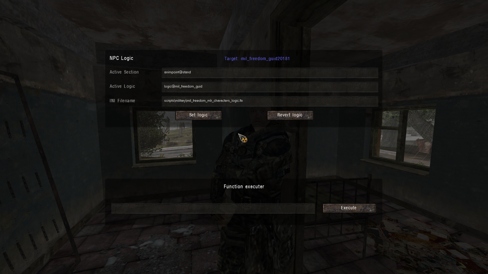

# NPC Logic/Execute

___

## About

Отладочный интерфейс для взаимодействия с логикой NPC

### NPC Logic

|  |  |
|---|---|
| Active Section | Активная секция конфигурации |
| Active Logic | Активная логическая схема |
| INI Filename | Файл конфигурации |
| Set logic | Применяет новую логику и схему к NPC |
| Revert logic | Восстанавливает оригинальную логику |

### Function executer

Содержит текстовое поле для ввода произвольного Lua-кода.

|  |  |
|---|---|
| Execute | Выполняет введенный код |

___

## Technical part

Script can be found in the file "`ui_debug_launcher.script`"
