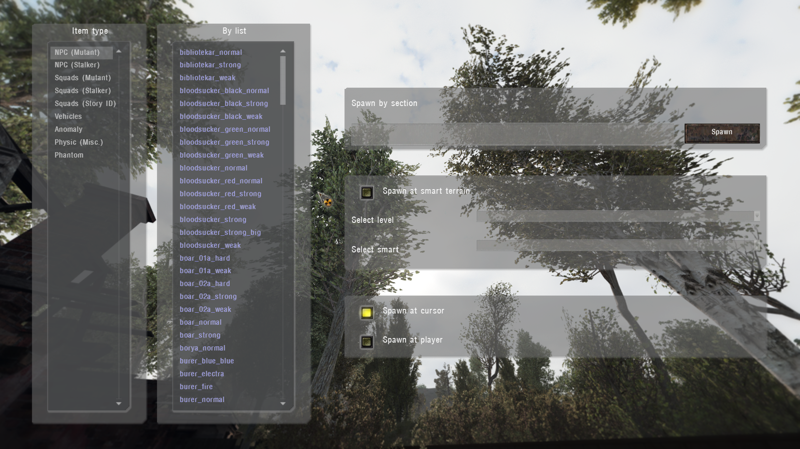

# Object Spawner

___

## About

Spawns sections of physical objects or living creatures

Similar to [Item Spawner](item-spawner.md) but has its own tools

- `Spawn at smart terrain` - allows you to spawn a selected section at a certain level and [smart terrain](../../glossary/glossary.html#smart-terrain)
- `Spawn at cursor` - the same as in [Item Spawner](item-spawner.md)
- `Spawn at player` - spawns the selected section directly on the player's coordinates

___

## Technical part

Sections appear in the list because of the specified `engine class` in their [*.ltx](../../references/file-formats/conf-script/ltx.md) file. The spawner script can be found in the file "`ui_debug_main.script`"

| Name | Engine Class |
|---|---|
| NPC (Mutant) | SM_KAR SM_BLOOD SM_BOARW SM_BURER SM_CAT_S SM_CHIMS SM_CONTR SM_DOG_S SM_FLESH SM_IZLOM SM_GIANT SM_POLTR SM_P_DOG SM_DOG_P SM_DOG_F SM_SNORK SM_TUSHK SM_ZOMBI SM_RAT SM_KARLIK SM_LURKER SM_PSYSUCKER |
| NPC (Stalker) | AI_STL_S AI_TRD_S |
| Squads (Mutant) | ON_OFF_S |
| Squads (Stalker) | ON_OFF_S |
| Squads (Story ID) | ON_OFF_S |
| Vehicles | C_HLCP_S C_NIVA SCRPTCAR |
| Anomaly | ZS_MBALD ZS_GALAN ZS_MINCE ZS_RADIO ZS_TORRD ZS_NGRAV Z_MBALD Z_RADIO Z_CFIRE Z_NOGRAV Z_TORRID Z_RUSTYH ZS_BFUZZ ZS_AMEBA |
| Physic (Misc.) | O_PHYSIC O_DSTRBL O_PHYS_S O_DSTR_S S_INVBOX O_INVBOX S_EXPLO II_EXPLO |
| Phantom | AI_PHANT |
