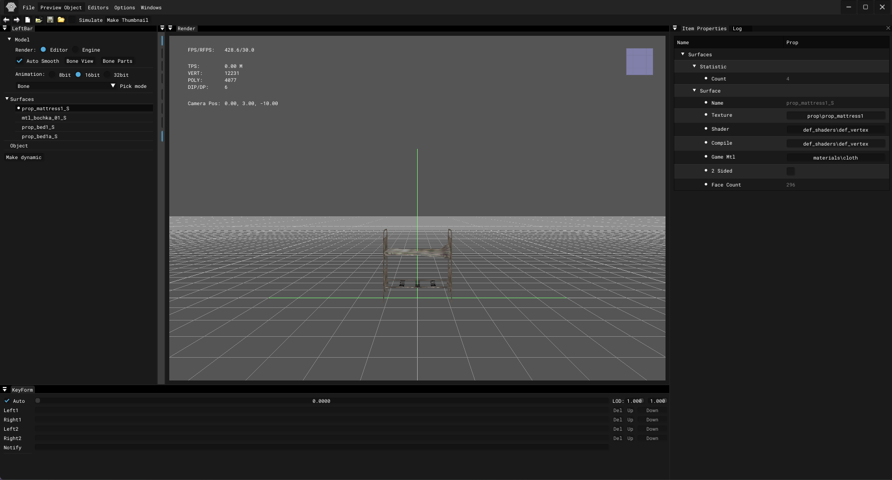

# Actor Editor

___

## About

The Actor editor is usually needed to customize objects (NPCs, Objects, etc.)

## Interface

import Tabs from '@theme/Tabs';
import TabItem from '@theme/TabItem';

<Tabs>
  <TabItem value="file" label="File" default>
    <table><thead>
      <tr>
        <th>Button</th>
        <th>Description</th>
        <th>Note</th>
      </tr></thead>
    <tbody>
      <tr>
        <td>Clear</td>
        <td>Clear scene</td>
        <td>-</td>
      </tr>
      <tr>
        <td>Load</td>
        <td>Load an object into a new scene</td>
        <td>-</td>
      </tr>
      <tr>
        <td>Save</td>
        <td>Save object</td>
        <td>-</td>
      </tr>
      <tr>
        <td>Save as...</td>
        <td>Save the object as</td>
        <td>*.object  *.lwo</td>
      </tr>
      <tr>
        <td>Open Recent</td>
        <td>Open recent</td>
        <td>-</td>
      </tr>
      <tr>
        <td>Import...</td>
        <td>Imports the model into the scene</td>
        <td>-</td>
      </tr>
      <tr>
        <td>Optimize Motions</td>
        <td>Goes through all the bones in the animation and optimizes their animation channels (e.g., position, rotation, scale) by removing&nbsp;&nbsp;& nbsp;&nbsp;redundant keyframes</td>
        <td>-</td>
      </tr>
      <tr>
        <td>Batch Convert...</td>
        <td>Batch file converting [Not Working]</td>
        <td>-</td>
      </tr>
      <tr>
        <td>Export</td>
        <td>Export the model to formats</td>
        <td>*.ogf *.omf *.obj *.dm C++</td>
      </tr>
      <tr>
        <td>Quit</td>
        <td>Exiting the program</td>
        <td>-</td>
      </tr>
    </tbody></table>
  </TabItem>
  <TabItem value="previewobject" label="Preview Object">
    This is an orange 🍊
  </TabItem>
  <TabItem value="editor" label="Editor">
    This is a banana 🍌
  </TabItem>
  <TabItem value="options" label="Options">
    This is a banana 🍌
  </TabItem>
  <TabItem value="windows" label="Windows">
    This is a banana 🍌
  </TabItem>
</Tabs>

### Top Bar

| Icon | Name | Description |
|:---:|---|---|
|  | Undo | Undo the last action |
|  | Redo | Repeat the last action |
|  | New | Clear/New Scene |
|  | Open | Open file |
|  | Save | Save file |
|  | Open Gamedata | Open "gamedata" folder |
|  | Simulate | Activates physics simulation |
|  | Make Thumbnail | Make thumbnail |
