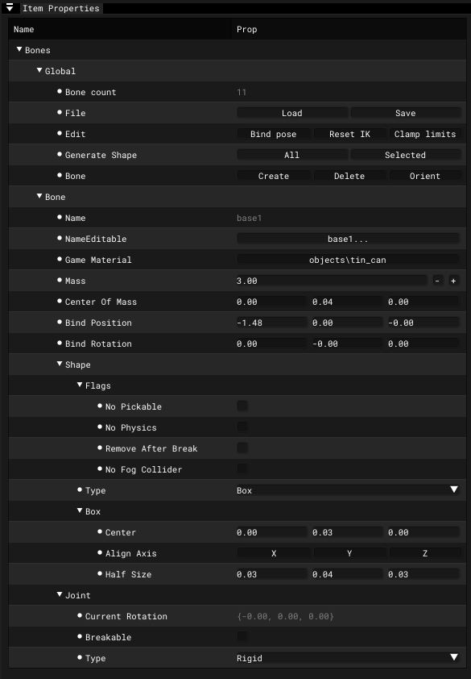

# Item Properties

___

## About

import Tabs from '@theme/Tabs';
import TabItem from '@theme/TabItem';

<Tabs>
  <TabItem value="bones" label="Bones" default>
  <table>
      <thead>
        <tr>
          <th>Group</th>
          <th />
          <th>Description</th>
          <th>Extra</th>
          <th>Description</th>
          <th>Extra</th>
          <th>Description</th>
        </tr>
      </thead>
      <tbody>
        <tr>
          <td rowSpan={11}>Global</td>
          <td>Bone Count</td>
          <td>Bone count</td>
          <td>-</td>
          <td>-</td>
          <td>-</td>
          <td>-</td>
        </tr>
        <tr>
          <td rowSpan={2}>File</td>
          <td rowSpan={2} />
          <td>Load</td>
          <td>Load file</td>
          <td>-</td>
          <td>-</td>
        </tr>
        <tr>
          <td>Save</td>
          <td>Save file</td>
          <td>-</td>
          <td>-</td>
        </tr>
        <tr>
          <td rowSpan={3}>Edit</td>
          <td rowSpan={3} />
          <td>Bind Pose</td>
          <td>Resets the transformations of all bones</td>
          <td>-</td>
          <td>-</td>
        </tr>
        <tr>
          <td>Reset IK</td>
          <td>
            Resets additional bone parameters to default values (IK parameters, bone
            game material, bone shape, mass and center of mass)
          </td>
          <td>-</td>
          <td>-</td>
        </tr>
        <tr>
          <td>Clamp Limits</td>
          <td />
          <td>-</td>
          <td>-</td>
        </tr>
        <tr>
          <td rowSpan={2}>Generate Shape</td>
          <td rowSpan={2}>
            Generates collisional shapes for skeletal bones based on mesh vertices
          </td>
          <td>All</td>
          <td>Generate collision shapes for all bones</td>
          <td>-</td>
          <td>-</td>
        </tr>
        <tr>
          <td>Selected</td>
          <td>Generate collision shapes for selected bones</td>
          <td>-</td>
          <td>-</td>
        </tr>
        <tr>
          <td rowSpan={3}>Bone</td>
          <td rowSpan={3} />
          <td>Create</td>
          <td>Create new bone</td>
          <td>-</td>
          <td>-</td>
        </tr>
        <tr>
          <td>Delete</td>
          <td>Delete selected bone</td>
          <td>-</td>
          <td>-</td>
        </tr>
        <tr>
          <td>Orient</td>
          <td />
          <td>-</td>
          <td>-</td>
        </tr>
        <tr>
          <td rowSpan={33}>Bone</td>
          <td>Name</td>
          <td>Bone name</td>
          <td>-</td>
          <td>-</td>
          <td>-</td>
          <td>-</td>
        </tr>
        <tr>
          <td>NameEditable</td>
          <td>Editable bone name</td>
          <td>-</td>
          <td>-</td>
          <td>-</td>
          <td>-</td>
        </tr>
        <tr>
          <td>Game Material</td>
          <td>Game material</td>
          <td>-</td>
          <td>-</td>
          <td>-</td>
          <td>-</td>
        </tr>
        <tr>
          <td>Mass</td>
          <td>Bone mass</td>
          <td>-</td>
          <td>-</td>
          <td>-</td>
          <td>-</td>
        </tr>
        <tr>
          <td>Center Of Mass</td>
          <td>Bone center of mass</td>
          <td>-</td>
          <td>-</td>
          <td>-</td>
          <td>-</td>
        </tr>
        <tr>
          <td>Bind Position</td>
          <td>Bone bind position</td>
          <td>-</td>
          <td>-</td>
          <td>-</td>
          <td>-</td>
        </tr>
        <tr>
          <td>Bind Rotation</td>
          <td>Bone bind rotation</td>
          <td>-</td>
          <td>-</td>
          <td>-</td>
          <td>-</td>
        </tr>
        <tr>
          <td rowSpan={7}>Shape</td>
          <td rowSpan={7} />
          <td rowSpan={4}>Flags</td>
          <td rowSpan={4} />
          <td>No Pickable</td>
          <td>Excludes a bone from collision handling</td>
        </tr>
        <tr>
          <td>No Physics</td>
          <td>Excludes physics processing for bone</td>
        </tr>
        <tr>
          <td>Remove After Break</td>
          <td>Allows removal of bone after an object has been destroyed</td>
        </tr>
        <tr>
          <td>No Fog Collider</td>
          <td>Bone won't interact with a voluminous smoke</td>
        </tr>
        <tr>
          <td rowSpan={3}>Type</td>
          <td rowSpan={3} />
          <td>Box</td>
          <td />
        </tr>
        <tr>
          <td>Sphere</td>
          <td />
        </tr>
        <tr>
          <td>Cylinder</td>
          <td />
        </tr>
        <tr>
          <td rowSpan={19}>Joint</td>
          <td rowSpan={19} />
          <td>Current Rotation</td>
          <td>Bone current rotation</td>
          <td>-</td>
          <td>-</td>
        </tr>
        <tr>
          <td>Breakable</td>
          <td>Allows bone to be breakable</td>
          <td>-</td>
          <td>-</td>
        </tr>
        <tr>
          <td>Break Force</td>
          <td>Threshold breaking force</td>
          <td>-</td>
          <td>-</td>
        </tr>
        <tr>
          <td>Break Torque</td>
          <td>Threshold fracture torque</td>
          <td>-</td>
          <td>-</td>
        </tr>
        <tr>
          <td rowSpan={5}>Type</td>
          <td rowSpan={5}>Joint type</td>
          <td>Rigid</td>
          <td>
            <a href="../../../../glossary/glossary.html#rigid-joint">Rigid Joint</a>
          </td>
        </tr>
        <tr>
          <td>Cloth</td>
          <td>
            <a href="../../../../glossary/glossary.html#cloth-joint">Cloth Joint</a>
          </td>
        </tr>
        <tr>
          <td>Joint</td>
          <td>
            <a href="../../../../glossary/glossary.html#joint">Universal Joint</a>
          </td>
        </tr>
        <tr>
          <td>Wheel [Steer-X/Roll-Z]</td>
          <td>
            <a href="../../../../glossary/glossary.html#wheel-joint">Wheel Joint</a>
          </td>
        </tr>
        <tr>
          <td>Slider</td>
          <td>
            <a href="../../../../glossary/glossary.html#slider-joint">
              Slider Joint
            </a>
          </td>
        </tr>
        <tr>
          <td>Friction</td>
          <td>Friction</td>
          <td>-</td>
          <td>-</td>
        </tr>
        <tr>
          <td>Spring Factor</td>
          <td>Spring Factor</td>
          <td>-</td>
          <td>-</td>
        </tr>
        <tr>
          <td>Damping Factor</td>
          <td>Damping Factor</td>
          <td>-</td>
          <td>-</td>
        </tr>
        <tr>
          <td rowSpan={3}>Limits</td>
          <td rowSpan={3} />
          <td>Axis X</td>
          <td />
        </tr>
        <tr>
          <td>Axis Y</td>
          <td />
        </tr>
        <tr>
          <td>Axis Z</td>
          <td />
        </tr>
        <tr>
          <td rowSpan={2}>Steer</td>
          <td rowSpan={2} />
          <td>Limits Min</td>
          <td />
        </tr>
        <tr>
          <td>Limits Max</td>
          <td />
        </tr>
        <tr>
          <td>Slide (Axis Z)</td>
          <td />
          <td>-</td>
          <td>-</td>
        </tr>
        <tr>
          <td>Rotate (Axis Z)</td>
          <td />
          <td>-</td>
          <td>-</td>
        </tr>
      </tbody>
    </table>
  </TabItem>
  <TabItem value="motions" label="Motions">
    <table>
      <thead>
        <tr>
          <th>Group</th>
          <th />
          <th>Description</th>
          <th>Extra</th>
          <th>Extra Description</th>
        </tr>
      </thead>
      <tbody>
        <tr>
          <td rowSpan={7}>Global</td>
          <td>Motion Count</td>
          <td>Motion count</td>
          <td>-</td>
          <td>-</td>
        </tr>
        <tr>
          <td>Motion Reference</td>
          <td>Adds Motion Reference</td>
          <td>-</td>
          <td>-</td>
        </tr>
        <tr>
          <td rowSpan={3}>Edit</td>
          <td rowSpan={3} />
          <td>Add</td>
          <td>Adds selected animations to the list</td>
        </tr>
        <tr>
          <td>Del</td>
          <td>Deletes the selected animation</td>
        </tr>
        <tr>
          <td>Save</td>
          <td>Saves all or only selected animations to a *.skl file</td>
        </tr>
        <tr>
          <td rowSpan={2}>Export Import</td>
          <td rowSpan={2} />
          <td>Export</td>
          <td>Export Motion Reference</td>
        </tr>
        <tr>
          <td>Import</td>
          <td>Import Motion Reference</td>
        </tr>
        <tr>
          <td rowSpan={23}>Motion</td>
          <td rowSpan={3}>Control</td>
          <td rowSpan={3}>Animations control</td>
          <td>Play</td>
          <td>Play</td>
        </tr>
        <tr>
          <td>Stop</td>
          <td>Stop</td>
        </tr>
        <tr>
          <td>Pause</td>
          <td>Pause</td>
        </tr>
        <tr>
          <td rowSpan={3}>Frame</td>
          <td rowSpan={3} />
          <td>Start</td>
          <td>Start frame</td>
        </tr>
        <tr>
          <td>Stop</td>
          <td>Stop frame</td>
        </tr>
        <tr>
          <td>Length</td>
          <td>Animation frame length</td>
        </tr>
        <tr>
          <td>Name</td>
          <td>Animation name</td>
          <td>-</td>
          <td>-</td>
        </tr>
        <tr>
          <td>Speed</td>
          <td>Animation speed</td>
          <td>-</td>
          <td>-</td>
        </tr>
        <tr>
          <td>Accrue</td>
          <td>The speed at which the animation fades in (or blends in)</td>
          <td>-</td>
          <td>-</td>
        </tr>
        <tr>
          <td>Falloff</td>
          <td>The speed at which the animation fades out (or blends out)</td>
          <td>-</td>
          <td>-</td>
        </tr>
        <tr>
          <td>Type FX</td>
          <td />
          <td>-</td>
          <td>-</td>
        </tr>
        <tr>
          <td rowSpan={8}>Cycle</td>
          <td rowSpan={8} />
          <td>Bone Part</td>
          <td>Part of the bones assigned to the animation</td>
        </tr>
        <tr>
          <td>Stop At End</td>
          <td>Animation will stop at end</td>
        </tr>
        <tr>
          <td>No Mix</td>
          <td>Animations will not mix</td>
        </tr>
        <tr>
          <td>Sync Part</td>
          <td>
            Flag indicates that the animation should be synchronized with another
            animation
          </td>
        </tr>
        <tr>
          <td>UseFootSteps</td>
          <td>
            Flag that helps the engine distinguish step animations from idle
            animations in order to properly apply inverse kinematics and manage
            transitions between states
          </td>
        </tr>
        <tr>
          <td>Move XForm</td>
          <td>Root motion flag?</td>
        </tr>
        <tr>
          <td>Idle</td>
          <td>
            Flag that helps the engine distinguish idle animations from moving
            (stepping) animations, in order to properly apply inverse kinematics and
            manage transitions between states
          </td>
        </tr>
        <tr>
          <td>UseWeaponBone</td>
          <td />
        </tr>
        <tr>
          <td rowSpan={2}>FX</td>
          <td rowSpan={2} />
          <td>Start Bone</td>
          <td>Type FX start bone</td>
        </tr>
        <tr>
          <td>Power</td>
          <td>Maximum animation intensity</td>
        </tr>
        <tr>
          <td>RootStartTransform</td>
          <td />
          <td>-</td>
          <td>-</td>
        </tr>
        <tr>
          <td>RootEndTransform</td>
          <td />
          <td>-</td>
          <td>-</td>
        </tr>
        <tr>
          <td rowSpan={4}>Marks</td>
          <td rowSpan={2}>Control-12</td>
          <td rowSpan={2} />
          <td>Add</td>
          <td>Add Left1 and Right1 Motion Marks</td>
        </tr>
        <tr>
          <td>Remove</td>
          <td>Remove Left1 and Right1 Motion Marks</td>
        </tr>
        <tr>
          <td rowSpan={2}>Control-34</td>
          <td rowSpan={2} />
          <td>Add</td>
          <td>Add Left1, Right1, Left2 and Right2 Motion Marks</td>
        </tr>
        <tr>
          <td>Remove</td>
          <td>Remove Left1, Right1, Left2 and Right2 Motion Marks</td>
        </tr>
      </tbody>
    </table>
  </TabItem>
  <TabItem value="object" label="Object">
    <table>
      <thead>
        <tr>
          <th />
          <th>Description</th>
          <th>Extra</th>
          <th>Extra Description</th>
          <th>Extra</th>
          <th>Extra Description</th>
        </tr>
      </thead>
      <tbody>
        <tr>
          <td rowSpan={5}>Object Type</td>
          <td rowSpan={5} />
          <td>Static</td>
          <td />
          <td>-</td>
          <td>-</td>
        </tr>
        <tr>
          <td>Dynamic</td>
          <td />
          <td>-</td>
          <td>-</td>
        </tr>
        <tr>
          <td>HOM</td>
          <td />
          <td>-</td>
          <td>-</td>
        </tr>
        <tr>
          <td>Multiply Usage</td>
          <td />
          <td>-</td>
          <td>-</td>
        </tr>
        <tr>
          <td>Sound Occluder</td>
          <td />
          <td>-</td>
          <td>-</td>
        </tr>
        <tr>
          <td rowSpan={4}>Flags</td>
          <td rowSpan={4} />
          <td>Make Progressive</td>
          <td>Only for Dynamic Object Type</td>
          <td>-</td>
          <td>-</td>
        </tr>
        <tr>
          <td>Disable Mesh Optimization</td>
          <td>
            If not disabled, it optimizes the mesh by removing unnecessary edges and
            vertices, reallocating memory and updating linked data structures. Only
            for Dynamic Object Type
          </td>
          <td>-</td>
          <td>-</td>
        </tr>
        <tr>
          <td>HQ Geometry</td>
          <td>Only for Dynamic Object Type</td>
          <td>-</td>
          <td>-</td>
        </tr>
        <tr>
          <td>Using LOD</td>
          <td>Only for Multiply Usage Object Type</td>
          <td>-</td>
          <td>-</td>
        </tr>
        <tr>
          <td rowSpan={5}>Transform</td>
          <td rowSpan={5} />
          <td>Position</td>
          <td>Object position</td>
          <td>-</td>
          <td>-</td>
        </tr>
        <tr>
          <td>Rotation</td>
          <td>Object rotation</td>
          <td>-</td>
          <td>-</td>
        </tr>
        <tr>
          <td>Scale</td>
          <td>Object scale</td>
          <td>-</td>
          <td>-</td>
        </tr>
        <tr>
          <td>BBox Min</td>
          <td>Object Bounding Box Min</td>
          <td>-</td>
          <td>-</td>
        </tr>
        <tr>
          <td>BBox Max</td>
          <td>
            Object{" "}
            <a href="https://en.wikipedia.org/wiki/Minimum_bounding_box">
              Bounding Box
            </a>{" "}
            Max
          </td>
          <td>-</td>
          <td>-</td>
        </tr>
        <tr>
          <td rowSpan={3}>LOD</td>
          <td rowSpan={3} />
          <td>Reference</td>
          <td>LOD reference</td>
          <td>-</td>
          <td>-</td>
        </tr>
        <tr>
          <td rowSpan={2}>Action</td>
          <td rowSpan={2}>Only for Multiply Usage Object Type</td>
          <td>Make HQ</td>
          <td />
        </tr>
        <tr>
          <td>Make LQ</td>
          <td />
        </tr>
        <tr>
          <td rowSpan={3}>Summary</td>
          <td rowSpan={3} />
          <td rowSpan={2}>Geometry</td>
          <td rowSpan={2} />
          <td>Object</td>
          <td>Objects vertex and face count</td>
        </tr>
        <tr>
          <td>Meshes</td>
          <td>Meshes vertex and face count</td>
        </tr>
        <tr>
          <td>Game Options</td>
          <td />
          <td>User Data</td>
          <td>User data</td>
        </tr>
      </tbody>
    </table>
  </TabItem>
  <TabItem value="surfaces" label="Surfaces">
    <table>
      <thead>
        <tr>
          <th>Button</th>
          <th>Description</th>
        </tr>
      </thead>
      <tbody>
        <tr>
          <td>Name</td>
          <td>Surface Name</td>
        </tr>
        <tr>
          <td>Texture</td>
          <td>Texture</td>
        </tr>
        <tr>
          <td>Shader</td>
          <td>Engine Shader</td>
        </tr>
        <tr>
          <td>Compile</td>
          <td>Compile Shader</td>
        </tr>
        <tr>
          <td>Game Mtl</td>
          <td>Game Material</td>
        </tr>
        <tr>
          <td>2 Sided</td>
          <td>
            Copies and inverts polygons so that the back side of the face is also
            visible when rendered
          </td>
        </tr>
        <tr>
          <td>Face Count</td>
          <td>Face Count</td>
        </tr>
      </tbody>
    </table>
  </TabItem>
</Tabs>
