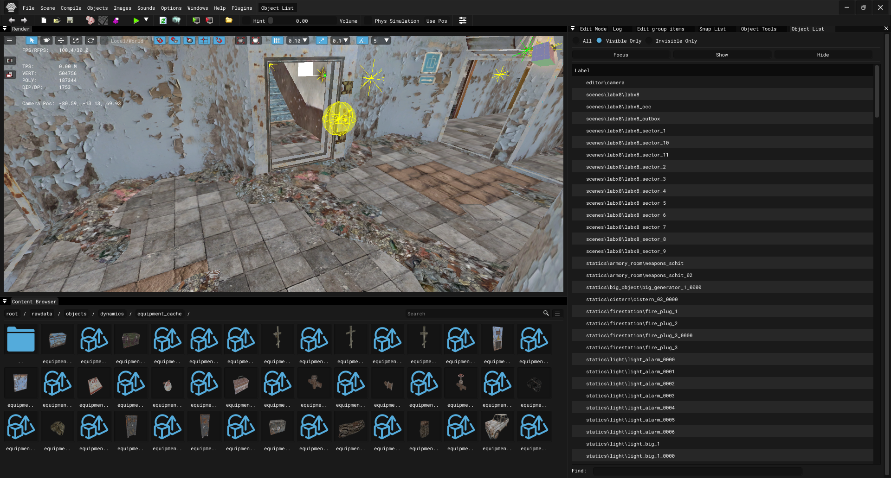

# Level Editor

___

## About

Level Editor is used to create locations

___

## Interface

### Top Bar

| Icon | Name | Description |
|:---:|---|---|
|  | Undo | Undo the last action |
|  | Redo | Repeat the last action |
|  | New Scene | Clear/New Scene |
|  | Open Level | Open Level |
|  | Save Level | Save Level |
|  | Build CFORM | Build CFORM |
|  | Build AI-Map | Build AI-Map |
|  | Build Game Graph | Build Game Graph |
|  | Start Play in Editor | Start Play in Editor |
|  |  | Play in Editor Settings |
|  |  | Reload Configs |
|  |  | Build and Make |
|  |  | Play Level |
|  |  | Play Level in Game |
|  |  | Open 'gamedata' folder |
|  | Hint |  |
|  | Volume |  |
|  | Phys Simulation | Activates the physics simulation of the selected object(s) |
|  | Use Pos | Use the position of the selected object when physics simulation is active. The position of the object will be applied when simulating physics |
|  | Preference | Preference |
