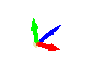
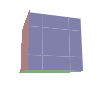

# Level Editor

___

## About

Level Editor is used to create locations

___

## Interface

import Tabs from '@theme/Tabs';
import TabItem from '@theme/TabItem';

<Tabs>
  <TabItem value="file" label="File" default>
    <table>
      <thead>
        <tr>
          <th>Button</th>
          <th>Description</th>
          <th>Note</th>
        </tr>
      </thead>
      <tbody>
        <tr>
          <td>Clear</td>
          <td>Clear scene</td>
          <td />
        </tr>
        <tr>
          <td>Load</td>
          <td>Load an object into a new scene</td>
          <td />
        </tr>
        <tr>
          <td>Save</td>
          <td>Save object</td>
          <td />
        </tr>
        <tr>
          <td>Save as...</td>
          <td>Save the object as</td>
          <td>
            *.object  
            *.lwo
          </td>
        </tr>
        <tr>
          <td>Open Recent</td>
          <td>Open recent</td>
          <td />
        </tr>
        <tr>
          <td>Import...</td>
          <td>Imports the model into the scene</td>
          <td />
        </tr>
        <tr>
          <td>Optimize Motions</td>
          <td>
            Goes through all the bones in the animation and optimizes their animation channels (e.g., position, rotation, scale) by removing redundant keyframes
          </td>
          <td />
        </tr>
        <tr>
          <td>Batch Convert...</td>
          <td />
          <td />
        </tr>
        <tr>
          <td>Export</td>
          <td>Export the model to formats</td>
          <td>
            *.ogf
             
            *.omf
             
            *.obj
             
            *.dm
             
            C++
          </td>
        </tr>
        <tr>
          <td>Quit</td>
          <td>Exiting the program</td>
          <td />
        </tr>
      </tbody>
    </table>
  </TabItem>
  <TabItem value="scene" label="Scene">
    <table>
      <thead>
        <tr>
          <th>Button</th>
          <th>Description</th>
          <th>Note</th>
        </tr>
      </thead>
      <tbody>
        <tr>
          <td>World Properties</td>
          <td />
          <td />
        </tr>
        <tr>
          <td>Export as archive</td>
          <td />
          <td />
        </tr>
        <tr>
          <td>Validate</td>
          <td>Checks the level for errors</td>
          <td />
        </tr>
        <tr>
          <td>Summary info</td>
          <td>Shows information about objects in the scene</td>
          <td />
        </tr>
        <tr>
          <td>Highlight Texture</td>
          <td>Highlights the selected texture</td>
          <td />
        </tr>
        <tr>
          <td>Clear Debug Draw</td>
          <td />
          <td />
        </tr>
        <tr>
          <td>Export entire Scene as Obj</td>
          <td />
          <td>
            *.object
             
            *.lwo
             
            *.txt
             
            *.xr
             
            *.wav
             
            *.obj
             
            *.ltx
             
            *.cpp
          </td>
        </tr>
        <tr>
          <td>Export selection as Obj</td>
          <td />
          <td>
            *.object
             
            *.lwo
             
            *.txt
             
            *.xr
             
            *.wav
             
            *.obj
             
            *.ltx
             
            *.cpp
          </td>
        </tr>
      </tbody>
    </table>
  </TabItem>
  <TabItem value="compile" label="Compile">
    <table>
      <thead>
        <tr>
          <th />
          <th>Description</th>
          <th>Extra</th>
          <th>Extra Description</th>
          <th>Extra</th>
          <th>Extra Description</th>
        </tr>
      </thead>
      <tbody>
        <tr>
          <td rowSpan={7}>Make</td>
          <td rowSpan={7} />
          <td>Make All</td>
          <td>
            Creates a [*.prj](../../../references/file-formats/game-levels/prj.md) precompilation file
          </td>
          <td>-</td>
          <td>-</td>
        </tr>
        <tr>
          <td>Make Game</td>
          <td />
          <td>-</td>
          <td>-</td>
        </tr>
        <tr>
          <td>Make Puddles</td>
          <td />
          <td>-</td>
          <td>-</td>
        </tr>
        <tr>
          <td>Make Details</td>
          <td>
            Creates a [*.details](../../../references/file-formats/game-levels/details.md) file
          </td>
          <td>-</td>
          <td>-</td>
        </tr>
        <tr>
          <td>Make HOM</td>
          <td>
            Creates a [*.hom](../../../references/file-formats/game-levels/hom.md)
            file
          </td>
          <td>-</td>
          <td>-</td>
        </tr>
        <tr>
          <td>Make SOM</td>
          <td>
            Creates a [*.som](../../../references/file-formats/game-levels/som.md)
            file
          </td>
          <td>-</td>
          <td>-</td>
        </tr>
        <tr>
          <td>Make AI-Map</td>
          <td>
            Creates a [*.ai](../../../references/file-formats/game-levels/ai.md) file
          </td>
          <td>-</td>
          <td>-</td>
        </tr>
        <tr>
          <td rowSpan={7}>Compile</td>
          <td rowSpan={7} />
          <td>Geometry &amp; Light</td>
          <td />
          <td>-</td>
          <td>-</td>
        </tr>
        <tr>
          <td>Detail Object Light</td>
          <td />
          <td>-</td>
          <td>-</td>
        </tr>
        <tr>
          <td rowSpan={3}>AI-Map</td>
          <td rowSpan={3} />
          <td>High</td>
          <td />
        </tr>
        <tr>
          <td>Low</td>
          <td />
        </tr>
        <tr>
          <td>Verify</td>
          <td />
        </tr>
        <tr>
          <td rowSpan={2}>Spawn</td>
          <td rowSpan={2} />
          <td>Only Current Level</td>
          <td />
        </tr>
        <tr>
          <td>All Levels</td>
          <td />
        </tr>
        <tr>
          <td>Import Error List</td>
          <td>Import Error List</td>
          <td>-</td>
          <td>-</td>
          <td>-</td>
          <td>-</td>
        </tr>
        <tr>
          <td>Import xrAI Error List</td>
          <td />
          <td>-</td>
          <td>-</td>
          <td>-</td>
          <td>-</td>
        </tr>
        <tr>
          <td>Export Error List</td>
          <td>Export Error List</td>
          <td>-</td>
          <td>-</td>
          <td>-</td>
          <td>-</td>
        </tr>
        <tr>
          <td>Clear Error List</td>
          <td>Clear Error List</td>
          <td>-</td>
          <td>-</td>
          <td>-</td>
          <td>-</td>
        </tr>
      </tbody>
    </table>
  </TabItem>
  <TabItem value="objects" label="Objects">
    <table>
      <thead>
        <tr>
          <th>Button</th>
          <th>Description</th>
        </tr>
      </thead>
      <tbody>
        <tr>
          <td>Library Editor</td>
          <td />
        </tr>
        <tr>
          <td>Multi Rename</td>
          <td />
        </tr>
        <tr>
          <td>Multi Replace</td>
          <td />
        </tr>
        <tr>
          <td>Reload</td>
          <td>Reload Objects</td>
        </tr>
      </tbody>
    </table>
  </TabItem>
  <TabItem value="images" label="Images">
    <table>
      <thead>
        <tr>
          <th>Button</th>
          <th>Description</th>
        </tr>
      </thead>
      <tbody>
        <tr>
          <td>Image Editor</td>
          <td>Open Image Editor</td>
        </tr>
        <tr>
          <td>Reload Textures</td>
          <td>Reload Textures</td>
        </tr>
        <tr>
          <td>Synchronize Textures</td>
          <td>Updates and synchronizes textures and their previews</td>
        </tr>
        <tr>
          <td>Check New Textures</td>
          <td>Check New Textures</td>
        </tr>
        <tr>
          <td>Edit minimap</td>
          <td />
        </tr>
        <tr>
          <td>SyncTHM</td>
          <td />
        </tr>
      </tbody>
    </table>
  </TabItem>
  <TabItem value="sounds" label="Sounds">
    <table>
      <thead>
        <tr>
          <th>Button</th>
          <th>Description</th>
        </tr>
      </thead>
      <tbody>
        <tr>
          <td>Sound Editor</td>
          <td>Open Sound Editor</td>
        </tr>
        <tr>
          <td>Synchronize Sounds (Soft)</td>
          <td />
        </tr>
        <tr>
          <td>Synchronize Sounds (Hard)</td>
          <td />
        </tr>
        <tr>
          <td>Refresh Environment Library</td>
          <td />
        </tr>
        <tr>
          <td>Refresh Environment Geometry</td>
          <td />
        </tr>
      </tbody>
    </table>
  </TabItem>
  <TabItem value="options" label="Options">
    <table>
      <thead>
        <tr>
          <th>Options</th>
          <th>1</th>
          <th>Description</th>
          <th>1</th>
          <th>Description</th>
        </tr>
      </thead>
      <tbody>
        <tr>
          <td rowSpan={10}>Render</td>
          <td>Quality</td>
          <td />
          <td>-</td>
          <td>-</td>
        </tr>
        <tr>
          <td rowSpan={3}>Fill Mode</td>
          <td rowSpan={3}>Fill Mode</td>
          <td>Point</td>
          <td>Vertex point fill mode</td>
        </tr>
        <tr>
          <td>Wireframe</td>
          <td>Wireframe fill mode</td>
        </tr>
        <tr>
          <td>Solid</td>
          <td>Solid fill mode</td>
        </tr>
        <tr>
          <td rowSpan={2}>Shader Mode</td>
          <td rowSpan={2}>Shader Mode</td>
          <td>Flat</td>
          <td>
            <a href="https://en.wikipedia.org/wiki/Shading#Flat_shading">
              Flat Shading
            </a>
          </td>
        </tr>
        <tr>
          <td>Gouraud</td>
          <td>
            <a href="https://en.wikipedia.org/wiki/Gouraud_shading">
              Gouraud Shading
            </a>
          </td>
        </tr>
        <tr>
          <td>Edged Faces</td>
          <td>Enables drawing of edges (wireframe) of a 3D mesh</td>
          <td>-</td>
          <td>-</td>
        </tr>
        <tr>
          <td>RenderHW</td>
          <td>Enables GPU rendering</td>
          <td>-</td>
          <td>-</td>
        </tr>
        <tr>
          <td>Filter Linear</td>
          <td>Enables linear texture filtering</td>
          <td>-</td>
          <td>-</td>
        </tr>
        <tr>
          <td>Textures</td>
          <td>Enables texture display (TODO Not Working)</td>
          <td>-</td>
          <td>-</td>
        </tr>
        <tr>
          <td>Draw Safe Rect</td>
          <td />
          <td />
          <td>-</td>
          <td>-</td>
        </tr>
        <tr>
          <td>Draw Grid</td>
          <td>Draw viewport grid</td>
          <td>-</td>
          <td>-</td>
          <td>-</td>
        </tr>
        <tr>
          <td rowSpan={3}>Coordinate Axes</td>
          <td>None</td>
          <td>None</td>
          <td>-</td>
          <td>-</td>
        </tr>
        <tr>
          <td>Axis</td>
          <td>
            
          </td>
          <td>-</td>
          <td>-</td>
        </tr>
        <tr>
          <td>Cube</td>
          <td>
            
          </td>
          <td>-</td>
          <td>-</td>
        </tr>
        <tr>
          <td>Fog</td>
          <td>-</td>
          <td />
          <td>-</td>
          <td>-</td>
        </tr>
        <tr>
          <td>Mute Sounds</td>
          <td>-</td>
          <td>Mute Sounds</td>
          <td>-</td>
          <td>-</td>
        </tr>
        <tr>
          <td>Real Time</td>
          <td>-</td>
          <td>Real Time</td>
          <td>-</td>
          <td>-</td>
        </tr>
        <tr>
          <td>Stats</td>
          <td>-</td>
          <td>Displaying statistics</td>
          <td>-</td>
          <td>-</td>
        </tr>
        <tr>
          <td>Preferences</td>
          <td>-</td>
          <td>
            Open <a href="../editors-preference.md">Preference window</a>
          </td>
          <td>-</td>
          <td>-</td>
        </tr>
      </tbody>
    </table>
  </TabItem>
  <TabItem value="windows" label="Windows">
    <table>
      <thead>
        <tr>
          <th>Button</th>
          <th>Description</th>
        </tr>
      </thead>
      <tbody>
        <tr>
          <td>Light Anim Editor</td>
          <td>Open Light Animation Editor</td>
        </tr>
        <tr>
          <td>Macro Editor</td>
          <td>Open Macro Editor</td>
        </tr>
        <tr>
          <td>Snap List</td>
          <td>Open Snap List window</td>
        </tr>
        <tr>
          <td>Objects Tools</td>
          <td>Open Objects Tools window</td>
        </tr>
        <tr>
          <td>Properties</td>
          <td>Open Editors Properties window</td>
        </tr>
        <tr>
          <td>Log</td>
          <td>Open Log windows</td>
        </tr>
        <tr>
          <td>Theme</td>
          <td>Open Editor Theme settings</td>
        </tr>
      </tbody>
    </table>
  </TabItem>
  <TabItem value="help" label="Help">
    <table>
      <thead>
        <tr>
          <th>Button</th>
          <th>Description</th>
        </tr>
      </thead>
      <tbody>
        <tr>
          <td>Wiki</td>
          <td />
        </tr>
        <tr>
          <td>About...</td>
          <td>Open About SDK Window</td>
        </tr>
      </tbody>
    </table>
  </TabItem>
  <TabItem value="plugins" label="Plugins">
    <table>
      <thead>
        <tr>
          <th>Button</th>
          <th>Description</th>
        </tr>
      </thead>
      <tbody>
        <tr>
          <td>Reinit</td>
          <td>Reinitialize all plugins</td>
        </tr>
        <tr>
          <td>Puddles Import</td>
          <td>Extract compiled puddles to editor format</td>
        </tr>
        <tr>
          <td>Restore Normal</td>
          <td>Restore normal map from bump</td>
        </tr>
        <tr>
          <td>Trees Paddins Generator (Directory to dds)</td>
          <td>
            This script processes DDS textures, generates padding, and saves the result in DXT3 format
          </td>
        </tr>
        <tr>
          <td>Trees Paddins Generator (Texture to dds)</td>
          <td>
            This script processes DDS textures, generates padding, and saves the result in DXT3 format
          </td>
        </tr>
        <tr>
          <td>Trees Paddins Generator (TGA)</td>
          <td>
            This script precesses DDS textures, generates padding, and saves the result in TGA format
          </td>
        </tr>
      </tbody>
    </table>
  </TabItem>
</Tabs>

### Top Bar

| Icon | Name | Description |
|:---:|---|---|
|  | Undo | Undo the last action |
|  | Redo | Repeat the last action |
|  | New Scene | Clear/New Scene |
|  | Open Level | Open Level |
|  | Save Level | Save Level |
|  | Build CFORM | Build CFORM |
|  | Build AI-Map | Build AI-Map |
|  | Build Game Graph | Build Game Graph |
|  | Start Play in Editor | Start Play in Editor |
|  |  | Play in Editor Settings |
|  |  | Reload Configs |
|  |  | Build and Make |
|  |  | Play Level |
|  |  | Play Level in Game |
|  |  | Open 'gamedata' folder |
|  | Hint |  |
|  | Volume |  |
|  | Phys Simulation | Activates the physics simulation of the selected object(s) |
|  | Use Pos | Use the position of the selected object when physics simulation is active. The position of the object will be applied when simulating physics |
|  | Preference | Preference |
