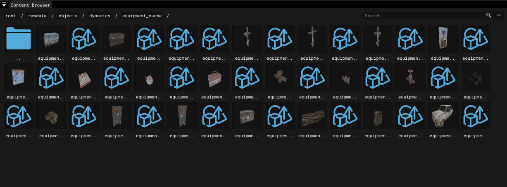

# Content Browser

___

## About

Window for working with objects. Allows to place [*.objects](../../../references/file-formats/models/object.md), [*.groups](../../../references/file-formats/models/group.md), spawn elements on scene, convert *.tga to [*.dds](../../../references/file-formats/textures/dds.md), delete files. (Under development)

| Icon | Name | Description |
|---|---|---|
|  | Show THM | Will show [*.thm](../../../references/file-formats/textures/thm.md) files |
|  | View Mode | View mode Tile List |

Right-click to open the context menu:

<table>
  <thead>
    <tr>
      <th>Name</th>
      <th>Description</th>
      <th>Extra</th>
      <th>Extra Description</th>
    </tr>
  </thead>
  <tbody>
    <tr>
      <td>Cut</td>
      <td>Cut file</td>
      <td>-</td>
      <td>-</td>
    </tr>
    <tr>
      <td>Copy</td>
      <td>Copy file</td>
      <td>-</td>
      <td>-</td>
    </tr>
    <tr>
      <td>Rename</td>
      <td>Rename file</td>
      <td>-</td>
      <td>-</td>
    </tr>
    <tr>
      <td>Delete</td>
      <td>Delete file</td>
      <td>-</td>
      <td>-</td>
    </tr>
    <tr>
      <td>Properties</td>
      <td>File properties</td>
      <td>Change icon</td>
      <td>Change file icon</td>
    </tr>
    <tr>
      <td>Convert</td>
      <td>Convert image file</td>
      <td>
        TGA \&lt;-&gt; PNG
          DDS \-&gt; TGA
          DDS \-&gt; PNG
      </td>
      <td>-</td>
    </tr>
  </tbody>
</table>
