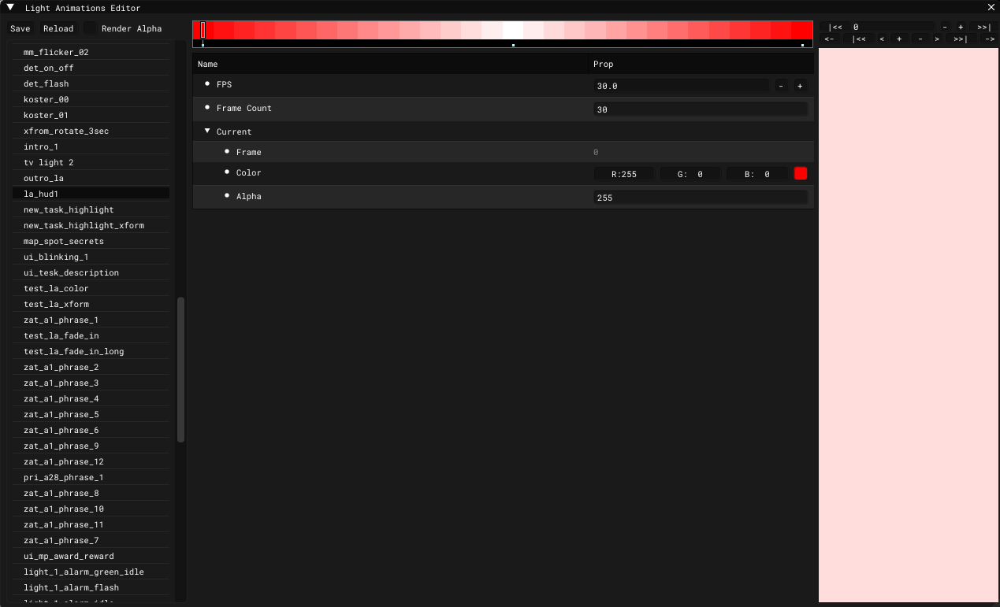

# Light Animations Editor

___

## About

Needed to create a light animation

___

<table>
  <thead>
    <tr>
      <th>Button</th>
      <th>Description</th>
    </tr>
  </thead>
  <tbody>
    <tr>
      <td>Save</td>
      <td>Save</td>
    </tr>
    <tr>
      <td>Reload</td>
      <td>Reload</td>
    </tr>
    <tr>
      <td>Render Alpha</td>
      <td>Will render alpha channel</td>
    </tr>
  </tbody>
</table>

___

<table>
  <thead>
    <tr>
      <th>Property name</th>
      <th>Description</th>
    </tr>
  </thead>
  <tbody>
    <tr>
      <td>FPS</td>
      <td>FPS</td>
    </tr>
    <tr>
      <td>Frame Count</td>
      <td>Frame count</td>
    </tr>
    <tr>
      <td>Frame</td>
      <td>Current frame</td>
    </tr>
    <tr>
      <td>Color</td>
      <td>Light color</td>
    </tr>
    <tr>
      <td>Alpha</td>
      <td>Alpha value</td>
    </tr>
  </tbody>
</table>

___

<table>
  <thead>
    <tr>
      <th>Playback Button</th>
      <th>Description</th>
    </tr>
  </thead>
  <tbody>
    <tr>
      <td>\|&lt;&lt;</td>
      <td>To first frame</td>
    </tr>
    <tr>
      <td>-</td>
      <td>One frame back</td>
    </tr>
    <tr>
      <td>+</td>
      <td>One frame forward</td>
    </tr>
    <tr>
      <td>&gt;&gt;\|</td>
      <td>To last frame</td>
    </tr>
  </tbody>
</table>

<table>
  <thead>
    <tr>
      <th>Frame Button</th>
      <th>Description</th>
    </tr>
  </thead>
  <tbody>
    <tr>
      <td>&lt;-</td>
      <td>Move selected keyframe one frame backward</td>
    </tr>
    <tr>
      <td>\|&lt;&lt;</td>
      <td>?</td>
    </tr>
    <tr>
      <td>&lt;</td>
      <td>One frame back</td>
    </tr>
    <tr>
      <td>+</td>
      <td>Add keyframe</td>
    </tr>
    <tr>
      <td>-</td>
      <td>Delete keyframe</td>
    </tr>
    <tr>
      <td>&gt;</td>
      <td>One frame forward</td>
    </tr>
    <tr>
      <td>&gt;&gt;\|</td>
      <td>?</td>
    </tr>
    <tr>
      <td>-&gt;</td>
      <td>Move selected keyframe one frame forward</td>
    </tr>
  </tbody>
</table>
