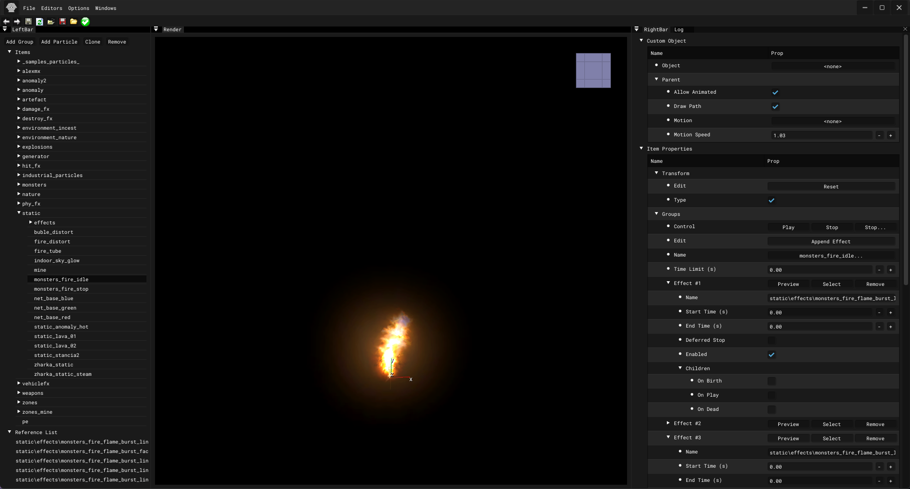

# Particle Editor

___

## About

Used to create particle effects ([*.pe](../../../references/file-formats/particles/pe.md)) or particle groups ([*.pg](../../../references/file-formats/particles/pg.md)).

___

## Interface

### Top Bar

| Icon | Name | Description |
|:---:|---|---|
|  | Undo | Undo the last action |
|  | Redo | Repeat the last action |
|  | Save | Save the particles in unpacked form(*.pe,\*.pg), in rawdata/particles |
|  | Reload | Reload particles from rawdata/particles |
|  | Open | Open file .xr |
|  | Save | Save file .xr |
|  | Open | Open folder Gamedata |
|  | Validate | Particle Validation |
