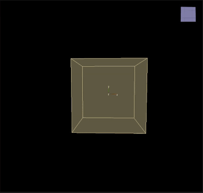

# Move

___

## About

Move particles positions based on velocities.

<table><thead>
  <tr>
    <th>Key</th>
    <th>Value</th>
    <th>Value Description</th>
  </tr></thead>
<tbody>
  <tr>
    <td rowspan="3">Move</td>
    <td>Name</td>
    <td>Action name</td>
  </tr>
  <tr>
    <td>Draw</td>
    <td></td>
  </tr>
  <tr>
    <td>Enabled</td>
    <td>Enabling or disabling Action</td>
  </tr>
</tbody>
</table>
