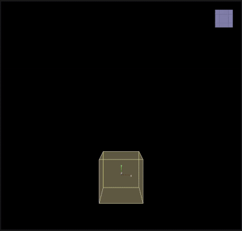

# Target Rotate

___

## About

Changes the rotation of all particles to the specified rotation.

<table><thead>
  <tr>
    <th>Key</th>
    <th>Value</th>
    <th>Value Description</th>
  </tr></thead>
<tbody>
  <tr>
    <td rowspan="5">TargetRotate</td>
    <td>Name</td>
    <td>Action name</td>
  </tr>
  <tr>
    <td>Rotation</td>
    <td>Target Rotation</td>
  </tr>
  <tr>
    <td>Scale</td>
    <td>A coefficient that determines how fast the particles will change their rotation per frame. A value of 1.0 means that the particles will instantly reach the target rotation, while values less than 1.0 will change rotation smoothly</td>
  </tr>
  <tr>
    <td>Draw</td>
    <td></td>
  </tr>
  <tr>
    <td>Enabled</td>
    <td>Enabling or disabling Action</td>
  </tr>
</tbody>
</table>
