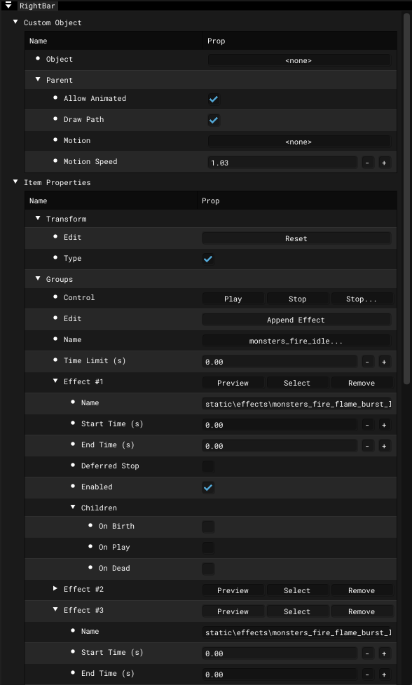

# Right Bar

___

## About

Window with settings and particle properties.

## Interface

### Custom Object

<table>
  <thead>
    <tr>
      <th />
      <th>Description</th>
      <th>Extra</th>
      <th>Extra Description</th>
    </tr>
  </thead>
  <tbody>
    <tr>
      <td>Object</td>
      <td />
      <td>-</td>
      <td>-</td>
    </tr>
    <tr>
      <td rowSpan={4}>Parent</td>
      <td rowSpan={4} />
      <td>Allow Animated</td>
      <td />
    </tr>
    <tr>
      <td>Draw Path</td>
      <td />
    </tr>
    <tr>
      <td>Motion</td>
      <td />
    </tr>
    <tr>
      <td>Motion Speed</td>
      <td />
    </tr>
  </tbody>
</table>

### Item Properties

Different Properties are used for Particle Effect and Particle Group

import Tabs from '@theme/Tabs';
import TabItem from '@theme/TabItem';

<Tabs>
  <TabItem value="particleeffect" label="Particle Effect" default>
<table>
  <thead>
    <tr>
      <th />
      <th />
      <th>Description</th>
      <th>Extra</th>
      <th>Extra Description</th>
      <th>Extra</th>
      <th>Extra Description</th>
    </tr>
  </thead>
  <tbody>
    <tr>
      <td rowSpan={2}>Transform</td>
      <td>Edit</td>
      <td />
      <td>Reset</td>
      <td />
      <td>-</td>
      <td>-</td>
    </tr>
    <tr>
      <td>Type</td>
      <td />
      <td>-</td>
      <td>-</td>
      <td>-</td>
      <td>-</td>
    </tr>
    <tr>
      <td rowSpan={51}>Effects</td>
      <td rowSpan={3}>Control</td>
      <td rowSpan={3} />
      <td>Play</td>
      <td>Play</td>
      <td>-</td>
      <td>-</td>
    </tr>
    <tr>
      <td>Stop</td>
      <td>Instant stop</td>
      <td>-</td>
      <td>-</td>
    </tr>
    <tr>
      <td>Stop...</td>
      <td>Deferred stop</td>
      <td>-</td>
      <td>-</td>
    </tr>
    <tr>
      <td>Name</td>
      <td />
      <td>-</td>
      <td>-</td>
      <td>-</td>
      <td>-</td>
    </tr>
    <tr>
      <td>Time Limit</td>
      <td />
      <td>Value (sec)</td>
      <td />
      <td>-</td>
      <td>-</td>
    </tr>
    <tr>
      <td rowSpan={9}>Sprite</td>
      <td rowSpan={9} />
      <td>Texture</td>
      <td>Selecting texture</td>
      <td>-</td>
      <td>-</td>
    </tr>
    <tr>
      <td>Shader</td>
      <td>Selecting Engine Shader</td>
      <td>-</td>
      <td>-</td>
    </tr>
    <tr>
      <td>Culling</td>
      <td>
        Enable{" "}
        <a href="https://www.khronos.org/opengl/wiki/Face_Culling">
          Back-Face Culling
        </a>
      </td>
      <td>CCW</td>
      <td>
        Enable{" "}
        <a href="https://www.khronos.org/opengl/wiki/Face_Culling">
          Counter-Clockwise Culling
        </a>
      </td>
    </tr>
    <tr>
      <td rowSpan={4}>Frame</td>
      <td rowSpan={4} />
      <td>Random Init</td>
      <td />
    </tr>
    <tr>
      <td>Count</td>
      <td />
    </tr>
    <tr>
      <td>Size U (0..1)</td>
      <td />
    </tr>
    <tr>
      <td>Size V (0..1)</td>
      <td />
    </tr>
    <tr>
      <td rowSpan={2}>Animated</td>
      <td rowSpan={2} />
      <td>Random Playback</td>
      <td />
    </tr>
    <tr>
      <td>Speed</td>
      <td />
    </tr>
    <tr>
      <td rowSpan={9}>Movement</td>
      <td rowSpan={9} />
      <td rowSpan={3}>Align To Path</td>
      <td rowSpan={3} />
      <td>Face Align</td>
      <td />
    </tr>
    <tr>
      <td>Default World Align</td>
      <td />
    </tr>
    <tr>
      <td>Default Rotate</td>
      <td />
    </tr>
    <tr>
      <td>Velocity Scale</td>
      <td />
      <td>Value</td>
      <td />
    </tr>
    <tr>
      <td rowSpan={5}>Collision</td>
      <td rowSpan={5} />
      <td>Collide With Dynamic</td>
      <td>Collide with Dynamic Objects</td>
    </tr>
    <tr>
      <td>Destroy On Contact</td>
      <td />
    </tr>
    <tr>
      <td>Friction</td>
      <td>Friction</td>
    </tr>
    <tr>
      <td>Resilence</td>
      <td />
    </tr>
    <tr>
      <td>Cutoff</td>
      <td />
    </tr>
    <tr>
      <td rowSpan={28}>Actions</td>
      <td rowSpan={28} />
      <td rowSpan={28}>Edit</td>
      <td rowSpan={28} />
      <td>
        <a href="actions/avoid.md">Avoid</a>
      </td>
      <td />
    </tr>
    <tr>
      <td>
        <a href="actions/bounce.md">Bounce</a>
      </td>
      <td />
    </tr>
    <tr>
      <td>
        <a href="actions/copy-vertexb.md">Copy VertexB</a>
      </td>
      <td />
    </tr>
    <tr>
      <td>
        <a href="actions/damping.md">Damping</a>
      </td>
      <td />
    </tr>
    <tr>
      <td>
        <a href="actions/explosion.md">Explosion</a>
      </td>
      <td />
    </tr>
    <tr>
      <td>
        <a href="actions/follow.md">Follow</a>
      </td>
      <td />
    </tr>
    <tr>
      <td>
        <a href="actions/gravitate.md">Gravitate</a>
      </td>
      <td />
    </tr>
    <tr>
      <td>
        <a href="actions/gravity.md">Gravity</a>
      </td>
      <td />
    </tr>
    <tr>
      <td>
        <a href="actions/jet.md">Jet</a>
      </td>
      <td />
    </tr>
    <tr>
      <td>
        <a href="actions/kill-old.md">Kill Old</a>
      </td>
      <td />
    </tr>
    <tr>
      <td>
        <a href="actions/match-velocity.md">Match Velocity</a>
      </td>
      <td />
    </tr>
    <tr>
      <td>
        <a href="actions/move.md">Move</a>
      </td>
      <td />
    </tr>
    <tr>
      <td>
        <a href="actions/orbit-line.md">Orbit Line</a>
      </td>
      <td />
    </tr>
    <tr>
      <td>
        <a href="actions/orbit-point.md">Orbit Point</a>
      </td>
      <td />
    </tr>
    <tr>
      <td>
        <a href="actions/random-accel.md">Random Accel</a>
      </td>
      <td />
    </tr>
    <tr>
      <td>
        <a href="actions/random-displace.md">Random Displace</a>
      </td>
      <td />
    </tr>
    <tr>
      <td>
        <a href="actions/random-velocity.md">Random Velocity</a>
      </td>
      <td />
    </tr>
    <tr>
      <td>
        <a href="actions/restore.md">Restore</a>
      </td>
      <td />
    </tr>
    <tr>
      <td>
        <a href="actions/scatter.md">Scatter</a>
      </td>
      <td />
    </tr>
    <tr>
      <td>
        <a href="actions/sink-velocity.md">Sink Velocity</a>
      </td>
      <td />
    </tr>
    <tr>
      <td>
        <a href="actions/sink.md">Sink</a>
      </td>
      <td />
    </tr>
    <tr>
      <td>
        <a href="actions/source.md">Source</a>
      </td>
      <td />
    </tr>
    <tr>
      <td>
        <a href="actions/speed-limit.md">Speed Limit</a>
      </td>
      <td />
    </tr>
    <tr>
      <td>
        <a href="actions/target-color.md">Target Color</a>
      </td>
      <td />
    </tr>
    <tr>
      <td>
        <a href="actions/target-size.md">Target Size</a>
      </td>
      <td />
    </tr>
    <tr>
      <td>
        <a href="actions/target-velocity.md">Target Velocity</a>
      </td>
      <td />
    </tr>
    <tr>
      <td>
        <a href="actions/turbulence.md">Turbulence</a>
      </td>
      <td />
    </tr>
    <tr>
      <td>
        <a href="actions/vortex.md">Vortex</a>
      </td>
      <td />
    </tr>
  </tbody>
</table>
  </TabItem>
  <TabItem value="particlegroup" label="Particle Group">
<table>
  <thead>
    <tr>
      <th />
      <th />
      <th>Description</th>
      <th>Extra</th>
      <th>Extra Description</th>
      <th>Extra</th>
      <th>Extra Description</th>
      <th>Extra</th>
      <th>Extra Description</th>
    </tr>
  </thead>
  <tbody>
    <tr>
      <td rowSpan={2}>Transform</td>
      <td>Edit</td>
      <td />
      <td>Reset</td>
      <td />
      <td>-</td>
      <td>-</td>
      <td>-</td>
      <td>-</td>
    </tr>
    <tr>
      <td>Type</td>
      <td />
      <td>-</td>
      <td>-</td>
      <td>-</td>
      <td>-</td>
      <td>-</td>
      <td>-</td>
    </tr>
    <tr>
      <td rowSpan={18}>Groups</td>
      <td rowSpan={3}>Control</td>
      <td rowSpan={3} />
      <td>Play</td>
      <td>Play</td>
      <td>-</td>
      <td>-</td>
      <td>-</td>
      <td>-</td>
    </tr>
    <tr>
      <td>Stop</td>
      <td>Instant stop</td>
      <td>-</td>
      <td>-</td>
      <td>-</td>
      <td>-</td>
    </tr>
    <tr>
      <td>Stop...</td>
      <td>Deferred stop</td>
      <td>-</td>
      <td>-</td>
      <td>-</td>
      <td>-</td>
    </tr>
    <tr>
      <td>Edit</td>
      <td />
      <td>Append Effect</td>
      <td>Add Particle Effect</td>
      <td>-</td>
      <td>-</td>
      <td>-</td>
      <td>-</td>
    </tr>
    <tr>
      <td>Name</td>
      <td />
      <td />
      <td />
      <td>-</td>
      <td>-</td>
      <td>-</td>
      <td>-</td>
    </tr>
    <tr>
      <td>Time Limit (s)</td>
      <td />
      <td />
      <td />
      <td>-</td>
      <td>-</td>
      <td>-</td>
      <td>-</td>
    </tr>
    <tr>
      <td rowSpan={12}>Effect</td>
      <td rowSpan={12} />
      <td>Preview</td>
      <td>Preview Particle Effect</td>
      <td>-</td>
      <td>-</td>
      <td>-</td>
      <td>-</td>
    </tr>
    <tr>
      <td>Select</td>
      <td />
      <td>-</td>
      <td>-</td>
      <td>-</td>
      <td>-</td>
    </tr>
    <tr>
      <td>Remove</td>
      <td />
      <td>-</td>
      <td>-</td>
      <td>-</td>
      <td>-</td>
    </tr>
    <tr>
      <td>Name</td>
      <td />
      <td>-</td>
      <td>-</td>
      <td>-</td>
      <td>-</td>
    </tr>
    <tr>
      <td>Start Time</td>
      <td />
      <td>-</td>
      <td>-</td>
      <td>-</td>
      <td>-</td>
    </tr>
    <tr>
      <td>End Time</td>
      <td />
      <td>-</td>
      <td>-</td>
      <td>-</td>
      <td>-</td>
    </tr>
    <tr>
      <td>Deferred Stop</td>
      <td />
      <td>-</td>
      <td>-</td>
      <td>-</td>
      <td>-</td>
    </tr>
    <tr>
      <td>Enabled</td>
      <td />
      <td>-</td>
      <td>-</td>
      <td>-</td>
      <td>-</td>
    </tr>
    <tr>
      <td rowSpan={4}>Children</td>
      <td rowSpan={4} />
      <td>On Birth</td>
      <td />
      <td>Effect Name</td>
      <td />
    </tr>
    <tr>
      <td rowSpan={2}>On Play</td>
      <td rowSpan={2} />
      <td>Effect Name</td>
      <td />
    </tr>
    <tr>
      <td>Play After Stop</td>
      <td />
    </tr>
    <tr>
      <td>On Dead</td>
      <td />
      <td>Effect Name</td>
      <td />
    </tr>
  </tbody>
</table>
  </TabItem>
</Tabs>
