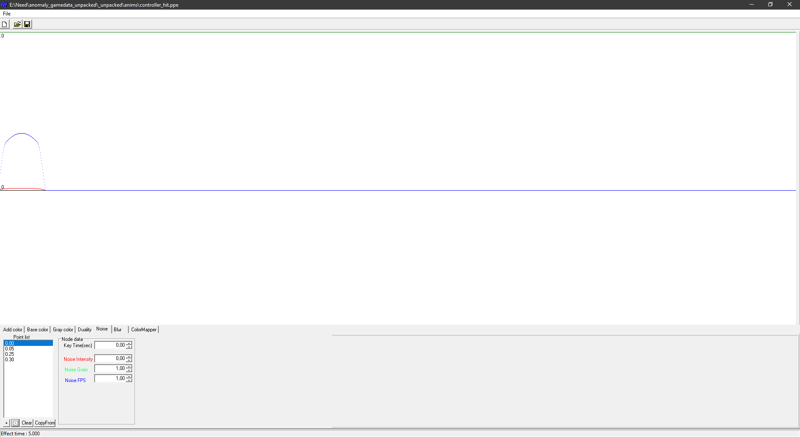

# Postprocess Editor

___

## About

Needed to create postprocess files ([*.ppe](../../../references/file-formats/postprocceses/ppe.md))

___

## Interface

### File Button

<table>
  <thead>
    <tr>
      <th>Button</th>
      <th>Description</th>
    </tr>
  </thead>
  <tbody>
    <tr>
      <td>New</td>
      <td>New ppe file</td>
    </tr>
    <tr>
      <td>Load</td>
      <td>Load ppe file</td>
    </tr>
    <tr>
      <td>Save</td>
      <td>Save ppe file</td>
    </tr>
  </tbody>
</table>

### Add Color

> Fills the picture with opaque RGB color on top of everything

<table>
  <thead>
    <tr>
      <th>Unit</th>
      <th>Description</th>
      <th>Buttons</th>
    </tr>
  </thead>
  <tbody>
    <tr>
      <td>Point List</td>
      <td>Places points on the timeline</td>
      <td>
        `+` - Adds a point `-` - Removes a point `Clear` - Clears the list of
        points `CopyForm` - Copies points from another selected tab
      </td>
    </tr>
    <tr>
      <td>Color</td>
      <td>Edits the color of a selected point</td>
      <td>
        `Key Time(sec)` - the time of the point on the timeline `R` - Red `G` -
        Green `B` - Blue  - Palette
      </td>
    </tr>
  </tbody>
</table>

### Base Color

> Fills the picture with a semi-transparent base color

<table>
  <thead>
    <tr>
      <th>Unit</th>
      <th>Description</th>
      <th>Buttons</th>
    </tr>
  </thead>
  <tbody>
    <tr>
      <td>Point List</td>
      <td>Places points on the timeline</td>
      <td>
        `+` - Adds a point `-` - Removes a point `Clear` - Clears the list of
        points `CopyForm` - Copies points from another selected tab
      </td>
    </tr>
    <tr>
      <td>Color</td>
      <td>Edits the color of a selected point</td>
      <td>
        `Key Time(sec)` - the time of the point on the timeline `R` - Red `G` -
        Green `B` - Blue  - Palette
      </td>
    </tr>
  </tbody>
</table>

### Grey Color

> Controls the amount of inverse saturation, that is, the more gray the less saturated the image

<table>
  <thead>
    <tr>
      <th>Unit</th>
      <th>Description</th>
      <th>Buttons</th>
    </tr>
  </thead>
  <tbody>
    <tr>
      <td>Point List</td>
      <td>Places points on the timeline</td>
      <td>
        `+` - Adds a point `-` - Removes a point `Clear` - Clears the list of
        points `CopyForm` - Copies points from another selected tab
      </td>
    </tr>
    <tr>
      <td>Color</td>
      <td>Edits the color of a selected point</td>
      <td>
        `Key Time(sec)` - the time of the point on the timeline `R` - Red `G` -
        Green `B` - Blue `Intensity` - Gray intensity parameter 
        Palette
      </td>
    </tr>
  </tbody>
</table>

### Duality

> Doubled screen tab

<table>
  <thead>
    <tr>
      <th>Unit</th>
      <th>Description</th>
      <th>Buttons</th>
    </tr>
  </thead>
  <tbody>
    <tr>
      <td>Point List</td>
      <td>Places points on the timeline</td>
      <td>
        `+` - Adds a point `-` - Removes a point `Clear` - Clears the list of
        points `CopyForm` - Copies points from another selected tab
      </td>
    </tr>
    <tr>
      <td>Node Data</td>
      <td>Edits the selected point</td>
      <td>
        `Key Time(sec)` - the time of the point on the timeline `Duality-H` -
        Vertical image doubling `Duality-V` - Horizontal image doubling
      </td>
    </tr>
  </tbody>
</table>

### Noise

> Noise parameters tab

<table>
  <thead>
    <tr>
      <th>Unit</th>
      <th>Description</th>
      <th>Buttons</th>
    </tr>
  </thead>
  <tbody>
    <tr>
      <td>Point List</td>
      <td>Places points on the timeline</td>
      <td>
        `+` - Adds a point `-` - Removes a point `Clear` - Clears the list of
        points `CopyForm` - Copies points from another selected tab
      </td>
    </tr>
    <tr>
      <td>Node Data</td>
      <td>Edits the selected point</td>
      <td>
        `Key Time(sec)` - the time of the point on the timeline `Noise
        Intensity` - Noise intensity `Noise Grain` - Noise granularity `Noise
        FPS` - FPS in noise
      </td>
    </tr>
  </tbody>
</table>

### Blur

> Blurring

<table>
  <thead>
    <tr>
      <th>Unit</th>
      <th>Description</th>
      <th>Buttons</th>
    </tr>
  </thead>
  <tbody>
    <tr>
      <td>Point List</td>
      <td>Places points on the timeline</td>
      <td>
        `+` - Adds a point `-` - Removes a point `Clear` - Clears the list of
        points `CopyForm` - Copies points from another selected tab
      </td>
    </tr>
    <tr>
      <td>Color</td>
      <td>Edits the color of a selected point</td>
      <td>
        `Key Time(sec)` - the time of the point on the timeline `R` - Red `G` -
        Green `B` - Blue `Intensity` - Intensity  - Palette
      </td>
    </tr>
  </tbody>
</table>

### Color Mapper

> Tab for postprocess gradient

<table>
  <thead>
    <tr>
      <th>Unit</th>
      <th>Description</th>
      <th>Buttons</th>
    </tr>
  </thead>
  <tbody>
    <tr>
      <td>Point List</td>
      <td>Places points on the timeline</td>
      <td>
        `+` - Adds a point `-` - Removes a point `Clear` - Clears the list of
        points `CopyForm` - Copies points from another selected tab
      </td>
    </tr>
    <tr>
      <td>Node Data</td>
      <td>Edits the selected point</td>
      <td>
        `Key Time(sec)` - the time of the point on the timeline `Influence` -
        Opacity ("influence") of the gradient `String` - Gradient texture name
        input field (usually grad/grad_texture)
      </td>
    </tr>
  </tbody>
</table>
