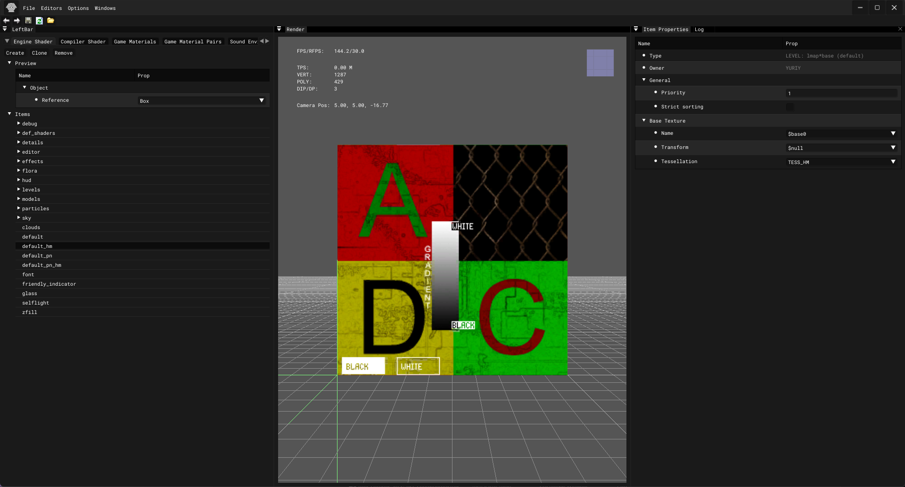
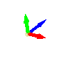
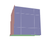

# Shader Editor

___

## About

Used to create/edit shaders

## Interface

import Tabs from '@theme/Tabs';
import TabItem from '@theme/TabItem';

<Tabs>
  <TabItem value="file" label="File" default>
<table>
  <thead>
    <tr>
      <th>Button</th>
      <th>Description</th>
    </tr>
  </thead>
  <tbody>
    <tr>
      <td>Save</td>
      <td />
    </tr>
    <tr>
      <td>Reload</td>
      <td />
    </tr>
  </tbody>
</table>
  </TabItem>
  <TabItem value="editors" label="Editors">
<table>
  <thead>
    <tr>
      <th>Option</th>
      <th>1</th>
      <th>Description</th>
    </tr>
  </thead>
  <tbody>
    <tr>
      <td rowSpan={3}>Image</td>
      <td>Image Editor</td>
      <td>Open Image Editor</td>
    </tr>
    <tr>
      <td>Synchronize Textures</td>
      <td>
        The function updates textures in the project by checking changes in the
        file system and synchronizing them
      </td>
    </tr>
    <tr>
      <td>Check New Textures</td>
      <td>Searches for new textures in the file system and imports them</td>
    </tr>
    <tr>
      <td rowSpan={3}>Sounds</td>
      <td>Sound Editor</td>
      <td>Open Sound Editor</td>
    </tr>
    <tr>
      <td>Synchronize Sounds (Soft)</td>
      <td>
        Searches for new sounds in the file system and imports them. Deletes
        only those sounds that do not exist in the file system and are not used
      </td>
    </tr>
    <tr>
      <td>Synchronize Sounds (Hard)</td>
      <td>
        Searches for new sounds in the file system and imports them. Deletes all
        sounds missing from the file system without checking if they are used
      </td>
    </tr>
    <tr>
      <td>Light Anim Editor</td>
      <td>-</td>
      <td>
        Open{" "}
        <a href="../light-animations-editor/light-animations-editor.md">
          Light Animation Editor
        </a>
      </td>
    </tr>
    <tr>
      <td>Minimap Editor</td>
      <td>-</td>
      <td>
        Open <a href="../minimap-editor/minimap-editor.md">Minimap Editor</a>
      </td>
    </tr>
  </tbody>
</table>
  </TabItem>
  <TabItem value="options" label="Options">
<table>
  <thead>
    <tr>
      <th>Options</th>
      <th>1</th>
      <th>Description</th>
      <th>1</th>
      <th>Description</th>
    </tr>
  </thead>
  <tbody>
    <tr>
      <td rowSpan={10}>Render</td>
      <td>Quality</td>
      <td />
      <td>-</td>
      <td>-</td>
    </tr>
    <tr>
      <td rowSpan={3}>Fill Mode</td>
      <td rowSpan={3}>Fill Mode</td>
      <td>Point</td>
      <td>Vertex point fill mode</td>
    </tr>
    <tr>
      <td>Wireframe</td>
      <td>Wireframe fill mode</td>
    </tr>
    <tr>
      <td>Solid</td>
      <td>Solid fill mode</td>
    </tr>
    <tr>
      <td rowSpan={2}>Shader Mode</td>
      <td rowSpan={2}>Shader Mode</td>
      <td>Flat</td>
      <td>
        <a href="https://en.wikipedia.org/wiki/Shading#Flat_shading">
          Flat Shading
        </a>
      </td>
    </tr>
    <tr>
      <td>Gouraud</td>
      <td>
        <a href="https://en.wikipedia.org/wiki/Gouraud_shading">
          Gouraud Shading
        </a>
      </td>
    </tr>
    <tr>
      <td>Edged Faces</td>
      <td>Enables drawing of edges (wireframe) of a 3D mesh</td>
      <td>-</td>
      <td>-</td>
    </tr>
    <tr>
      <td>RenderHW</td>
      <td>Enables GPU rendering</td>
      <td>-</td>
      <td>-</td>
    </tr>
    <tr>
      <td>Filter Linear</td>
      <td>Enables linear texture filtering</td>
      <td>-</td>
      <td>-</td>
    </tr>
    <tr>
      <td>Textures</td>
      <td>Enables texture display (TODO Not Working)</td>
      <td>-</td>
      <td>-</td>
    </tr>
    <tr>
      <td>Draw Safe Rect</td>
      <td />
      <td />
      <td>-</td>
      <td>-</td>
    </tr>
    <tr>
      <td>Draw Grid</td>
      <td>Draw viewport grid</td>
      <td>-</td>
      <td>-</td>
      <td>-</td>
    </tr>
    <tr>
      <td rowSpan={3}>Coordinate Axes</td>
      <td>None</td>
      <td>None</td>
      <td>-</td>
      <td>-</td>
    </tr>
    <tr>
      <td>Axis</td>
      <td>
        
      </td>
      <td>-</td>
      <td>-</td>
    </tr>
    <tr>
      <td>Cube</td>
      <td>
        
      </td>
      <td>-</td>
      <td>-</td>
    </tr>
    <tr>
      <td>Fog</td>
      <td>-</td>
      <td />
      <td>-</td>
      <td>-</td>
    </tr>
    <tr>
      <td>Mute Sounds</td>
      <td>-</td>
      <td>Mute Sounds</td>
      <td>-</td>
      <td>-</td>
    </tr>
    <tr>
      <td>Real Time</td>
      <td>-</td>
      <td>Real Time</td>
      <td>-</td>
      <td>-</td>
    </tr>
    <tr>
      <td>Stats</td>
      <td>-</td>
      <td>Displaying statistics</td>
      <td>-</td>
      <td>-</td>
    </tr>
    <tr>
      <td>Preferences</td>
      <td>-</td>
      <td>
        Open <a href="../editors-preference.md">Preference window</a>
      </td>
      <td>-</td>
      <td>-</td>
    </tr>
  </tbody>
</table>
  </TabItem>
  <TabItem value="windows" label="Windows">
<table>
  <thead>
    <tr>
      <th>Button</th>
      <th>Description</th>
    </tr>
  </thead>
  <tbody>
    <tr>
      <td>Log</td>
      <td>Open Log window</td>
    </tr>
    <tr>
      <td>Theme</td>
      <td>Editor theme</td>
    </tr>
  </tbody>
</table>
  </TabItem>
</Tabs>

| Icon | Description |
|---|---|
|  | Undo the last action|
|  | Repeat the last action |
|  | Save all '.xr' |
|  | Reload everything '.xr' |
|  | Open folder 'GameData' |
