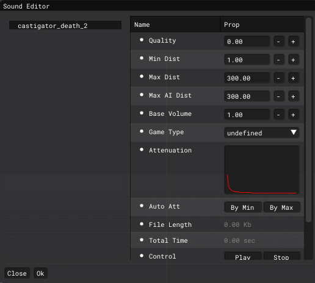

# Sound Editor

___

## About

A sound editor is needed to edit sound files in [*.wav](https://en.wikipedia.org/wiki/WAV) format and convert to [*.ogg](../../../references/file-formats/audio-video/ogg.md)

## Interface

| Key | Description | Value |
|---|---|---|
| Quality | Quality | Range is 0.00 - 1.00 |
| Min Dist | indicates the distance in meters from the sound source at which it can still be heard at 100% volume | Range is 0.01 - 1000.00 |
| Max Dist | Distance in meters from the sound source at which you can no longer hear the sound | Range is 0.10 - 1000.00 |
| Max AI Dist | Distance from the sound source (in meters) at which NPCs can no longer hear the sound | Range is 0.10 - 1000.00 |
| Base Sound Volume | Default sound volume in the game at the sound source location | Range is 0.00 - 2.00 |
| Game Type | Determines how the sound will be perceived by NPCs and mutants in the game | undefined anomaly_idle item_dropping item_hiding item_pickup item_taking item_using NPC_attacking NPC_dying NPC_eating NPC_injuring NPC_step NPC_talking object_breaking object_colliding object_exploding weapon_bullet_hit weapon_empty_click weapon_recharging weapon_shooting world_ambient |
| [Attenuation](https://en.wikipedia.org/wiki/Attenuation) | Attenuation Graph | - |
| Auto Att | Automatic attenuation based on minimum and maximum audible distance values | By Min By Max |
| File Length | File Length | - |
| Total Time | Total Time | - |
| Control | Control | Play Stop |
| Auto Play | Auto Play | on off |
| MANAGE | Synchronizes changes | SyncCurrent |
