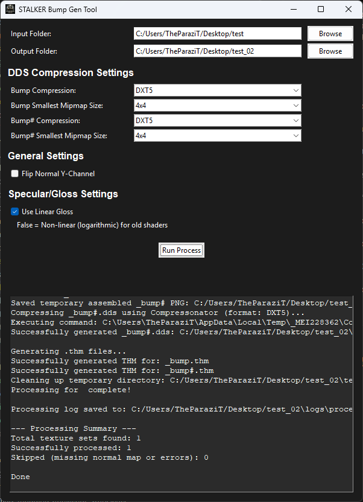

# Stalker Bump Gen Tool

___

## Info

<table>
  <tbody>
    <tr>
      <td>Program Developer</td>
      <td>UmYeahNo</td>
    </tr>
    <tr>
      <td>Described Version</td>
      <td>Version from 28/07/25</td>
    </tr>
  </tbody>
</table>

___

## About

This tool is designed for simultaneous processing of one or more sets of textures. A set of textures (e.g., \*_normal.tga, \*_specular.tga, \*_height.tga). The tool identifies each complete set of textures by its name. Then it processes each set, generating the appropriate (\*_bump.dds, \*_bump.thm) and (\*_bump#.dds, \*_bump#.thm). Supports up to 8K identical or mixed texture input formats. (\*.tga, \*.png, \*.tiff, \*.dds). You don't need to run the program separately for each complete set of textures.

## Intallation

1. Extract and run

## Interface

### Pathes

<table>
  <tbody>
    <tr>
      <td>Input Folder</td>
      <td>Input folder</td>
    </tr>
    <tr>
      <td>Ouput Folder</td>
      <td>Ouput folder</td>
    </tr>
  </tbody>
</table>

### DDS Compression Settings

<table>
    <tr>
      <td>Bump Compression</td>
      <td>
        DXT5
         BC3
         BC7
      </td>
    </tr>
    <tr>
      <td>Bump Smallest MipMap Size</td>
      <td>
        Disabled
         4x4
         8x8
         16x16
         32x32
         64x64
         128x128
         256x256
      </td>
    </tr>
    <tr>
      <td>Bump# Compression</td>
      <td>
        DXT5
         BC3
         BC7
      </td>
    </tr>
    <tr>
      <td>Bump# Smallest MipMap Size</td>
      <td>
        Disabled
         4x4
         8x8
         16x16
         32x32
         64x64
         128x128
         256x256
      </td>
    </tr>
</table>

### General Settings

Flip Normal Y-Channel - Flip Y-Channel for Normal Map

### Specular/Gloss Settings

Use Linear Gloss - Use Linear Gloos. If false will use non-linear (logarithmic) for old shaders.
