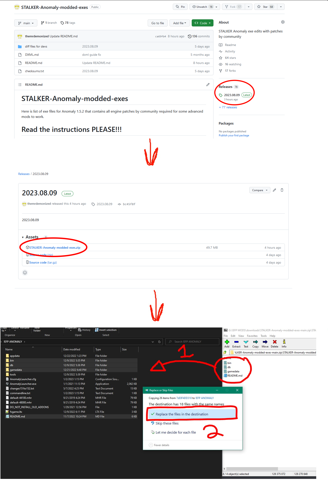

# DLTX

___

<Authors
  authors={["nltp_ashes"]}
  size="medium"
  showTitle={true}
  showDescription={true}
/>

## 1. About

Modding S.T.A.L.K.E.R. has this annoying tendency to result in conflicts when two different mods overwrite the same [*.ltx](../../references/file-formats/conf-script/ltx.md) file, but not the same variables and sections within that file.

DLTX aims to mitigate this by allowing a mod author to only override the values that they actually wish to change in a separate file, which should greatly reduce the amount of needless mod conflicts and the need to manually merge mods.

___

## 2. Installation

DLTX is built-in the Anomaly Modded Exes.

- Download the file `STALKER-Anomaly-modded-exes.zip` from [this repository](https://github.com/themrdemonized/xray-monolith);
- Back up the contents of your "bin" folder;
- Unpack the contents of the archive on top of your game's root folder.



___

## 3. Tools

To make the process easier for people uncomfortable with DLTX, or to automatically DLTX-ify older addons, you can use the [LTXDiff](https://github.com/MerelyMezz/LTXDiff/releases/tag/1.4.2) tool.

___

### LTXDiff findroot

In order to properly DLTX-ify a file, you need to find its root file. For this, you can either manually trace back the chain of #includes, or use the [LTXDiff](https://github.com/MerelyMezz/LTXDiff/releases/tag/1.4.2).

In order to make a differential change to the LTX records, you have to follow these steps:

#### Step 1 : Find the root file

Execute the following command :

LTXDiff findroot " [Base Folder] " " [Mod Folder] " " [Relative Path to File] "

Where :

- [Base Folder] : A path to the unpacked vanilla files of the game;
- [Mod Folder] : A path to your mod's folder;
- [Relative Path to File] : A path relative to `gamedata/` to the file you wish to find the root of.

For example :

LTXDiff findroot " C:\Games\Anomaly\tools\_unpacked " " C:\Mods\MyMod\gamedata " " configs\items\items\items_repair.ltx

#### Step 2 : Create your DLTX file

Once you have found the root file, create a new file in the same directory with the name :

mod_ [Root File Name] _ [Mod Suffix] .ltx

Where :

- [Root File Name] : The name of the root file you identified via [Step 1](#step-1--find-the-root-file);
- [Mod Suffix] : A unique name (as to not conflict with other addons) of your liking;

For example :

mod_ system _ my_name_jeff_addon .ltx

#### Step 3 : Write your DLTX edits/additions

Apply the changes or additions of your liking. See [syntax chapter](#4-syntax) for more details.

___

### LTXDiff dltxify

[LTXDiff](https://github.com/MerelyMezz/LTXDiff/releases/tag/1.4.2) is capable of automatically converting conventional mods into a DLTX-ready format.

If you're lucky, the [DLTXify by right click](https://www.moddb.com/mods/stalker-anomaly/addons/dltxify-by-right-click-for-modders-tool) might work for you. Instructions about it are available on the addon's page. Alternatively, you can use LTXDiff dltxify.

Execute the following command :

LTXDiff dltxify " [Base Folder] " " [Mod Folder] " " [Mod Suffix] "

Where :

- [Base Folder] : A path to the unpacked vanilla files of the game;
- [Mod Folder] : A path to your mod's folder;
- [Mod Suffix] : The unique name you want to be used for your addon's file.

___

## 4. Syntax

The following table connects the different symbols used by DLTX to their corresponding feature(s).

| Symbol  |                                 Feature(s)                                 |
|:-------:|:--------------------------------------------------------------------------:|
|   `!`   | [Section override](#section-override) or [Field override](#field-override) |
|  `!!`   |                   [Section deletion](#section-deletion)                    |
|   `@`   |           [Section creation/override](#section-creationoverride)           |
|   `>`   |            [Field CSV list addition](#field-csv-list-addition)             |
|   `<`   |            [Field CSV list deletion](#field-csv-list-deletion)             |

___

### Section override

To override a section, you use the `!` symbol before the section declaration.

To override the section called `some_section` :

```ini
[some_section]:parent_section
price       = 5000
weight      = 1.0
friends     = me, myself, i
```

You use :

```ini
![some_section]
```

Please note :

- this alone does nothing, and needs to be used in combination with other things;
- when you override a section, **you do not list again the parent sections inheritance**.

___

### Section deletion

To delete a section, you [delete all the section's fields](#field-deletion), and you use the `!!` symbols before the section declaration.

To delete the section called `some_section` :

```ini
[some_section]:parent_section
price       = 5000
weight      = 1.0
friends     = me, myself, i
```

You use :

```ini
!![some_section]
```

___

### Section creation/override

To create a section if it doesn't exist, or override it if it already exists, you use the `@` symbol before the section declaration.

To create/override the section called `some_section` :

```ini
[some_section]:parent_section
price       = 5000
weight      = 1.0
friends     = me, myself, i
```

You use :

```ini
@[some_section]
```

:::note

- this alone does nothing, and needs to be used in combination with other things;
- this only exists in the Anomaly 1.5.2 version of the Modded Exes.

:::

___

### Section inheritance addition

To add a new parent section to another section, you add the new parent as you normally would, **without listing all the existing parents again**.

To add the `some_other_section` section as parent of `some_section` :

```ini
[some_section]:parent_section
price       = 5000
weight      = 1.0
friends     = me, myself, i
```

You use :

```ini
![some_section]:some_other_section
```

___

### Section inheritance deletion

To remove a parent section of a section, you prefix the parent section you wish to remove with the `!` symbol in the list of parents.

To remove the `parent_section` section from the parent of `some_section` :

```ini
[some_section]:parent_section
price       = 5000
weight      = 1.0
friends     = me, myself, i
```

You use :

```ini
![some_section]:!parent_section
```

___

### Field override

To override a field within a section, you [override its section](#section-override) and you redefine the field.

To override the field called `price` in `some_section` :

```ini
[some_section]:parent_section
price       = 5000
weight      = 1.0
friends     = me, myself, i
```

You use :

```ini
![some_section]
price       = 10000
```

___

### Field deletion

To delete a field within a section, you use the `!` symbol before the field declaration.

To delete the field called `price` in `some_section` :

```ini
[some_section]:parent_section
price       = 5000
weight      = 1.0
friends     = me, myself, i
```

You use :

```ini
![some_section]
!price
```

___

### Field CSV list addition

To add an item in a CSV list, you use the `>` symbol before the field declaration, and list the elements you want to add.

To add the item `you` in the field called `friends` in `some_section` :

```ini
[some_section]:parent_section
price       = 5000
weight      = 1.0
friends     = me, myself, i
```

You use :

```ini
![some_section]
>friends    = you
```

:::note
Do not list again the elements already present in this list
:::

___

### Field CSV list deletion

To remove an item from a CSV list, you use the `<` symbol before the field declaration, and list the elements you want to remove.

To remove the item `myself` in the field called `friends` in `some_section` :

```ini
[some_section]:parent_section
price       = 5000
weight      = 1.0
friends     = me, myself, i
```

You use :

```ini
![some_section]
<friends    = myself
```

:::note
Do not list again the elements already present in this list
:::

___

## Sources

[Modded Exes (contains DLTX)](https://github.com/themrdemonized/xray-monolith)

[Legacy page for DLTX on Moddb](https://www.moddb.com/mods/stalker-anomaly/addons/dltx-differential-ltx-loading)

[LTXDiff Source Code](https://github.com/MerelyMezz/LTXDiff)

[DLTXify by right click](https://www.moddb.com/mods/stalker-anomaly/addons/dltxify-by-right-click-for-modders-tool)
