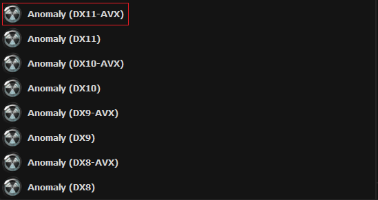
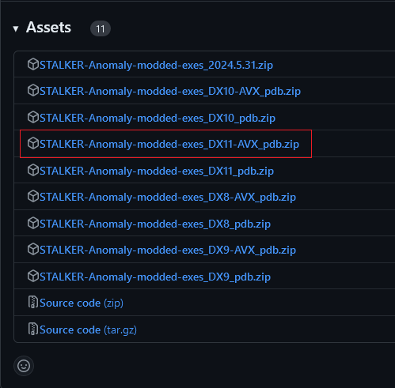
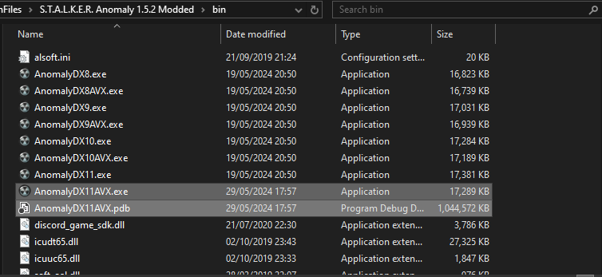

# Program Debug Database (PDB)

___

Written by @nltp_ashes

___

## 1. About

When using addons, it is frequent that the game will crash without showing any information in the log. This is a problem, because people that are not familiar with modding will often call for help and post their logs, except it contains virtually no useful information.

Program Debug Database (PDB, for short) files are useful in this scenario, because they allow the engine to print, in the log, the callstack (i.e. where in the engine) at the time of the crash.

When using PDB files, you can expect this kind of logs :

```log
SymInit: Symbol-SearchPath: '.;I:\ProgramFiles\S.T.A.L.K.E.R. Anomaly 1.5.2 Modded\bin;I:\ProgramFiles\S.T.A.L.K.E.R. Anomaly 1.5.2 Modded\bin;C:\WINDOWS;C:\WINDOWS\system32;', symOptions: 530, UserName: 'ASHES'
OS-Version: 6.2.9200 () 0x100-0x1
I:\ProgramFiles\S.T.A.L.K.E.R. Anomaly 1.5.2 Modded\bin\AnomalyDX11AVX.exe:AnomalyDX11AVX.exe (0000000140000000), size: 18108416 (result: 0), SymType: 'PDB', PDB: '.\AnomalyDX11AVX.pdb'
I:\Projects\STALKER\xray-monolith\src\xrCore\xrDebugNew.cpp (123): LogStackTrace
I:\Projects\STALKER\xray-monolith\src\xrCore\xrDebugNew.cpp (811): UnhandledFilter
I:\Projects\STALKER\xray-monolith\src\xrPhysics\PHSimpleCharacterInline.h (128): CPHSimpleCharacter::UpdateDynamicDamage
I:\Projects\STALKER\xray-monolith\src\xrPhysics\PHSimpleCharacter.cpp (1620): CPHSimpleCharacter::InitContact
I:\Projects\STALKER\xray-monolith\src\xrPhysics\PHActorCharacter.cpp (362): CPHActorCharacter::InitContact
I:\Projects\STALKER\xray-monolith\src\xrPhysics\Physics.cpp (245): CollideIntoGroup
I:\Projects\STALKER\xray-monolith\src\xrPhysics\Physics.cpp (289): NearCallback
I:\Projects\STALKER\xray-monolith\src\xrPhysics\PHObject.cpp (140): CPHObject::CollideDynamics
I:\Projects\STALKER\xray-monolith\src\xrPhysics\PHObject.cpp (128): CPHObject::Collide
I:\Projects\STALKER\xray-monolith\src\xrPhysics\PHSimpleCharacter.cpp (2126): CPHSimpleCharacter::Collide
I:\Projects\STALKER\xray-monolith\src\xrPhysics\PHWorld.cpp (346): CPHWorld::Step
I:\Projects\STALKER\xray-monolith\src\xrPhysics\PHWorld.cpp (294): CPHWorld::OnFrame
I:\Projects\STALKER\xray-monolith\src\xrEngine\device.cpp (184): mt_Thread
at address 0x0000000140C0C69E
```

Instead of this when you do not use PDB files :

```log
SymInit: Symbol-SearchPath: '.;I:\ProgramFiles\S.T.A.L.K.E.R. Anomaly 1.5.2 Modded\bin;I:\ProgramFiles\S.T.A.L.K.E.R. Anomaly 1.5.2 Modded\bin;C:\WINDOWS;C:\WINDOWS\system32;', symOptions: 530, UserName: 'ASHES'
OS-Version: 6.2.9200 () 0x100-0x1
I:\ProgramFiles\S.T.A.L.K.E.R. Anomaly 1.5.2 Modded\bin\AnomalyDX11AVX.exe:AnomalyDX11AVX.exe (0000000140000000), size: 18108416 (result: 0), SymType: 'PDB', PDB: '.\AnomalyDX11AVX.pdb'
at address 0x0000000140C0C69E
```

___

## 2. Important

1. PDB files must be used for the exact version of the executable you are running. So if you update the .exe file, you must also update the .pdb file.
2. PDB files are have a very large disk size, so only use them for the version of the engine you are using (more on that later).

___

## 3. Installation

Download the Anomaly Modded Exes from [here](https://github.com/themrdemonized/xray-monolith/releases/latest).


Download the first archive in the list, and install them in your game's `bin` folder.


Download the PDB archive that corresponds to the version of DirectX you are using.
If you use DX11-AVX, download the `DX11-AVX_pdb.zip`, if you use DX10, download the `DX10_pdb.zip`, etc.

|                                   |                                            |
|:---------------------------------:|:------------------------------------------:|
|  |  |

Place the PDB files in the same folder as the executable you are using (i.e. in your game's `bin` folder).


