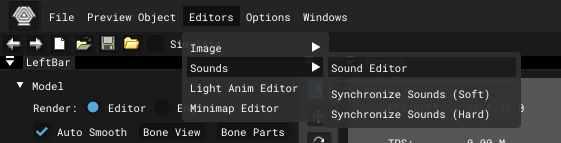
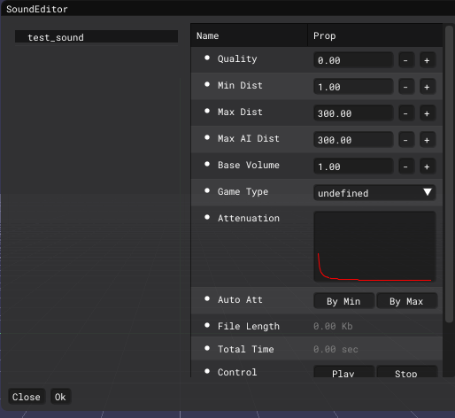
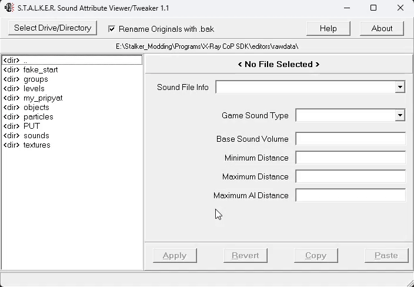

# Setup *.ogg

___

## About

[*.ogg](../../references/file-formats/audio-video/ogg.md) is a special sound format. It needs setup for proper playback in the game world and AI response.

## Setup via SDK

:::note
The sound file must be in the source *.wav format.
:::

To convert *.wav to \*.ogg with SDK setup, you need to drop the file into the `rawdata\sounds` folder

:::tip
If there is no `sounds` folder in `rawdata`, you can just create a folder.
:::

Open [Actor Editor](../../modding-tools/sdk/actor-editor/actor-editor.md) -> `Editors` -> `Sounds` -> [Sound Editor](../../modding-tools/sdk/sound-editor/sound-editor.md).

In the window that opens you will see your file, click on it and setup.

## Setup via SAVANT

:::note
The sound file must be in the *.ogg format.
:::

[Sound Attribute Viewer And Tweaker](../../modding-tools/audio-video/savandt.md) - This is a fan program for editing *.ogg.

Download and open SAVANT and select the directory with your sound.

Now you can setup your file.
