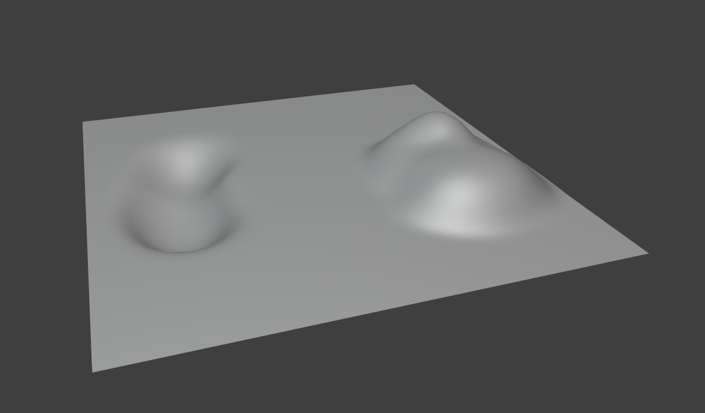
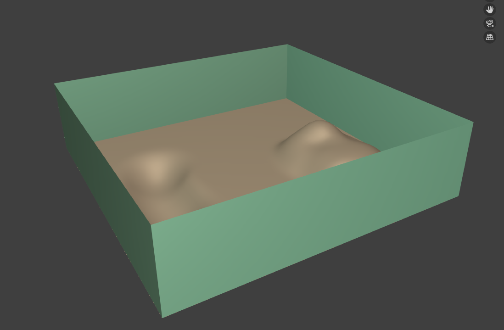

# Creating Location in Blender

___

## Need to know

- How working in Blender
- Familiarize yourself with the formats for levels ([*.lights](../../reference/file-formats/game-levels/lights.md), [level](../../reference/file-formats/game-levels/level.md), [*.ai](../../reference/file-formats/game-levels/ai.md), [*.cform](../../reference/file-formats/game-levels/cform.md), [*.details](../../reference/file-formats/game-levels/details.md), [*.env_mod](../../reference/file-formats/game-levels/env_mod.md), [*.fog_vol](../../reference/file-formats/game-levels/fog_vol.md), [*.game](../../reference/file-formats/game-levels/game.md), [*.geom](../../reference/file-formats/game-levels/geom.md), [*.geomx](../../reference/file-formats/game-levels/geomx.md), [*.hom](../../reference/file-formats/game-levels/hom.md), [*.ltx](../../reference/file-formats/conf-script/ltx.md), [*.ps_static](../../reference/file-formats/game-levels/ps_static.md), [*.spawn](../../reference/file-formats/game-levels/spawn.md), [*.wallmarks](../../reference/file-formats/game-levels/wallmarks.md), [*.som](../../reference/file-formats/game-levels/som.md))

## Start

```admonish note
At the moment with Blender and Blender X-Ray addon there is no way to create a full-fledged location (no compilation, AI map creation and other things), so you need to use together with SDK.
```

В первую очередь нам нужно создать терреин нашей локации.

```admonish tip
Террейн можно создать разными способами. От процедурной генерации до ручного труда, либо через иные программы или аддоны.
```

Для этого туториала я создам террейн быстрым и легким путем, просто сделав его вручную (Я просто создал плейн и редактировал его в Scult режиме).



Далее я просто создал ограничетель, через который игрок не сможет пройти



```admonish tip
После создания обьектов (если пларируется использовать их в SDK) хорошим тоном будет экспортировать их в *.object формат в папку с SDK, а в Export Path (X-Ray Engine: Object) добавить ссылку на обьект который мы экспортировали. Это поможет в конце создания локации в Blender просто экспортировать специальный Save Selection формат, который при загрузке в SDK Level Editor сразу загрузит нужные нам модели.
```

Настоло время наполнить нашу локацию. Давайте добавим разные обьекты.

Я добавил уже заранее созданные обькты с настроенными Export Path:

- Статический обьект (Основная статья: Настройка Статического Обьекта в Blender)


- Динамический обьект (Основная статья: Настройка Динамического Обьекта в Blender)

- Разрушаймый обьект (Основная статья: Создание Разрушаемого Обьекта в Blender)

- Подвешенный обьект (Основная статья: Создание Подвешенного Обьекта в Blender)

- Рабочую лестницы (Основная статья: Создание Лестницы в Blender)

- Лампу (Основная статья: Создание Лампы в Blender)

- Строение (Основная статья: Подготовка Строения в Blender)

- SOM окклюдер (Основная статья: Создание SOM Occluder в Blender)

- Detail Object (Основная статья: Создание Detail Object в Blender)