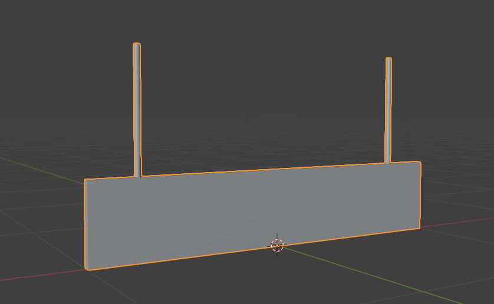
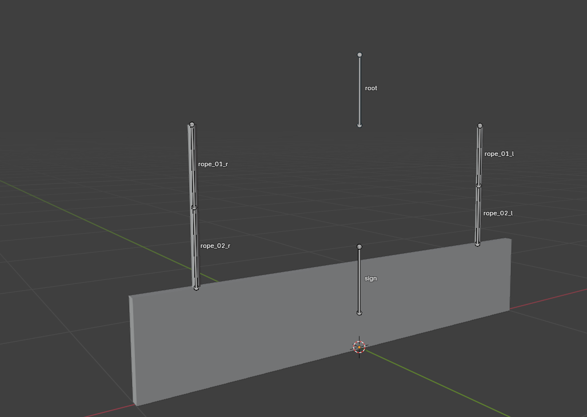
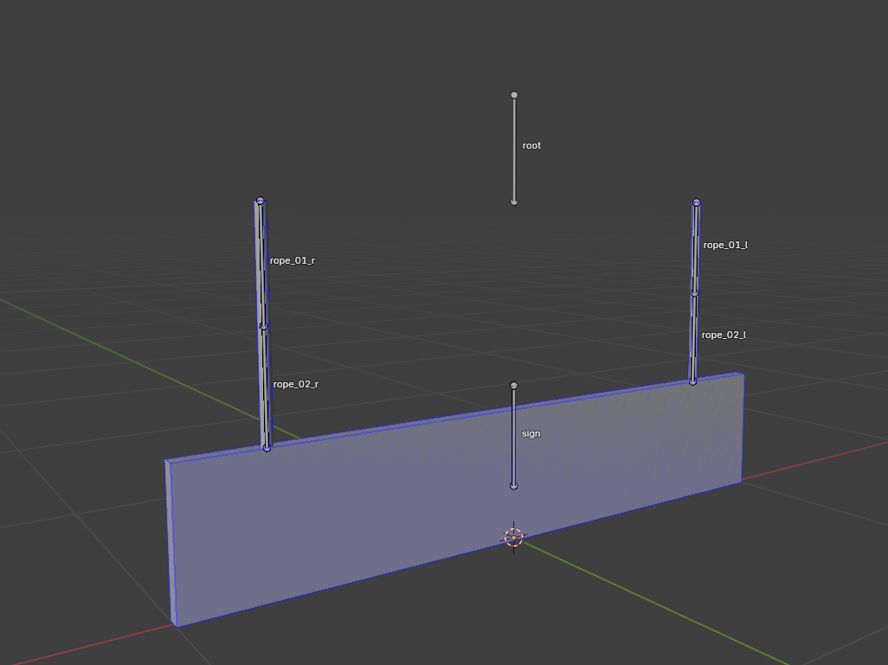

# Creating Hanging Object in Blender

___

## About

Hanging objects (lamps or signs) such objects have special bones that allow them to imitate ropes or any other kind of rope.

## Start

We're gonna need a model. Like a model of a sign on ropes.

Create several bones.

- One for the collision of the sign itself
- Two (or more) bones for the ropes.
- One main (root) bone

## Bone

Let's set up bones

Go to Bone Properties and in X-Ray Engine: Bone, choose:

- For rope bones, select `Cloth` in Joint Type and needed `Bone Shape`.
- For sign bone select `Joint` and needed `Bone Shape`.
- For root bone, select `Rigid`. `Bone Shape` - `None`.

:::tip
Also for more accurate weight you can adjust the mass and center of mass for the bones
:::

## Finish

:::tip
If you plan to place the object on the ceiling, it is better to flip the object to the intended attachment point on top and apply all transformations to the armature and model. This will allow you to easily fix the object in the SDK at the desired angle.
:::

Go to `Object Properties`.

In [X-Ray Engine: Object](../../modding-tools/blender/addon-panels/panel-object.md) select `Dynamic` or `Progressive Dynamic` in the `Type` list.
