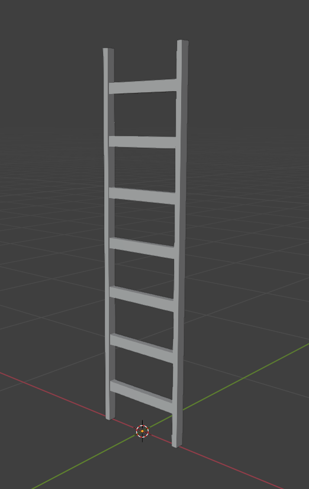
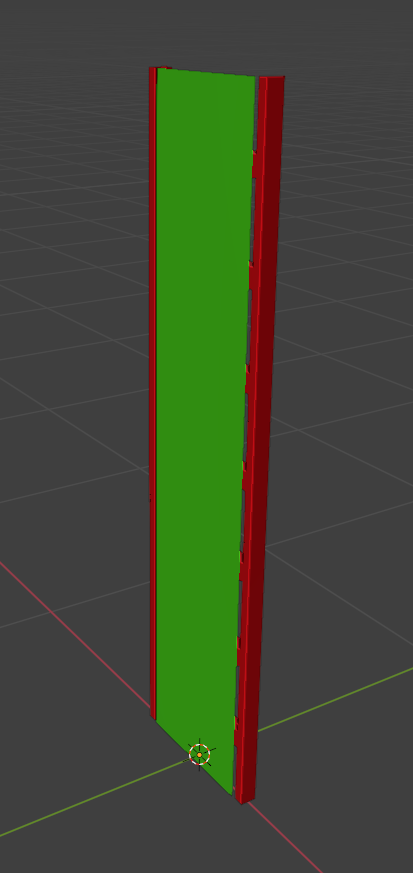
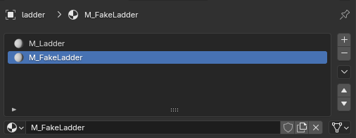
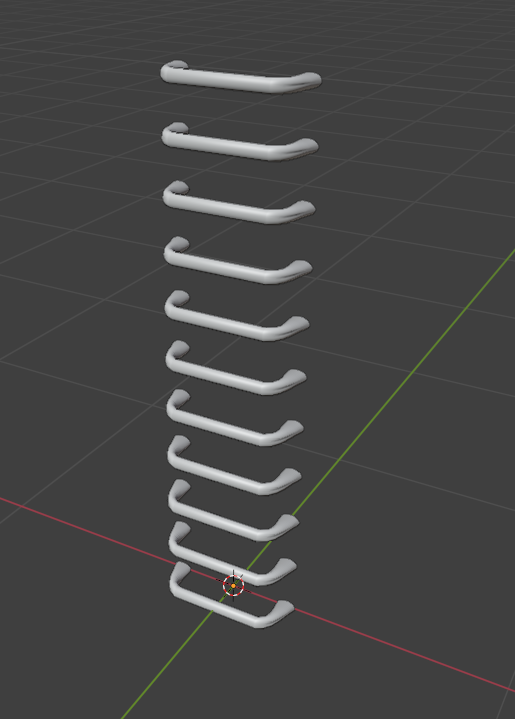

# Creating Ladder in Blender

___

## Need to know

- How to work in Blender
- How to work with Blender [X-Ray Addon](../../modding-tools/blender/blender-x-ray-addon-summary.md)
- What is a [Static Object](../../glossary/glossary.html#static-object)
- What is a [Game Material](../../glossary/glossary.html#game-material)

___

## About

Creating a ladder with climbing ability in Blender.

## Start

### Example 1

Let's create a ladder that can only be climbed from one side.

Here is an example of my ladder model.

All we need to do is add a plane to the entire area where the climbing possibility will be available.

:::note
Green color is the plane on which the player can climb.

Red - ladder model
:::

### Surface

Go to `Material Properties`.

Create a separate material for our plane.

In [X-Ray Engine: Material](../../modding-tools/blender/addon-panels/panel-material.md) for plane (fake ladder) choose:

#### Shader

Choose any [Engine Shader](../../glossary/glossary.html#engine-shader) for Static Object. ([list of all Engine Shaders](../../references/shaders/shaders-list/engine-shaders-list.md))

#### Compiler

Any [Compiler Shader](../../glossary/glossary.html#compiler-shader). ([list of all Compiler Shaders](../../references/shaders/shaders-list/compiler-shaders-list.md))

#### Material

Select a suitable [Game Material](../../glossary/glossary.html#game-material) that has the `Climable` flag checked. Example `materials/fake_ladder`. ([list of all Game Materials](../../references/materials/materials-list.md))

### Example 2

If your ladder doesn't have a border where you can climb. For example, a ladder like this.

Then assign to ladder material the Game Material where the `Climable` flag is enabled (`materials/fake_ladder` as example).

## Finish

Go to `Object Properties`.

In [X-Ray Engine: Object](../../modding-tools/blender/addon-panels/panel-object.md) select `Static` in the `Type` list.
