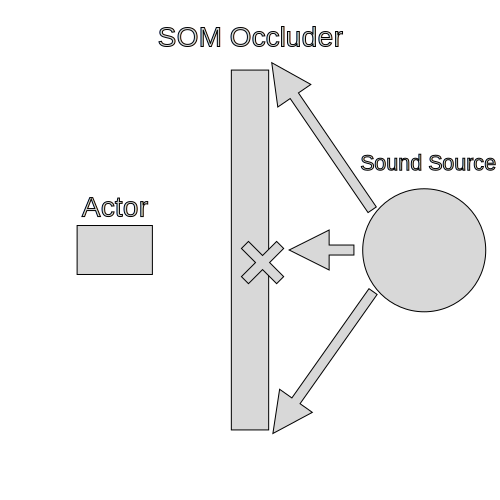
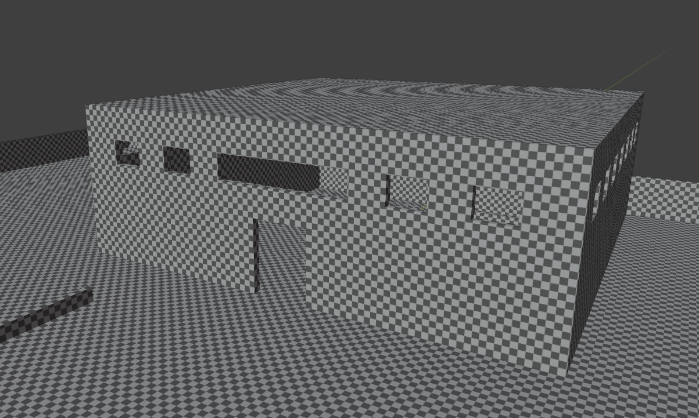
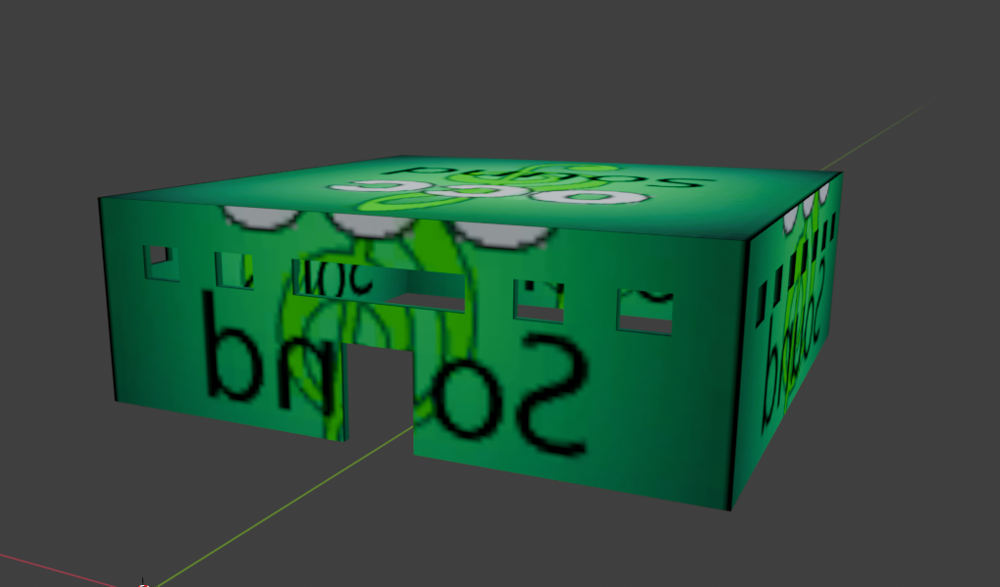

# Creating SOM Occluder in Blender

___

## Authors

TheParaziT

## Need to know

- How to work in Blender
- How to work with Blender [X-Ray Addon](../../modding-tools/blender/blender-x-ray-addon-summary.md)
- What is a [Static Object](../../glossary/glossary.html#static-object)
- What is a [Sound Occluder Mesh](../../glossary/glossary.html#sound-occluder-mesh)
- What is a [Game Material](../../glossary/glossary.html#game-material)

___

## About

SOM occluders are needed to calculate the occlusion of the sound, since the sound engine cannot do this in real time. The occlusion will be calculated depending on the `Game Material` settings.



## Start

For example, let's create such an object for a building with a large space inside.

Building example:



Create a mesh that simply represents your model.



```admonish tip
You can simply duplicate your model, but remember that the fewer polygons and the better SOM Occluder represents your model, the better.
```

## Surface

Go to `Material Properties`.

Create a separate material for our SOM occluder.

```admonish note
If you go to have the sound cut off on both sides, select the `2 Sided` flag
```

In [X-Ray Engine: Material](../../modding-tools/blender/addon-panels/panel-material.md) choose:

### Shader

Choose any [Engine Shader](../../glossary/glossary.html#engine-shader) for Static Object ([list of all Engine Shaders](../../reference/shaders/shaders-list/engine-shaders-list.md))

### Compiler

Any [Compiler Shader](../../glossary/glossary.html#compiler-shader) ([list of all Compiler Shaders](../../reference/shaders/shaders-list/compiler-shaders-list.md))

### Material

Choose or create new [Game Material](../../glossary/glossary.html#game-material) ([list of all Game Materials](../../reference/materials/materials-list.md))

```admonish note
In Game Material for the SOM occluder the main factor will be `Sound occlusion`
```

## Finish

Go to `Object Properties`.

In [X-Ray Engine: Object](../../modding-tools/blender/addon-panels/panel-object.md) select `Sound Occluder` in `Type` list.

This completes the setup of the SOM Occluder. You can safely export it in the model format you need.
