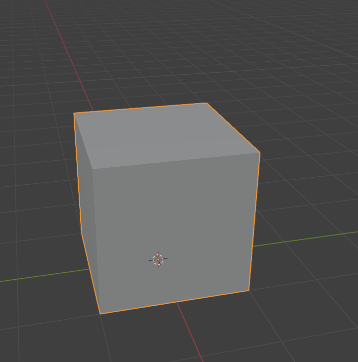
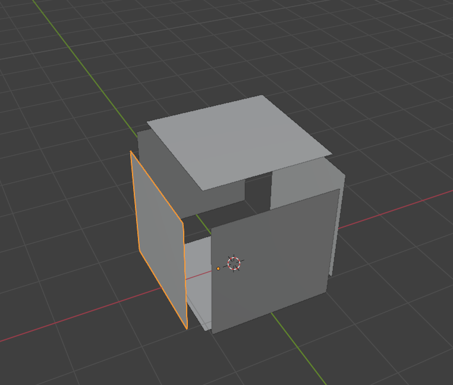
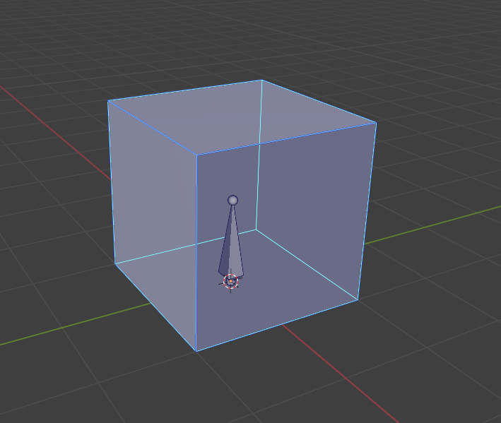
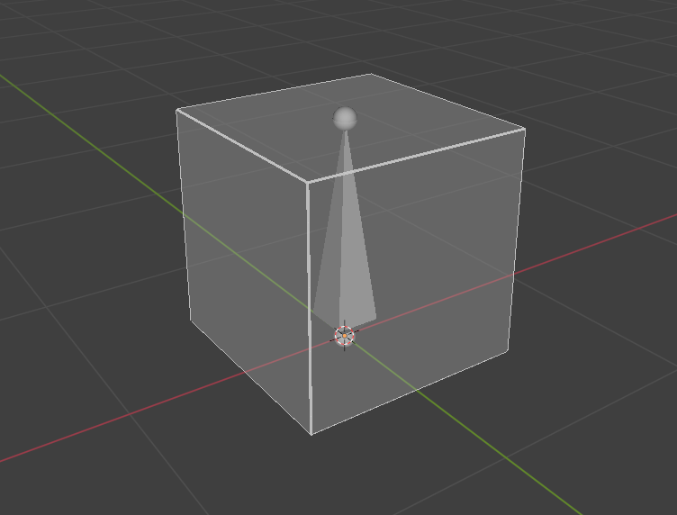

# Creating Breakable Object in Blender

___

## Need to know

- How to work in Blender
- How to work with Blender [X-Ray Addon](../../modding-tools/blender/blender-x-ray-addon-summary.md)
- What is a [Dynamic Object](../../glossary/glossary.html#dynamic-object)
- What is a [Game Material](../../glossary/glossary.html#game-material)

___

## About

In X-Ray, Dynamic Objects can be breakable if you set them up correctly.

## Start

First, we need a model that you have made or downloaded. I'll have one of those:

Choose your model and duplicate it.

:::note
When breaking a model, a separate, already broken model will be spawned. It can be divided parts of the original object or the same object, but with a different number of bones and Bone Shapes.
:::

:::note
Note that the broken parts should repeat the place as in the original model. For example:
:::

We need to divide the parts of the original model into component parts:

## Bones

[Main article: Setup Dynamic Object in Blender](setup-dynamic-object-in-blender.md)

For the main object we need to create a bone and a Bone Shape and Joint Type - Rigid.

For parts of the object we will also need to create our own bones and `Bone Shapes`.

## Surface

### Shader

### Compiler

### Material

[Main article: Creating Game Material in SDK](../materials/creating-game-material-in-sdk.md)

The main object needs to be matched with a suitable Game Material (where the `Breakable` flag is set). [List of all materials](../../references/materials/materials-list.md).

## Finish

At the end we should have two models. One for the unbroken version of the object, and one for the broken one.

Go to `Object Properties`.

In [X-Ray Engine: Object](../../modding-tools/blender/addon-panels/panel-object.md) select `Dynamic` or `Progressive Dynamic` in the `Type` list.
