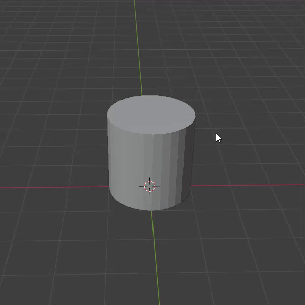
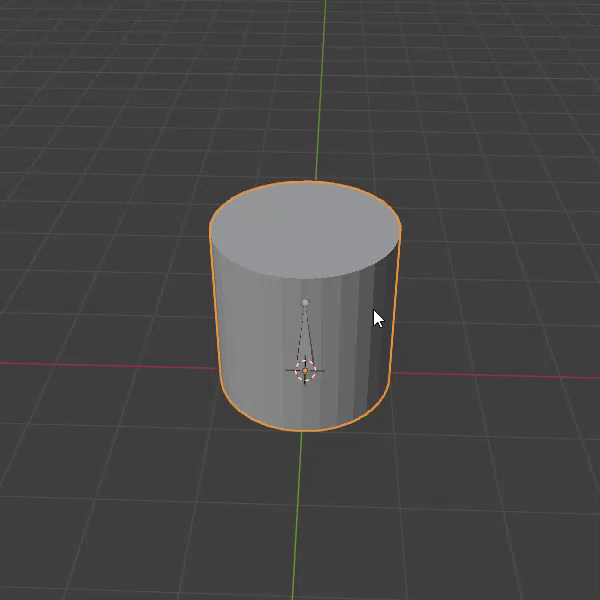
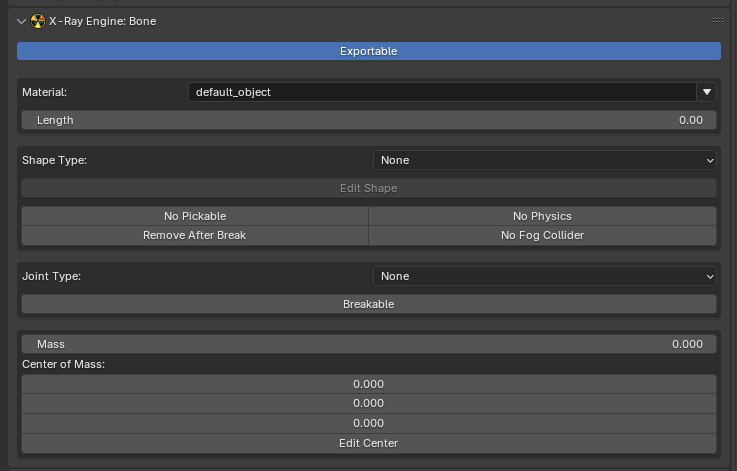
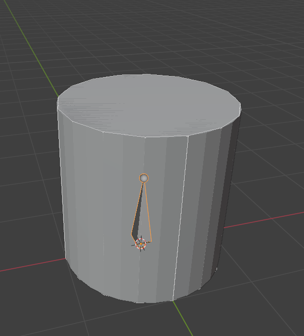

# Setup Dynamic Object in Blender

___

## Need to know

- How to work in Blender
- How to work with Blender [X-Ray Addon](../../modding-tools/blender/blender-x-ray-addon-summary.md)
- Familiarize yourself with the limitations and capabilities of the format [*.object](../../reference/file-formats/models/object.md) (because you may export to it more often than to [*.ogf](../../reference/file-formats/models/ogf.md)) to avoid errors
- Familiarize yourself with [Dynamic Object](../../glossary/glossary.html#dynamic-object) model type

___

## About

If you want your model to interact with the world and be subject to game physics, Dynamic Objects are just right for the task.

## Start

You must have a model downloaded or created by you.

You must have one UV map per mesh.

For my example, I'll have a model with this UV map.

Сreate an armature (`Shift + A` > `Armature`).

:::tip
When you create an armature, you may not see the created bone as it is rendered behind the object. To see the bone, go to `Object Data Properties` and in `Viewport Display` -> click the `In Front` checkbox.
:::

:::note
It is important to remember that in X-Ray, the bones act as a place to anchor the collision shape.
:::

Go to `Edit Mode` and name the bone as you wish.

## Binding

Next, we need to bind our model to the bone we created.

With the Shift key held down, select the model and then the armature.

Press `CTRL + P` -> `With Automatic Weights`.

:::tip
In Blender, there are several choices of binding methods. In this case (where there is a single bone), the method via `With Automatic Weights` is appropriate. For cases where there are more bones, you will most likely need manual binding via `Weight Paint` or other methods.
:::

## Bone

Select the bone and go to the `Bone Properties` tab.

We see the [X-Ray Engine: Bone](../../modding-tools/blender/addon-panels/panel-bone.md) section.

The desired field is `Shape Type` (where you choose the type of shape (for collision)).

From the whole list, our object is more suitable for the `Cylinder` type. Let's choose it.

Next, click the `Edit Shape` button to check and edit the Shape itself.

:::tip
To see `Bone Shapes`, go to `Object Data Properties`. In [X-Ray Engine: Armature](../../modding-tools/blender/addon-panels/panel-armature.md) -> `Display Bone Shapes`.
:::

My model fits quite nicely into the Bone Shape.

Next, choose [Rigid](../../glossary/glossary.html#rigid-joint) in `Joint Type`.

## Surface

Navigate to `Material Properties`.

In [X-Ray Engine: Material](../../modding-tools/blender/addon-panels/panel-material.md) you need to choose:

### Engine

Choose Engine Shader for Dynamic Object

### Compiler

### Material

Choose Game Material for Dynamic Object

:::note
Since the object is dynamic, you need to choose the right Engine Shader and [Game Material](../../reference/materials/materials-list.md) for Dynamic Objects!
:::

## Finish

Go to `Object Properties`.

In [X-Ray Engine: Object](../../modding-tools/blender/addon-panels/panel-object.md) select `Dynamic` or `Progressive Dynamic` in the `Type` list.

This completes the setup of the Dynamic Object. You can safely export it in the model format you need.
