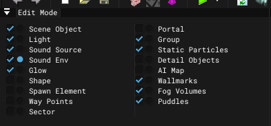
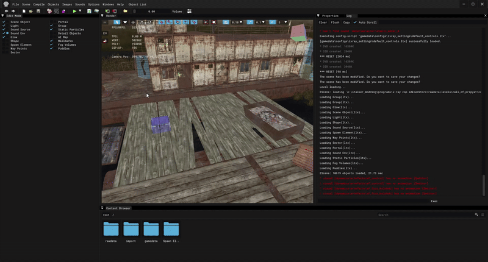
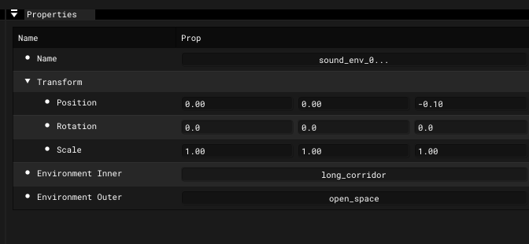

# Creating Sound Environment in SDK

___

<Authors
  authors={["theparazit"]}
  size="medium"
  showTitle={true}
  showDescription={true}
/>

## Need to know

- How to work in [SDK](../../modding-tools/sdk/README.md)
- What is a [Sound Environment Object](../../glossary/glossary.html#sound-environment-object)

___

## About

`Sound Environment Object` is needed to create zones with special sound distribution properties, as the sound engine is not able to do this in real time.

## Start

Open [Level Editor](../../modding-tools/sdk/level-editor/level-editor.md).

In the [Edit Mode](../../modding-tools/sdk/level-editor/windows/edit-mode.md) window, select `Sound Env` .

Next, in the [Render](../../modding-tools/sdk/level-editor/windows/render.md) window enable the Add mode and click the left mouse button in the same window. The object should be added.

In the [Properties](../../modding-tools/sdk/level-editor/windows/properties.md) window, you are left to setup the object.

