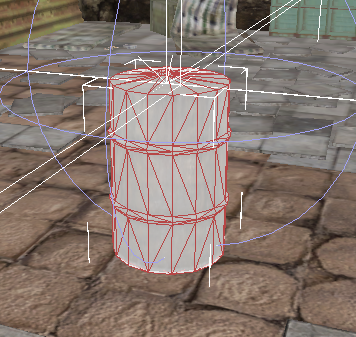
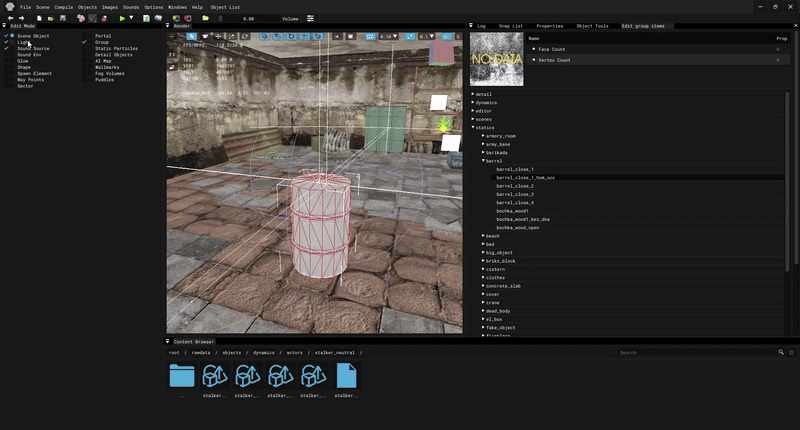
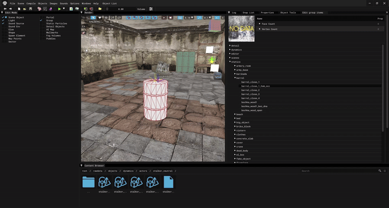

# Creating and Placing Group in SDK

___

<Authors
  authors={["theparazit"]}
  size="medium"
  showTitle={true}
  showDescription={true}
/>

## Need to know

- How to work in [SDK](../../modding-tools/sdk/README.md)
- What is a [*.group](../../references/file-formats/models/group.md)

___

## About

Groups in the SDK are useful because you can combine several types of objects into one group and easily place them in a level (e.g. a light source and a model, a crate spawn element and a crate model, etc.).

## Creating group

For example, let's make a group of a [Static Object](../../glossary/glossary.html#static-object), its [HOM Occluder](../../glossary/glossary.html#hierarchical-occluder-mesh), a [Sound Source](../../glossary/glossary.html#sound-source-object) and a [Light Source](../../glossary/glossary.html#light-source-object).

Open [Level Editor](../../modding-tools/sdk/level-editor/README.md).

I added a static barrel model and its HOM Occluder with the same coordinates to the level.
Then I added a sound and light source.

:::note
Before creating a group, you need to select the desired objects in their category. For example, if you put two Static Objects, they should be selected in their `Scene Object` category, the same for other types of objects.
:::

In the [Edit Mode](../../modding-tools/sdk/level-editor/edit-mode.md) window, select `Group`.
Open the [Object Tools](../../modding-tools/sdk/level-editor/object-tools.md) window. In it, click `Commands` -> `Group`.

Here you can also setup the group (in the [Properties](../../modding-tools/sdk/level-editor/properties.md) and [Object Tools](../../modding-tools/sdk/level-editor/object-tools.md) windows), ungroup it or save it.

## Placing group

To place an already prepared saved group on a level, select `Group` in the [Edit Mode](../../modding-tools/sdk/level-editor/edit-mode.md) window, go to [Object Tools](../../modding-tools/sdk/level-editor/object-tools.md) in `Current Object`, click `Select ...` and select the desired group. Then in the [Render](../../modding-tools/sdk/level-editor/render.md) window select `Add Mode` and add your group to the scene.

