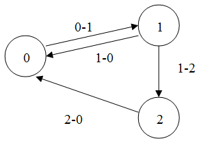

# A-Life (AI)

___

> Important note, these articles were written a long time ago (approximately before Shadow of Chernobyl was released) and may not reflect the current state or principles of A-Life in Anomaly. So for example the FSM was only used by mutants in the release version of the game.

## About

A-Life uses [GOAP](#goap), [FSM](#fsm-finite-state-machines) and [MG](#mg-motivational-graphs)

### GOAP

[Goal-Oriented Action Planning (GOAP)](https://alumni.media.mit.edu/~jorkin/goap.html) - an AI design technique in which a chain of behaviors of agents (NPCs, abstract entities, "living" obstacles) is automatically selected in real time to satisfy a goal. Thus, more variability of action and unpredictability is added. It is essentially similar to theorem proving methods, but simpler, because of the specifics of its application in games (see AI Game Programming Wisdom 2 for a detailed description).

For GOAP, we need to define a representation of the world in terms of an object. Each property of the world representation must be evaluated by an evaluator. Each object action has a list of preconditions and effects, i.e., what we expect from the action; in addition, each action has its own weight. Based on this information, having the current state of the world and the target state (i.e., the state of the world in which some of its properties have some values), we can construct a sequence of actions of the shortest weight that will move the world from the current state to the target state. An action can occur several times in the constructed sequence. If at given parameters the sequence cannot be constructed, the previous sequence of actions is executed.

#### Implementation details

In the GOAP game implementation, the size of the world representation is not limited, since only those properties of the world that are necessary to find the optimal solution are evaluated when constructing the sequence of actions. After the sequence is constructed, only the first action of the sequence will be executed until the goal changes or the current state of the world changes. If the sequence is rebuilt and its first action is not the same as the previous one, the finalize method is called for the previous one and the initialize method for the new one. The execute method is called to perform the action. If with the given parameters the sequence cannot be built, a warning about this is written to the log, along with a dump of the current state of the world (or rather, only those properties of the world that have been evaluated when finding the sequence) and the target one. The action itself may not be atomic. Thus, it is possible to build hierarchical GOAP models

> Dmitry Yasenev 02.04.2004

___

### FSM (Finite State Machines)

Finite State Machines (FSM) are a common and convenient technique for programming the behavior of bots (NPCs) in computer games.

The FSM is based on the principle that at any given moment the NPC is in some well-defined state. Such states are a finite number, and all of them are known in advance. For example, the states of the bot can be: doing nothing, walking the route, playing sound or animation. A special state is when the NPC is under the control of the game's AI.

An NPC can go from one state to another after meeting some transition condition. When specifying a transition condition from state A to state B, we actually define under what conditions the transition from one state to another will be performed. At that, transition from B to A requires defining its own transition condition. If the transition condition between any two states is not set, the transition is considered impossible.

The FSM structure can be represented as an oriented graph, whose vertices (circles) are states, and edges (arrows) are transition conditions.

#### Example

|||
---|---|
| States | 0 – soldier's state under the control of the AI  1 – the soldier says "stop, I'll shoot!"  2 – the soldier says "gone bastard" |
| Transition conditions | 0-1 – soldier sees actor for the first time  1-0 – soldier finished saying the phrase "stop, I'll shoot!" and sees the actor  1-2 - soldier finished saying the phrase "stop, I'll shoot!" and lost sight of the actor  2-0 - soldier finished saying the phrase "gone bastard". |

> Yuri Dobronravin 01.11.2003

___

### MG (Motivational Graphs)

Motivational Graphs is a decision-making method described in AI Game Programming Wisdom 2, which, according to the authors, is something between Decision Trees and Neural Networks.

The essence of the method is that decision-making is based on NPC motivations, including mutually contradictory ones. Let there be several motivations. Each motivation can have sub-motivations. All motivations make up a motivational graph. This graph is oriented and is structurally very similar to a tree. The difference from a tree is that several nodes can have the same children, moreover, several tree roots are possible. The leaves of our graph, i.e. nodes that have no sub-motivations, set goals for NPCs. So the task of MG is to find out WHAT to do, while the task of GOAP is to find out HOW to do it.

So how does MG choose which goal an NPC should fulfill? To do this, we go through all the roots of the graph (i.e. nodes that have no incoming edges), giving them initial weight 1. All other nodes have initial weight 0. Then each root (based on some considerations) distributes its weight to all its submotivations (this may cause "energy" leakage, i.e. the distributed weight may be less in total than the initial weight). We continue this procedure recursively for the children of the root until we get to the leaves of the graph. Each time one of the motivation branches arrives at them, the weight is summed up. Eventually, after the weight propagation procedure is complete, we choose the leaf of the graph that has gained the maximum weight.

> Dmitry Yasenev 2004

___

## Sources

- [GOAP](https://xray-engine.org/index.php?title=Goal-Oriented_Action_Planning)
- [FSM](https://xray-engine.org/index.php?title=Finite_State_Machines_(%D0%BA%D0%BE%D0%BD%D0%B5%D1%87%D0%BD%D1%8B%D0%B5_%D0%B0%D0%B2%D1%82%D0%BE%D0%BC%D0%B0%D1%82%D1%8B))
- [MG](https://xray-engine.org/index.php?title=Motivational_Graphs_(%D0%BC%D0%BE%D1%82%D0%B8%D0%B2%D0%B0%D1%86%D0%B8%D0%BE%D0%BD%D0%BD%D1%8B%D0%B5_%D0%B3%D1%80%D0%B0%D1%84%D1%8B))
