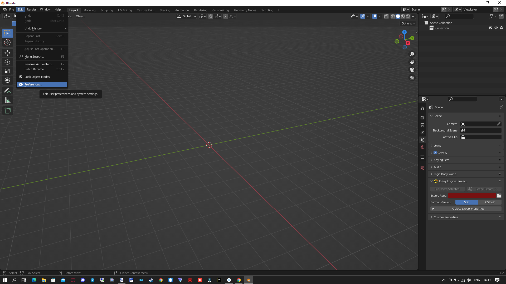
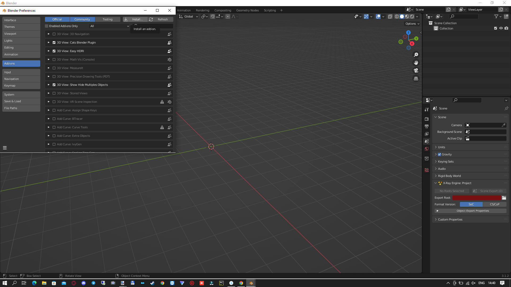
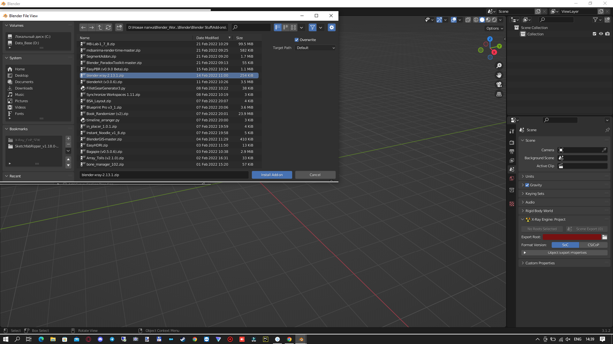
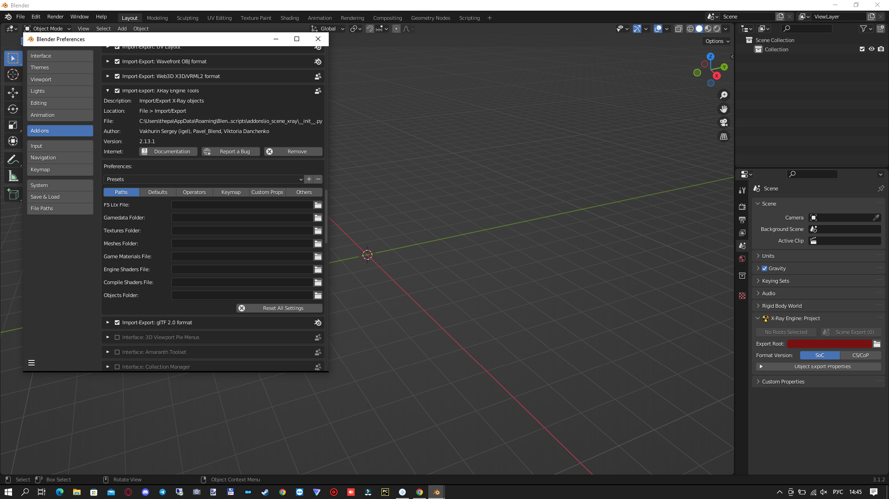
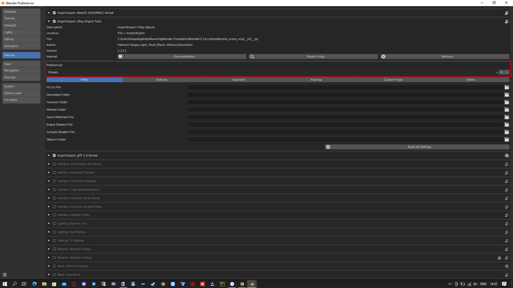
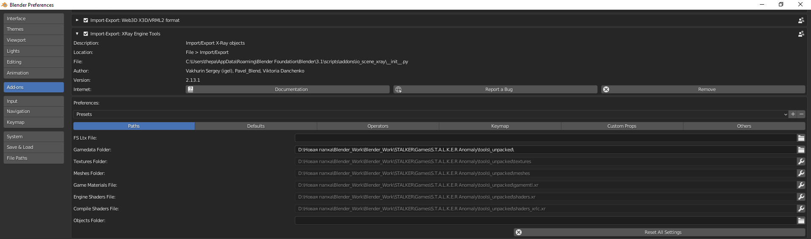
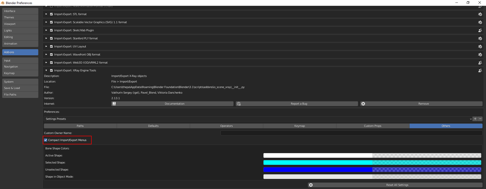
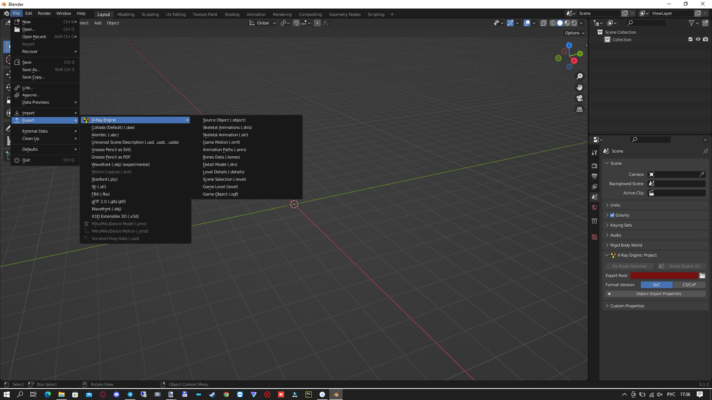

# Addon installation and setup

___

[Download the latest version of the addon](https://github.com/PavelBlend/blender-xray/releases)

Go into Blender. Click "Edit" > Preferences ()

Add-ons > Install ()

Сhoose the downloaded version of the addon ().

Blender will then notify you that the addon has been successfully installed.

___

# Setup

Find the installed addon in the list of addons.

In order to start setting up and using the addon, you need a little theory.

## Presets

Addon settings presets. Intended to save settings, with the ability to switch between them. To create a new preset, you must first configure the addon settings and then click the button to the right with the plus () sign. In the window that appears, specify the name of the preset and click OK. To delete a preset, select it from the list and click on the minus () button.

## Path Settings

These settings specify paths to external files or directories of X-Ray Engine or X-Ray SDK.It is possible to set paths automatically, based on a single parameter. For example, if you specify the gamedata folder in the Gamedata Folder parameter, empty paths (except, fs.ltx File) will be filled in automatically. Automatically filled paths have text (auto) at the end of the name. To change the path manually, you have to click on the button with a wrench (). The wrench button will disappear and the folder icon button will be displayed instead. You can then open the file browser using the folder button. In the browser, select the desired folder or file. Or you can change the path in the text box by typing it in from the keyboard. If the path is set manually, its value will not be changed automatically by the addon. To return the automatic path indication, you need to clear the path input field.

Example Path Settings:

- [About the required paths can be found here](../blender/addon-settings-options/pathes.md)

- [Advanced Settings](addon-settings-options/index.html)

- [More Details (Addon Wiki)](https://github.com/PavelBlend/blender-xray/wiki/Preferences#paths-settings)

Once the paths are installed, the setup is pretty much complete. Already at this stage you can work.

___

## P.S 

For even more comfortable work it is recommended to go to the tab "Other" and check the box "Compact Import/Export Menus".

If this option is enabled, the import/export menu will keep the operators in a compact form and will be grouped in one X-Ray submenu.

