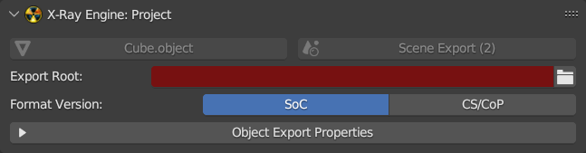
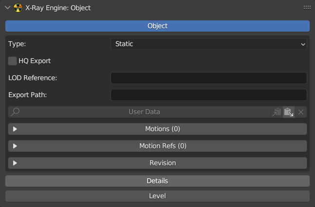
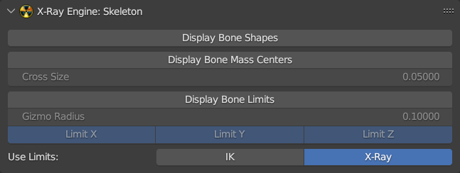
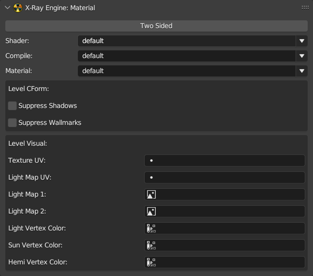
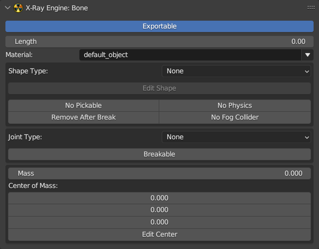

# Panels

## Scene Properties

### X-Ray Engine: Project

| Button | Description |
---|---|
| Export Root | The root folder for export |
| Format Version | Soc  CS/CoP |
| Export Motions | Export Motions |
| Texture Names from Image Paths | Generate Texture Names from image paths (by substact \<gamedata/textures> prefix and \<file-extension> suffix) |

___

## Object Properties

### X-Ray Engine: Object

#### Object

<table>
	<tbody>
		<tr>
			<td rowspan="7">Type</td>
			<td>Custom</td>
			<td></td>
		</tr>
		<tr>
			<td>Sound Occluder</td>
			<td></td>
		</tr>
		<tr>
			<td>Multiple Usage </td>
			<td></td>
		</tr>
		<tr>
			<td>HOM</td>
			<td></td>
		</tr>
		<tr>
			<td href=https://igigog.github.io/anomaly-modding-book/terminology/terminology.html#progressive-meshes>Progressive Dynamic</td>
			<td></td>
		</tr>
		<tr>
			<td>Dynamic</td>
			<td></td>
		</tr>
		<tr>
			<td>Static</td>
			<td></td>
		</tr>
	</tbody>
</table>

| Button/Checkbox | Description |
---|---|
| HQ Export | Enable HQ Export |
| LOD Reference | LOD Reference Path |
| Export Path | Export Path to rawdata folder |

#### Details

| Button | Description |
---|---|
| No Waving |  |
| Min Scale |  |
| Max Scale |  |
| Detail Index |  |

#### Level

<table>
	<tbody>
		<tr>
			<td></td>
			<td>Type</td>
			<td>Description</td>
			<td></td>
			<td></td>
			<td></td>
			<td></td>
			<td></td>
			<td></td>
			<td></td>
		</tr>
		<tr>
			<td rowspan="19">Type</td>
			<td>Level</td>
			<td></td>
			<td>Source Path</td>
			<td></td>
			<td></td>
			<td></td>
			<td></td>
			<td></td>
			<td></td>
		</tr>
		<tr>
			<td rowspan="6">Visual</td>
			<td></td>
			<td>LoD</td>
			<td></td>
			<td></td>
			<td></td>
			<td></td>
			<td></td>
			<td></td>
		</tr>
		<tr>
			<td></td>
			<td>Tree Progressive</td>
			<td></td>
			<td></td>
			<td></td>
			<td></td>
			<td></td>
			<td></td>
		</tr>
		<tr>
			<td></td>
			<td>Tree Static</td>
			<td></td>
			<td></td>
			<td></td>
			<td></td>
			<td></td>
			<td></td>
		</tr>
		<tr>
			<td></td>
			<td>Progressive</td>
			<td></td>
			<td></td>
			<td></td>
			<td></td>
			<td></td>
			<td></td>
		</tr>
		<tr>
			<td></td>
			<td>Hierrarhy</td>
			<td></td>
			<td></td>
			<td></td>
			<td></td>
			<td></td>
			<td></td>
		</tr>
		<tr>
			<td></td>
			<td>Normal</td>
			<td></td>
			<td></td>
			<td></td>
			<td></td>
			<td></td>
			<td></td>
		</tr>
		<tr>
			<td rowspan="2">Portal</td>
			<td></td>
			<td>Sector Front</td>
			<td></td>
			<td></td>
			<td></td>
			<td></td>
			<td></td>
			<td></td>
		</tr>
		<tr>
			<td></td>
			<td>Sector Back</td>
			<td></td>
			<td></td>
			<td></td>
			<td></td>
			<td></td>
			<td></td>
		</tr>
		<tr>
			<td rowspan="10">Light Dynamic</td>
			<td></td>
			<td>Controller ID</td>
			<td></td>
			<td></td>
			<td></td>
			<td></td>
			<td></td>
			<td></td>
		</tr>
		<tr>
			<td></td>
			<td>Light Type</td>
			<td></td>
			<td></td>
			<td></td>
			<td></td>
			<td></td>
			<td></td>
		</tr>
		<tr>
			<td></td>
			<td>Diffuse</td>
			<td></td>
			<td></td>
			<td></td>
			<td></td>
			<td></td>
			<td></td>
		</tr>
		<tr>
			<td></td>
			<td>Specular</td>
			<td></td>
			<td></td>
			<td></td>
			<td></td>
			<td></td>
			<td></td>
		</tr>
		<tr>
			<td></td>
			<td>Ambient</td>
			<td></td>
			<td></td>
			<td></td>
			<td></td>
			<td></td>
			<td></td>
		</tr>
		<tr>
			<td></td>
			<td>Range</td>
			<td></td>
			<td></td>
			<td></td>
			<td></td>
			<td></td>
			<td></td>
		</tr>
		<tr>
			<td></td>
			<td>Falloff</td>
			<td></td>
			<td></td>
			<td></td>
			<td></td>
			<td></td>
			<td></td>
		</tr>
		<tr>
			<td></td>
			<td>Attenuation 0</td>
			<td></td>
			<td></td>
			<td></td>
			<td></td>
			<td></td>
			<td></td>
		</tr>
		<tr>
			<td></td>
			<td>Attenuation 1</td>
			<td></td>
			<td></td>
			<td></td>
			<td></td>
			<td></td>
			<td></td>
		</tr>
		<tr>
			<td></td>
			<td>Attenuation 2</td>
			<td></td>
			<td></td>
			<td></td>
			<td></td>
			<td></td>
			<td></td>
		</tr>
	</tbody>
</table>

___

## Object Data Properties (Object and Bone)

### X-Ray Engine: Mesh

| Button | Description |
---|---|
| Visible |  |
| Locked |  |
| SGMask |  |

### X-Ray Engine: Skeleton

| Button | Description |
---|---|
| Display Bone Shapes | Display Bone Shapes |
| Display Bone Mass Centers | Display Bone Mass Centers |
| Display Bone Limits | Display Bone Limits |

| Use Limits Button | Description |
---|---|
| IK |  |
| X-Ray |  |

___

## Material Properties

### X-Ray Engine: Material

| Button | Description | Note |
---|---|---|
| Two Sided | The model will be drawn from the outside and inside | The number of polygons in the model is doubled |
| Shader | Shader | [list of shaders](../../shaders/shaders-list/shaders-list.md) |
| Compile | Compile Shaders | [list of compile shaders](../../shaders/shaders-list/compiler-shaders-list.md) |
| Material | Material | [list of materials](../../shaders/shaders-list/materials-list.md) |
| Suppress Shadows |  |  |
| Suppress Wallmarks |  |  |
| Texture UV |  |  |
| Light Map UV |  |  |
| Light Map 1 |  |  |
| Light Map 2 |  |  |
| Light Vertex Color |  |  |
| Sun Vertex Color |  |  |
| Hemi Vertex Color |  |  |

___

## Bone Properties

### X-Ray Engine: Bone

| Button | Description | Note |
---|---|---|
| Exportable | Will the bone be exported | - |
| Lenght |  |  |
| Material | Material | [list of materials](../../shaders/shaders-list/materials-list.md) |
| Shape Type | Shape type for ODE | None  Box  Sphere  Cylinder |
| Edit Shape | Edit Shape | - |
| No Pickable | <acronym title="Simply put, a beam of light (read DXR for more)">Ray Query Rays</acronym>, hit wallmarks will skip this element |  |
| No Physics | The engine ignores shape physics | - |
| Remove After Break | When activated, all dice will start a "remove_time" timer from the config, after which the object will be removed | Example: wooden box |
| No Fog Collider | Volumetric Fog will ignore this element | - |
| Joint Type | Joint type for ODE | None  Rigid  Cloth  Joint  Wheel  Slider |
| Breakable |  |  |
| Mass | Bone mass | - |
| Center of Mass | Center of Mass | - |
| Edit Center | Edit Center of Mass | - |
