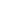

# Creating animations for the camera in Blender

## Beginning

- First, familiarize yourself with the [.anm](../main-folders-and-files/file-formats/anm.md) file format.

## Creating animations

Create or enter a Blender scene.

In the N-panel in the X-Ray panel in the Add rollout, click on the "Add X-Ray Camera"() button.
After adding the blank, set the Order of rotation to YXZ.
Next, select the camera and in the Object Constraint Properties() panel add the "Child of" modifier( and choose a blank as the target. Set Transform Rotation X coordinates to 90.
Everything is ready, you can create animations.

## Export

To export the animation you need to select the blank through the export operator in .anm and export.