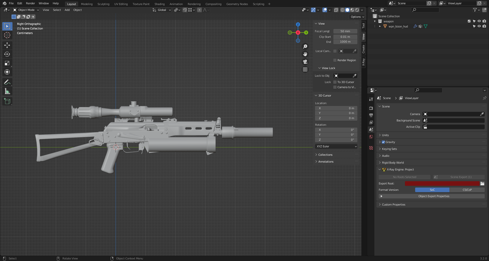
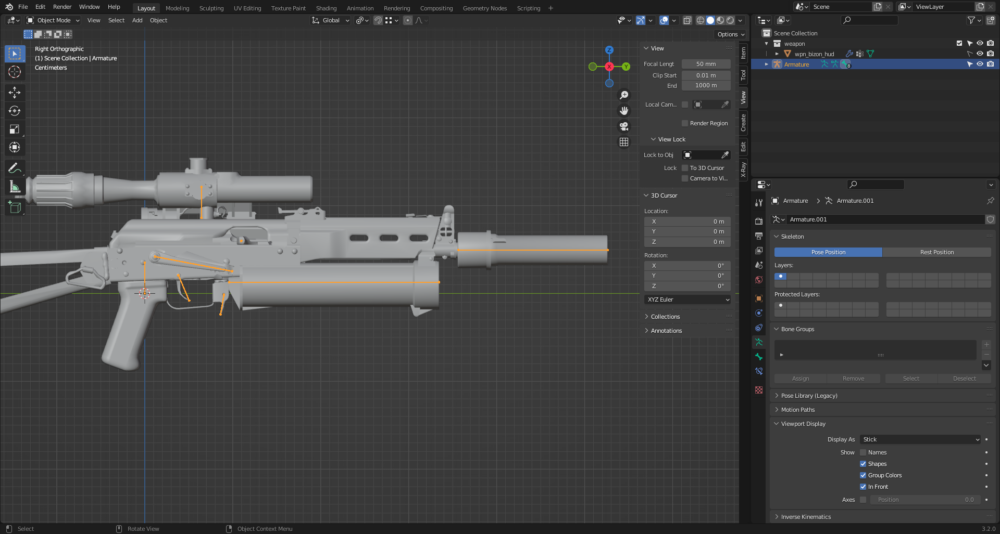
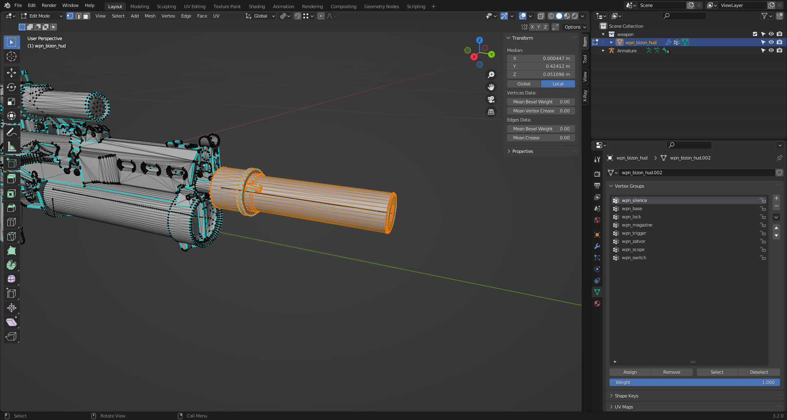

# Creating an animation in Blender for a HUD object

This article is about creating an animation for a HUD object in Blender 

## Beginning

- First, check out the information about [.omf](../main-folders-and-files/file-formats/omf.md), .skl, and .skls formats (you can do that [here](../main-folders-and-files/file-formats/index.html))
- To create the animation, we need a hand model (can be found in this [article](../modding-tools-and-resources/resources/models-objects-locations.md)) and a model of what will be animated in the hands (a weapon or other object).

### Preparing the HUD model

[Create](creating-model-in-blender.md) or download our model, which will be the HUD.

Next, you need to make a rig of the model, if it does not exist.

### Rig Creating

How to create a basic skeleton was described in this [article](creating-model-in-blender.md) (creating bones and Vertex Groups)

A more advanced skeleton and rig should be made for this model.

- P.S.
For a more convenient arrangement of the bones, it is advisable to check the "In Front" checkbox in the Object Data Properties () in the Viewport Display section.

The resulting skeleton:

Note that you need your own bones for the attached silencer and scope.

Next, you need to assign Vertex Groups to the selected vertices. 

And rename the bones as the desired Vertex Groups.

- P.S.
At this stage, I suggest duplicating the main skeleton bone of the HUD object (if it is a weapon, for example) and naming it differently. Assign this bone as the parent to all bones. And set the previous main bone as its parent. Due to these manipulations it will be fashionable to rotate weapon regardless of lead_gun position.

- P.P.S.
To set the location where the magazine should be located, you can do the following:
- Duplicate the store bone and name it *_rig.
- Duplicate it again and name it *_place
- Remove the parent of these bones.
- Select the main magazine bone and add the Copy Trasform modifier. Select the *_rig bone as the target. Then select *_rig and add the Copy Transform modifier to it, and select *_place as the target.
This will allow you to correctly attach the store bone to its original position without damaging the skeleton hierarchy for the HUD model.

In order for the animation to apply to all bones, it is necessary to set their Bone Groups. You can do this by going to the Object Data Properties tab. In the Bone Groups section, create a new group and add the HUD object's bones to it.

After all the steps, you need to add a Bone Group for the bones of the HUD object. To do this, go to the Object Data Properties tab and create a new group in the Bone Groups list, adding all the bones of the HUD object there.

Import hands for animation (Append Button). Select the main bone of your skeleton for the HUD object and add the Copy Transform modifier via the Bone Constraint Properties tab. Select the hand skeleton and lead_gun bone as the target. Be sure to check that your object HUD bones are equal to 1!

### Creating Animations

Switch to the Animation tab and start building the original pose. Selecting the dice you want, move them around until you get the final look.
Don't forget to put the keys (Button I > Location & Rotation).
Select the arm skeleton and name your animation (for example*_idle). Do the same for the object's HUD skeleton. This is necessary because in the game HUD hands and object use their own bones and their own animations. Don't forget to put a "Fake User" for the animation!

Next comes the easiest and at the same time the most difficult - the creation of animations.
Copy the idle animation and start creating!

- P.S.
For easier animation, I suggest creating help bones.
Copy a weapon bone, remove the parent and add the "Child of" modifier to that bone and select some functional bone (e.g. a bolt bone) as a target. Further, if you add "Copy Transform" modifier to the hand bone and select the Help bone created as a target, it will simplify the animation (for example, when the bolt moves, the hand will move too).

- P.P.S.
The engine currently supports the following list of animations (First write the hand animation, and after the comma the weapon animation (if no weapon animation is specified, the idle weapon animation will be used)):

 - Idle animations

|  | Description |
---|---|
| anm_idle | Idle animation |
| anm_idle_empty | Idle animation of an empty magazine |
| anm_idle_aim | Idle animation in aiming mode |
| anm_idle_g |  |
| anm_idle_g_aim |  |
| anm_idle_w_gl |  |
| anm_idle_w_gl_aim |  |

 - Motion animations

|  | Description |
---|---|
| anm_idle_aim_moving | Animation in the aiming mode when moving |
| anm_idle_aim_moving_crouch | Animation in the aiming mode when moving in a crouch |
| anm_idle_moving | Motion animation |
| anm_idle_moving_empty | Motion animation with an empty magazine |
| anm_idle_moving_crouch_g_aim |  |
| anm_idle_moving_crouch_w_gl_aim |  |
| anm_idle_moving_g |  |
| anm_idle_moving_g_aim |  |
| anm_idle_moving_w_gl |  |
| anm_idle_moving_w_gl_aim |  |
| anm_idle_sprint | Running animation |
| anm_idle_sprint_empty | Running animation with an empty magazine |
| anm_idle_sprint_g |  |
| anm_idle_sprint_w_gl |  |
| anm_hide | Hiding animation |
| anm_hide_empty | Hiding animation with an empty magazine |
| anm_hide_g|  |
| anm_hide_w_gl |  |
| anm_show | Show animation |
| anm_show_empty | Show animation with an empty magazine |
| anm_show_g |  |
| anm_show_w_gl |  
| anm_bore | Boredom Animation |

- Weapon animations

|  | Description |
---|---|
| anm_reload | Reloading (When there is still a bullet in the chamber) |
| anm_reload_empty | Reloading |
| anm_reload_g | Animation of the underbarrel grenade launcher reload |
| anm_reload_w_gl |  |
| anm_shots | Shot animation |
| anm_shot_l | Last shot animation |
| anm_shots_g | Underbarrel grenade launcher shot animation |
| anm_shots_w_gl |  |
| anm_switch | Animation of switching to alternate firing mode |
| anm_switch_g | Animation of switching to underbarrel grenade launcher firing mode |

Once created, you can export the animations to .skl, .skls, or [.omf](../main-folders-and-files/file-formats/omf.md)
To export animations to [.omf](../main-folders-and-files/file-formats/omf.md) you must:
Go to the Object Properties of the selected skeleton (Hands or HUD object)
In the tab X-Ray Engine: Object expand the list of Motions.
In the Dependency field select the skeleton you need (on which skeleton the animation needed for the skeleton will be played)
Press the plus button to add the field, in it you need to select the desired animation and add all the animations you need for the selected skeleton. 
Then you can export the [.omf](../main-folders-and-files/file-formats/omf.md) by pre-selecting the skeleton with animations.
