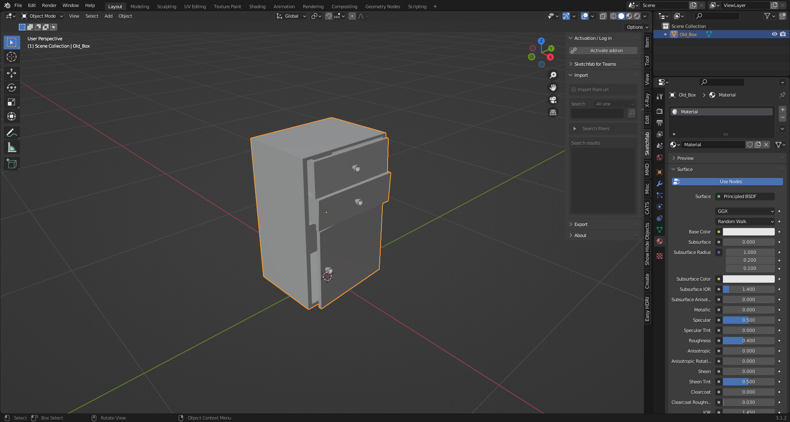
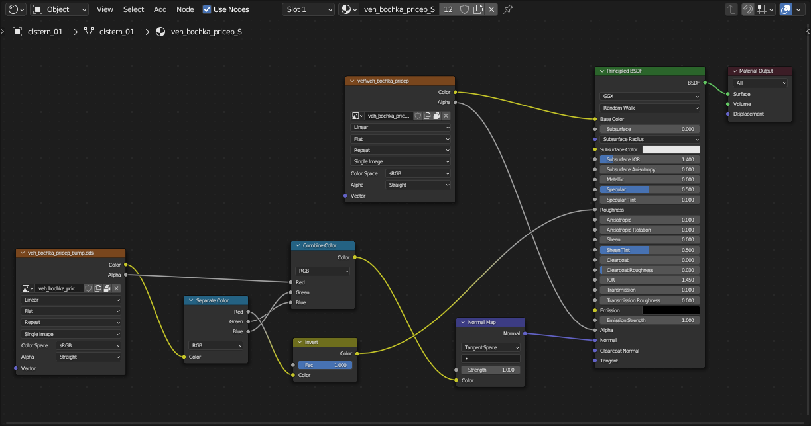
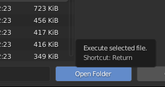
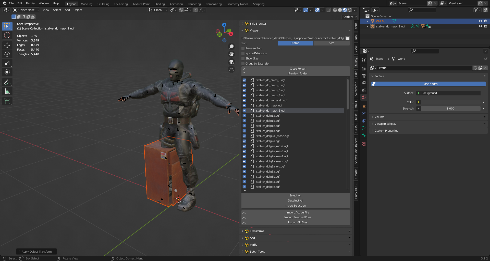
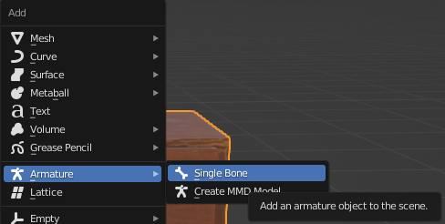
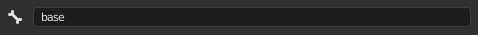
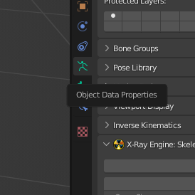
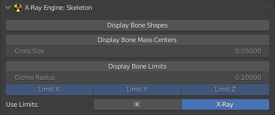

# Creating and setting up a model in Blender
## Article author: TheParaziT

This article is about creating a model and setting its parameters

## Beginning

- First, familiarize yourself with the limitations and capabilities of the format [.object](../main-folders-and-files/file-formats/object.md) (because you may export to it more often than to .ogf) to avoid errors.
- This article will talk about textures, [read an article about creating and preparing them](../texturing/сreating-and-preparing-textures.md).

## Start

Create or download the model you like.
Do a UV if you don't have one.

- ### Example:

The model itself:

UV:

## Texturing

Textures can be created in any program designed for this purpose, or you can simply download them.

Texture:

- ### Important note about texture maps
In STALKER, due to its outdated engine, only the following texture maps are used:
- Color Map ([.dds](../main-folders-and-files/file-formats/dds.md))
- Normal Maps (For Stalker they are used as [.bump](../main-folders-and-files/file-formats/bump.md) and .bump#) (The Blender X-Ray addon does not support the [.bump](../main-folders-and-files/file-formats/bump.md) format at this time (June 2022).)

So extra texture maps will have to be removed.

Here you need to add your created texture in [.dds](../main-folders-and-files/file-formats/dds.md) format

As a result, in the Shader Editor () our textures should look something like this:

So after creating the model, the UV and the texture, the setup within Blender begins.

## Setting up

- ### Model
First, the model itself will be set up. 
You can start by positioning the model over the origin in this way (The ["Drop It"](https://andreasaust.gumroad.com/l/drop_it) addon for Blender is highly recommended for such actions):

Then apply the coordinates with Ctrl + A > All Transform. This will allow us (if you make for example a model library or work in the SDK) to drag and drop the model on the surface.

Next, we need to adjust our model to normal size (so that in the game it will not be big or small).
If you have already set up the addon to use and set up the necessary paths to your folders, you need to import into the scene model of some person from the game.

In the N-panel there should be a tab "X-Ray" in it unfolds the list "Viewer" and we click "Open Folder" ().

The Blender explorer window opens. Go to our unpacked folder with the game files (namely the folder "meshes").
The character models you need are in the "actors" folder, where the faction models are sorted into folders. [(More about the structure of folders, main folders and files you can learn here)](../main-folders-and-files/README.md)

Select the desired folder with the models and click on the "Open Folder" button.

Depending on the size of the models in the "Viewer" folder may take longer to open than you would like.
So, "Viewer" is open. It shows all the models in the selected folder. Click on any model and a character model appears in front of us.

Next, we just adjust our model to acceptable proportions.
After fitting, apply transformations to our object.

In the "Viewer" list, we can click on "Close Folder ()" to close the list of models and the model imported to us in the scene, too.

At this point we have to decide what type of model we want to use (static, dynamic, or something else). (About the types of objects you can learn here)

It was decided to make our object dynamic. 
To do this, you need to create a bone and a vertex group (so that the bone can affect exactly the vertices you choose).
Select the model and go to the "Object Data Properties" () tab
Image here

Under "Vertex Groups" click on the plus sign (a "Vertex Group" with the name "Group" () will be added) and double-click to rename it (the same name will be needed later for the bone).

The next step is to create a bone (Shift + A > Armature > Single Bone).

To make our model move like the bone in the future, we need to rename the bone to the name that was given to "Vertex Groups" ().

And rename the bone.

Select our object and switch to "Wireframe" mode () ("Z" Button) (this is optional).
Place the bone approximately in the center of the model.

After that, apply the bone transformations (Ctrl + A > All Transform).

Select our model and go to the "Modifier Properties" () tab.

In the "Modifier Properties" () tab, add the "Armature" modifier () (Add Modifier > Armature (under Deform)).

The modifier has the following necessary items:
- Object ()
- Bind to () Vertex Groups

In the "Object" () field, select our bone (you can select it with the pipette ()).
Also make sure that the checkbox next to "Vertex Grops" () is marked.
These actions allowed us to bond our object and bone, but not yet to the fullest extent.

Next step:
First select the bone after selecting the model, press Ctrl + P. A list appears, select "Bone".

This allowed the bone and the model to be fully bonded together. Now when the bone moves or rotates, the model will move with it.

Now you have to set the bone properties for X-Ray.

- ### Bone
Select the bone and go to the "Bone Properties" () tab.

We see the "X-Ray Engine: Bone" section.

The desired field is "Shape Type" (where you choose the type of shape (for collision)).
From the whole list, our object is more suitable for the "Box" type. Let's choose it.
Next, click the "Edit Shape" button to check and edit the Shape itself.
The Shape of the bone appears and it does not match the model.
The Shape that just appeared is automatically selected and the "Object Properties" () tab is selected.

In the same tab we see the "X-Ray Engine: Edit Helper" section with three buttons:

-  Apply Shape (accepts changes to the bone shape)
-  Fit Shape (Blender will automatically try to fit the Shape to the size of the object)
-  Cancel (closes Shape editing mode)

Apply Shape may help in some cases, but not in this one (nothing happens after clicking), so you need to adjust the Shape manually.
Without going into Edit mode, press "S" and start fitting the Shape to the model. Going through the combinations, changing the shape of the Shape, we finally create an acceptable Shape.

Accept the transformation by clicking on "Apply Shape" (). Everything will apply and the Shape will disappear.
To check the correctness of the shape and adjust the center of mass for the bone, go to the "Object Data Properties" () panel.

Here we see the "X-Ray Engine: Skeleton" section and the two buttons we need:
- Display Bone Shape
- Display Bone Mass Centers

Click on "Display Bone Shape" to check the bone shape

And by clicking on "Display Bone Mass Centers" a Cross will appear, from which you can understand where the center of mass is located (its mass and location can be edited in the tab "Bone Properties").

Go to the "Object Properties" () tab.
Here you will find the "X-Ray Engine: Object" section.

Remember that our object, by design, will be dynamic, so click on the button "Object", where we select the type "Dynamic".

The editing of the bone parameters is finished, the next step is Materials.

- ### Material
Select our object and go to the "Material Priperties" () tab.

Here we see the name of our material and a list of "X-Ray Engine: Material" with lots of items.

There is no point in telling about each point here. (there is a separate section in the book)

The items we need for the model now are:

- Shader (This setting is responsible for the appearance of the surface.)
- Compile (Here are descriptions of the settings that the level geometry compiler uses)
- Material (Here you can select surface materials)

Select the shaders you want. ([For a list of shaders, click here](../main-folders-and-files/shaders-list/README.md))

Well, the model setup in Blender is done. Congratulations!

## The final stage

- ### Checking the model for correct operation
To check the model you can go the following ways:

- Load the model into the SDK and check
- Export the model in .ogf format and add it directly to the game.
- [Check the model and parameters through third-party programs](../modding-tools/modding-tools.md)