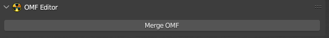
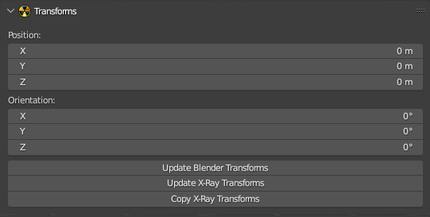
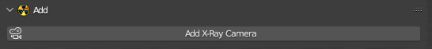

# Side Panels

## Motions Browser

> Allows viewing and importing various animations

## Viewer

> Allows viewing and importing of various models

## OMF Editor

> Allows merging of several [.omf](../main-folders-and-files/file-formats/README.md#omf-open-motions-format) files into a single file

## Transforms

> Allows editing the position and orientation of the model

## Add

> Creates a camera on the scene with a choice of type (HUD or Level)

## Verify

> Various verifications critical for X-Ray

## Props Tools

> Allows quick editing of various model components

## Batch Tools

> Allows editing of various material settings, baking, etc.

## Custom Properties

> Needed for custom properties

## Armature Tools

> Allows to modify and edit various properties of bones and armatures

## Rig

> ?

## Update

> Allows to check for addon updates

## Import

> Import

## Export

> Export
