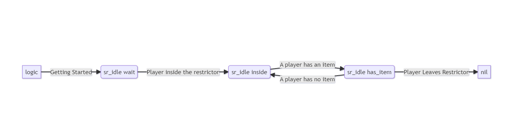
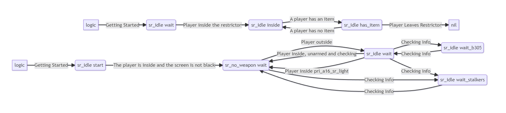

# Algoritm of Logic

"Executable" files, game logic files, unlike config files, have an algorithm that, if I'm not mistaken, is based on scripts. The peculiarity of such files is that they have a "Current Section", which defines reactions to interactions with it. Let's look at an example:

```ini
[logic]
active = sr_idle@wait

[sr_idle@wait]
on_actor_inside = sr_idle@inside

[sr_idle@inside]
on_info = {=actor_has_item(item)} sr_idle@has_item

[sr_idle@has_item]
on_info = {!actor_has_item(item)} sr_idle@inside
on_actor_outside = nil
```

The implementation is not the most correct, there are better options, but it is made specifically for demonstration purposes. If we visualize it, it will happen:



Depending on the condition, the object will change the current section. Thus, if the current section is `sr_idle@has_item` then parameters such as `sr_idle@inside` will be ignored, because information about other sections besides the current one will be unknown.

> Important! Information about the current section is stored in game saves. So if you change your logic, you should check if it works in a new game, because the object will keep its state during the save, and this means the previous sections before the current one will not be called (as shown above, from the `sr_idle@has_item` section the object will never return to the `sr_idle@wait` section). This is implemented in the [load_obj](https://github.com/AziatkaVictor/ltx-support/blob/7392d65c6663abfe3715c3f2666c10d3bbfa9087/data/scripts/xr_logic.script#L1400-L1453) script from `xr_logiс.script`.

Now let's look at more complex logic:

```ini
[logic]
active = sr_idle@start

[sr_idle@start]
on_actor_inside = {!black_screen} sr_no_weapon@wait

[sr_idle@wait]
on_actor_inside = {=check_smart_alarm_status(pri_a16:normal) !actor_has_weapon} sr_no_weapon@wait
on_info = {=actor_in_zone(pri_a16_sr_light)} sr_no_weapon@wait
on_info2 = {+pri_a28_update_task_cover_strelok -pri_a28_actor_in_zone_stay} sr_idle@wait_stalkers
on_info3 = {+pri_b305_third_cam_go -pri_b305_quest_completed} sr_idle@wait_b305

[sr_no_weapon@wait]
on_actor_outside = sr_idle@wait
on_info = {+pri_a28_update_task_cover_strelok -pri_a28_actor_in_zone_stay} sr_idle@wait_stalkers

[sr_idle@wait_stalkers]
on_info = {+pri_a28_actor_in_zone_stay} sr_idle@wait

[sr_idle@wait_b305]
on_info = {+pri_b305_fifth_cam_end} sr_idle@wait
```

This logic is already bigger than the previous one, but it is not complicated at all, if you understand it. Now let's visualize it:



I think some have already noticed that there is no action here at all, just changing sections. I dare to suggest that it is about the type of section `sr_no_weapon`, which prohibits the player to get the weapon. Depending on the condition, the restrictor prohibits or allows the player to take out a weapon, based on the current section.

___

## Sources

[GitHub Wiki Page](https://github.com/AziatkaVictor/ltx-support/wiki/Algoritm-of-Logic)
