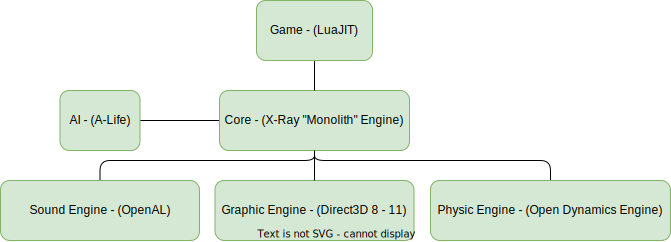

## Engine (X-Ray "Monolith" Engine)

___

## About
The X-Ray "Monolith" Engine is an Anomaly mod open for use and modification. It is based on X-Ray 1.6 Engine (CoP), Open X-Ray Call of Chernobyl Edition and some modifications.

## Some Main Features

- 64-bit Engine
- In-game editing tools
- Support for 21:9 ratio
- Multi threaded sound prefetching
- Discord integration
- Animation Blending/Movement layers

## Engine Structure

___

## Sources
[Source Code](https://bitbucket.org/anomalymod/xray-monolith/)