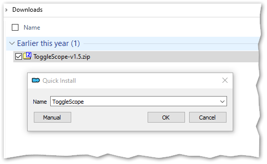
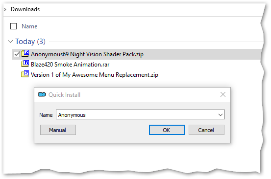
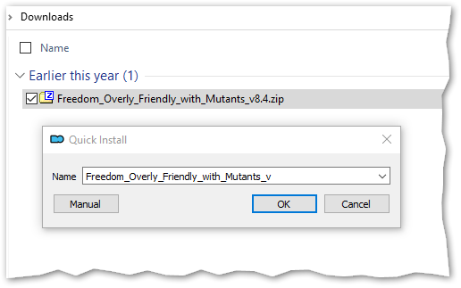

# Package Naming Guidelines
**for Mod Organizer 2**

_by [Ishmaeel](https://github.com/Ishmaeel)_

While installing an addon, Mod Organizer 2 can extract a nice name from the archive (ZIP/7Z/RAR):


For more advanced scenarios, you will eventually want to graduate to more powerful [installer formats](addon-installers.md), but for simpler addons, the least you can do for your users is naming your archive package in a way that can be parsed easily by MO2.

Follow these simple rules and your MO2-using audience will be thankful for it:

- Give a descriptive name to your addon.
- Do not separate words with the dash (`-`) character. Use underscores (`_`) or spaces. [^note1].
- Do not use numbers or special characters in the name.
- Separate extra information such as the version number with a dash (`-`).
- Do not change the name part in subsequent updates. Only change the “version” part.

> [^note1] We recommend underscores because spaces have other issues in file names and URLs.
You can also consider using [PascalCase](https://en.wikipedia.org/wiki/Camel_case).

MO2 will scan the file name for numbers, special characters and dashes. Everything after the first special character will be stripped by MO2, leaving behind only the name part. If you use any special characters in the middle of your addon name, MO2 Quick Installer will fail to parse the name nicely and your users will end up having to edit the name manually.

Here is a sample file name that includes extraneous information such as a version number:

```plaintext
ToggleScope-v1.5.zip
```

This is how MO2 will parse the name during installation:



See that everything after and including the dash is stripped away, leaving only the base name.

> **Note**: MO2 will not use the version part at all. The version displayed in the application will be the addon installation date. If you want to explicitly specify a version number, you will have to use [BAIN or FOMOD formats](addon-installers.md).

As long as you adhere to a similar format and keep the same base name, MO2 will recognize your update as belonging to the same addon and offer to upgrade it in place:


**_The End._**

---

_**Author's note:** The original version of this guide was motivated by annoyance and frustration, so it ended up missing its mark._

_For Anomaly Modding Book, we decided to put the actual advice up front in a sarcasm-free manner. You now know the Right Way™ to name your packages._

_If you are not interested in the rationale behind this advice or if you do not appreciate snark, feel free to stop reading here._

_For a tongue-in-cheek accounting of commonly made mistakes and their grave consequences, proceed to the next section where we have guidance on..._

# How to Annoy MO2 Users
**A Reverse Naming Guide for Mod Authors**

Most people do not know about this, but some players prefer to use an obscure piece of software called [Mod Organizer 2](https://github.com/ModOrganizer2/modorganizer). In this section, we outline some simple mistakes you can make while naming your addon packages for maximum annoyance of those wimpy persons.

> Please note that this guide does not cover how to annoy Chads™ who extract addons directly into gamedata, overwriting whatever is already there. Frankly, we do not think it is even possible to agitate such strong-willed individuals.

MO2 is a tool that _enables_ those who are _unable_ to keep track of several thousand files. It even tries to _cleverly_ extract the addon name from the package name during installation. 

Thankfully, there are many ways to subvert this clever mechanism.

## Are You an Alpha Modder?

_Disclaimer:_ If your addon has a single-word name such as **Addon.zip** or a zero-effort name such as **New folder.rar**, then this guide has nothing to offer you. You are already at the zenith of human annoyingness. You are the ultimate expert in irritation. We bow before your magnifinuisance.

## Inconsistent Naming

The fastest takeaway that you can get from this guide is **using a different file name** for every single release. If you can bring yourself to do this, you don’t need to read the rest of this guide. By default, MO2 will install every new version as a separate addon and the users will have to type out a name for every upgrade if they want a proper installation. It is a surefire way to piss of MO2 virgins:


However, if you feel this one is too on the nose and are looking for subtler ways to annoy the unwashed masses, please read on.

## All Characters Are Equal but Some Characters Are More Equal than Others

As mentioned previously, MO2 tries to be _clever_ when determining the addon name from the installation package. To do this, MO2 treats some characters differently. 

- **Alphabetic characters, underscore and space:** These are considered “good” characters for addon naming. 
MO2 will extract all good characters to generate the default name until it finds a junk character. The rest of the file name is ignored.
- **Numeric characters, dash and other symbols:** These are considered “junk” characters. 
MO2 does not think an addon name should include these. Anything after (and including) the first junk character is chopped off and thrown to pigs.

> **Note:** MO2 allows the addon names to _start with_ junk characters, but as soon as a _good_ character is encountered, this exception flies out the window for the rest of the name.

## Dashes as Word Separators

You will remember that everything after the first dash is simply discarded. As such, you can use dashes to separate words, so that MO2 will mutilate the awesome and catchy name that you picked for your addon:


This also goes for other fancy characters such as apostrophes. Go crazy!

## Numerals: Up Front!

What if you have a cool nickname such as **Blaze420** and want to flaunt it in your addon? What if you like putting release numbers first, such as **Version 1 of My Awesome Menu Replacement.zip**? That’s right. Your MO2-wielding audience is in for a surprise:



> Note that if the file name starts immediately with a number, this trick will not work. 
But good news! If you can manage to sneak the version number in with a cheaty name like **1.0.3_Brooks_Plagiarized_Audio_Patcher.zip**, your anemic MO2 users will now have to edit the name with **every**. **single**. **update**!

## Pedantic Versioning

You are releasing a new update for your addon with features, bugfixes and localizations? Do not forget to prepend your version number with the letter “**v**” so that everybody understands what follows is THE VERSION NUMBER! 

This will instantly make your file names look more enterprisey and sophisticated:



See the little “_v” at the end? It’s there to bug the MO2-weaklings. Mission accomplished!

**Bonus:** For even more devious fun, try separating your version number with an “underscore”, so it gets treated as part of the name:


## How Not to Smell Like a Filthy UX Hipster

Most importantly, avoid giving descriptive names to your addons and never adhere to a consistent naming format.

If you fail to include one or more of the mistakes above with your every release, those MO2-crybabies will have a minimal-friction upgrade experience, and we don’t want that to happen, do we? 
