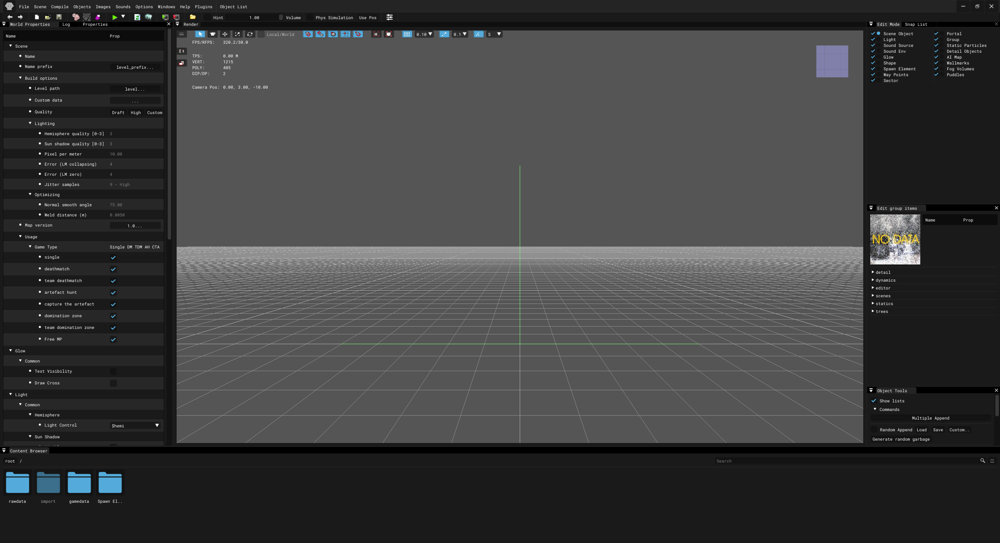

# Mapping

___

**This specific guide will teach you how to make custom maps for Anomaly or for Call of Pripyat and its mods. Do note that this is a very difficult process as the original SDKs and even forks of them are quite uncomfortable to use.**

**They say curiosity killed the cat, so if you're really curious, this guide is for you:**

___

Now, you'll have to get the SDK editors and set them up. I'll explain that right now.
Firstly, there are three leaked SDKs and the official SDK which was released by GSC Game World back in 2010.

Those are:
* X-Ray SDK 0.4 for Shadow of Chernobyl
* X-Ray SDK 0.5 and 0.6 for Clear Sky
* X-Ray SDK 0.7 for Call of Pripyat

**None of these SDKs are backwards compatible with each other, keep that in mind!**

As you can see, the X-Ray SDK 0.5 and X-Ray SDK 0.6 is only for Clear Sky, but the difference between the X-Ray SDK 0.5 and X-Ray SDK 0.6 is that X-Ray SDK 0.6 adds volumetric smoke support for those who wish to add it in their levels.

These SDKs are really a pain to use and aren't very bug-free, nor stable, this is why SDK forks of them exist, but most are for the X-Ray SDK 0.7 as that's the most popular official SDK out of them all. 

That doesn't mean X-Ray SDK 0.5/0.6 and X-Ray SDK 0.4 have no forks, they do, but they're not as advanced as the forks based on X-Ray SDK 0.7.

**Since most of you are going to be future mappers making new levels for Anomaly or for Call of Pripyat and its mods.**

**In this guide, I'll be specifically guiding you about the X-Ray SDK 0.7 and I'll be using its fork called IX-Ray SDK, which is not fully finished, but good enough for creating new levels and has LOTS of Quality of Life features, and I highly recommend you to use it as well, even though it's optional.**

It is based on the [IX-Ray Engine 1.6](https://github.com/ixray-team/ixray-1.6-stcop) platform, a fork of the X-Ray Engine 1.6.02, which is used in Call of Pripyat.

After explaining the existing SDK versions and the diffences between them, it's now the time to install and use the X-Ray SDK 0.7! 

I'll cover the installation guide for the vanilla SDK 0.7 and the fork of it which I'll be using.

## Installation guide for the original X-Ray SDK 0.7 without any of its forks

[Get the original X-Ray SDK 0.7 here!](https://www.moddb.com/games/stalker-call-of-pripyat/downloads/x-ray-16-engine-sdk-v07)

Once you have downloaded the file, install the X-Ray SDK 0.7!

If you have installed it, you can skip the guide below if you are a masochist and wish to use the vanilla X-Ray SDK 0.7!

[Skip to the guide about the SDK editors](README.md#guide-about-the-sdk-editors)

## Installation guide for the IX-Ray SDK

For this, you'll need the original X-Ray SDK 0.7 and the full Call of Pripyat game data in order to utilize all of the SDK's features.

[Here's the download link of the recent official build released by the developers of this X-Ray fork!](https://drive.google.com/file/d/13kvLVdkPlVTF7T_4b_ipb-0OfRrF3Eqy/view)

Once you have downloaded, unextract it and it should look like this when opened.

Now, you'll have to drag all of the files inside into your root SDK folder, namely inside the **editors** folder.

**Replace ALL files if asked, DO NOT skip identical files instead of overwriting them, it CAN and WILL cause problems!**

To utilize all of the SDK's features, you'll need a fully unpacked Call of Pripyat game data and put it inside the SDK's **gamedata** folder. If you are doing this optional step as well, **DO NOT replace any files if asked!!!**

## Guide about the SDK editors

If you have installed the SDK sucessfully, regardless of which fork you installed, it should look like this from inside the SDK folder.

It looks confusing at first, but I'll explain what are these folders and what purpose do they serve:

* **help** is where you can learn how to use this SDK, however, some files are broken and most if not all of the working ones are in Russian.
* **scripts_plugins** contains Maya plugins that were used to export models from there into stalker format and a .bat file to launch a test map quickly.
* **sources** contains several files as some examples, but most are pretty useless.
* **editors** is where all of the SDK editors are stored at and its rawdata and game data folders.
* **map_compressor** contains a tool used to compress maps into .db format to reduce files sizes and for other benefits.

This is how it looks like inside the SDK editors folder.

**As you can see, there are multiple SDK editors included instead of just of the Level Editor, and that's because at once, you'll have to use these other SDK tools eventually, but I'll explain what are they used for and what does each folder serve its purpose.**

* **bin** is where all of the SDK's binaries are stored.
* **plugins** in my case is an IX-Ray SDK exclusive folder containing several useful plugins written in Python and Lua for texture work.
* **gamedata** is where all of the unpacked game files are located.
* **shortcuts** is where your SDK preferences are stored that.
* **rawdata** is where all of the SDK's content, textures, objects, level sources, and other stuff are stored at.

## Launching the Level Editor

There are also a lot of .bat files inside, which may look confusing, but these are shortcuts used to launch one of the SDK editors.

**Since we want to learn about mapping, we'll obviously run the .bat file that's gonna launch the Level Editor.**

It should look like this when the SDK has launched!

**It looks very scary at first, but that's normal, you can drag these windows around to your liking!**

Since I don't want to make this specific page super long, I'll specifically explain all of the SDK's windows on what are they used for and what do they do [here](../mapping/level-editor-tutorial.md)