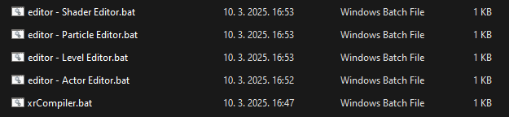
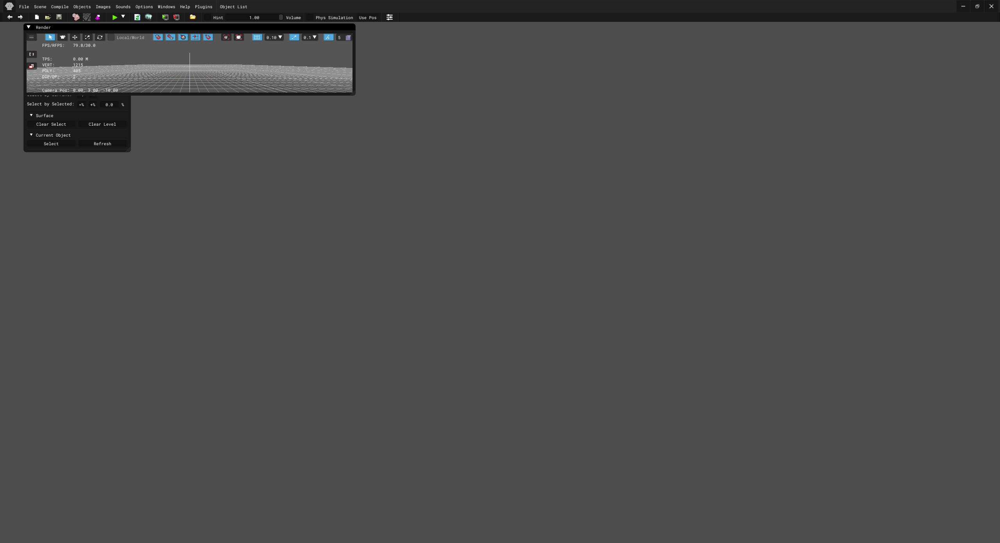
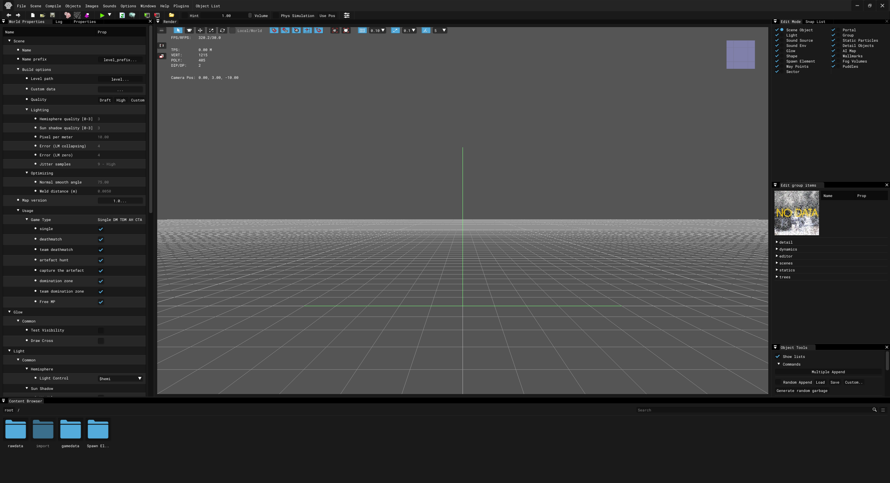

## The Level Editor

This page will teach you how to use the Level Editor and its tools.

**Before we get started, I'm assuming you've already read and understood the things I've wrote in the mapping introduction. If not, go read it [here](./index.md)!**

## Launching the Level Editor

To launch the Level Editor, we have to launch one of the .bat files which is included in every single SDK version. These are shortcuts into launching one of the SDK editors.

**It should look like this after opening the Level Editor for the first time!**

**After the Level Editor has been opened, it may look scary at first, but the IX-Ray Level Editor supports draggable windows, so you can drag them to your liking, including properties per window.**

**It's very confusing when you're using the Level Editor for the first time ever, but you'll get the hang of it when using it for a while.**

After adjusting the windows, I'll explain what each window does in depth and what purpose it serves, but firstly, we have to learn the basics of the SDK.

**To move around in all of the SDK Editors, we need to use these specific hardcoded keybinds:**

* Shift + Left Mouse Button to move vertically.
* Shift + Right Mouse Button to move horizontally.
* Shift + RMB and LMB to rotate the camera vertically and horizontally.

**Tip: You can simultaneously switch between keybinds on where to move, whether it'd be vertically, horizontally, or just to rotate the camera without having to release all buttons at once per action.**

**To see the log while using the Level Editor, hover your mouse to the "Windows" tab and click it and then tick on "Log". This is very helpful and it'll show errors in the log, such as wrong parameters of an object, and etc.**

**You can configure the properties of an object by ticking on "Properties" from the SDK's "Windows" tab and then selecting an object (applies for every Edit Mode type).**

Now that we know how to move around in the Level Editor and how to use some of its features, I'll talk about the SDK windows and what do they do.

## Edit Mode

The Edit Mode has seperate tabs each serving their own purpose and are important in a level. There are 16 different Edit Modes and one more which is an IX-Ray exclusive feature and it isn't supported in Anomaly.

* Scene Object
* Light
* Sound Source
* Sound Env
* Glow
* Shape
* Spawn Element
* Way Points
* Sector
* Portal
* Group
* Static Particles
* Detail Objects
* AI Map
* Wallmarks
* Fog Volumes
* Puddles (IX-Ray exclusive feature, it's not supported in Anomaly!!!)

**Scene Objects** are your primary static objects in a level. They essentially make up the entirety of a level and can use different types of [shaders](../shaders/shaders-list/shaders-list.md) and [compiler shaders](../shaders/shaders-list/compiler-shaders-list.md). They're NOT dynamic and for dynamic objects, you'd have to place them from Spawn Elements. They're stored in .object format and can be opened and used by most of the SDK Editors, including Blender, assuming you have PavelBlend's X-Ray tools plugin.

**"In group editable" (boolean value) is only available to objects that have been placed from the "Group" Edit Mode, which I will talk about later.**

* Reference - defines the object's model reference and you can change the reference to use a different object model.

* Surfaces - shows the object's meshes, followed by their textures, shaders, compiler shaders, game materials, etc.

* Texture - define's the texture image of an object's mesh.

* Shader - defines the shader of an object's mesh.

* Compiler Shader - defines the compiler shader specifically used by xrLC (xrLightCompiler - used to compile the geometry of a level) of an object's mesh. 

* Game Mtl - defines the material of an object's mesh.

* Action - reverts back the original parameters (configured in the Actor Editor), of every single mesh in an object.

**Note that when you're building a level, the SDK may give you an error telling you in the log that you have incorrect object parameters despite them being correct from the properties, and that's because the IX-Ray Level Editor takes object parameters from the Actor Editor into account, so you'll have to edit the object model and add proper parameters. It is always adviced to configure your objects in the Actor Editor.**

**Lights** also make up the entirety of a level. They can be dynamic or static.

Light types can be "Point" and "Is Spot Light" (only available from the Spawn Elements Edit Mode!!!)

* Color defines the light's color. It's controlled by RGB values.

* Brightness controls the overall brightness of a light.

In stalker, there are there light controls, those are:

* $static
* $hemi
* $sun

Light controls are essentially different types of light, $static is the most commonly used light control on static and dynamic lights, while $hemi is only used for brighetning up interiors, placing them at openings near the floor and increasing their intensity depending on how big the opening is. $sun is not needed to use in your everyday lights, it's most likely unused!

As for usages, those are:

* LightMap
* Dynamic
* Animated

Usages for lights can vary, but ticking on "LightMap" means that light will be used on lightmaps, and "Dynamic" if the light is able to cast dynamic shadows. Ticking on "Animated" doesn't seem to do anything and most lights don't use it at all, instead "Fuzzy" is used, which influences light brightness on the light randomly.

* Range defines the light's maximum range.

Attentuation is a light's advanced settings.

* Constant - controls the starting point of a light's flow. (float value - 0.0/1.0)
* Linear - controls the general light flow linearly. (float value - 0.0/1.0)
* Quadratic - controls the light flow exponentially. (float value - 0.0/1.0)
* Auto - sets the light flow depending if you clicked "Linear" and/or "Quadratic". **Constant** is also affected by it.
* Graphic - shows how the light flow looks like.

These options allow you to tink around with lights extensively instead of only being limited to a couple of options.

Fuzzy is a boolean value where it controls a light's brightness randomly.

* Count - how many light entities you want have per box/sphere
* Generate - generates a random position of light entities, whether you have 1 or 5.
* Shape - defines the shape of the main entity, it can only be a box and a sphere.
* Radius - controls how large the main entity is and how spread out the light entities are.

* Use in D3D - self-explanatory.

