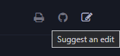
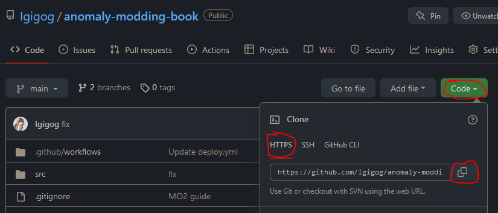
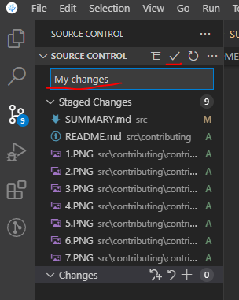
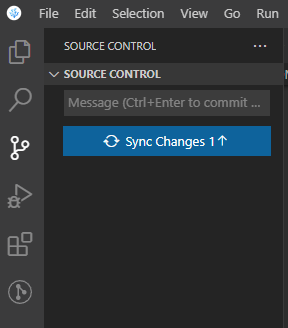

# Contributing

___

## Forward

For all of these methods you will need a github account. It's free and Microsoft has only barely begun to enshittify it.

Simple changes like correcting word choice, or adding a couple sentences to an existing guide can be done via the first method with no real knowledge of github or markdown. Changing formatting and adding links or images will require a familiarity with markdown, or a markdown editor. There are extensions for google docs that can export to markdown. [StackEdit](https://stackedit.io/) is an online markdown editor that will let you format text using normal word processor tools and dispaly both the raw markdown and the final file side by side and can be a nice way to learn markdown. Lastly the github web editor can be toggled back and forth between editing the raw mark down and previewing the final formatting, but lacks a spell check.

The book has advanced styling that can only be previewed using the third contribution method, anything you preview in a markdown editor or the web github editor will not look exactly like it will in the book.

The style sheet article includes some basic markdown tips and the structure article will tell you where you should put new files.

___

## First way to contribute

You can easily suggest edits by clicking on the button at the top right



It will simplify the process of forking the book the first time and submitting a pull request when you commit (save) your changes. It will load you into the github webeditor.  
___

## Second way to contribute

If you want to add entirely new articles via only a web interface (because you can't or do not want to install new software on your computer for instance) and don't mind that you won't be able to preview the exact way the file will look in the book then this section may be for you, but you should consider using the third method as it is the intended way to interface with the software that runs the book. Lastly the github web client doesn't have a way for you to save your work in progress without committing them which can be awkward (clutters up the commit history), this can mostly be gotten around by using one of the web markdown editors mentioned in the forward.

First you will need to fork the book, if you have already submitted simple changes via the first method this will already have been done. Otherwise you can follow these steps:

1. Go to the [main repo](https://github.com/Igigog/anomaly-modding-book)
2. Press the fork button

    

3. Create the fork

    

Next you need to navigate to the folder where your file will be created, see the Book Structure article. In the upper right of the window will be an add file button. You can upload a file you already have or create a new one directly.

If you create a new article, you need to add it to `src/SUMMARY.md` for it to be shown.

___

## Third way to contribute

This book is written using [mdBook](https://github.com/rust-lang/mdBook). To contribute to this book, you will need:

1. [mdBook](https://github.com/rust-lang/mdBook)
2. [git](https://gitforwindows.org/)
3. [GitHub](https://github.com/) account
4. (Optional) [VSCodium](https://vscodium.com/)

VSCodium or VSCode is highly recommended to use. Although it is optional, I will assume you are using it.

Below I describe the setup steps needed to run and contribute to this book. *__But before that, go and install VSCodium and Git__*.

## Forking book repository

Contributing to this book follows the standard "Pull Request" workflow. That basically means that you will have your own copy of the book, and you will ask us to pull your changes into the main repository.

Here is the overview of steps needed for contributing:

1. Copy ("fork") the main repository
2. Download your copy of repo
3. Add your changes to your copy
4. Upload your changes
5. Open the Pull Request to merge your changes into main repository

Welp, let's get started. I hope you already have a GitHub account.

### Forking

1. Go to the [main repo](https://github.com/Igigog/anomaly-modding-book)
2. Press the fork button

    

3. Create the fork

    

4. You're awesome

#### Downloading your repo

1. Open the folder you want to download into in VSCodium. In my case, it will be Desktop.

    

2. Open Powershell Terminal session
3. Copy the link to your repo.

    

4. Run the following command in your Powershell Terminal with your link instead of LINK.

    ```git
    git clone LINK
    ```

5. You're awesome.

#### Dependencies (Optional)

To run the local version you need to install dependencies. This can be done in different ways

1. `CTRL+Shift+B` -> `Install Rust`(Choose `Windows` or `Unix`) - To install Rust
2. `CTRL+Shift+B` -> `Install Dependencies` - Various necessary dependencies

Or

1. Download and install [Rust](https://www.rust-lang.org/tools/install)
2. Install the following dependencies:

- Preprocessor for mdBook to add Material Design admonishments

    ```bash
    cargo install mdbook-admonish
    ```

- Preprocessor for mdBook to add mermaid support

    ```bash
    cargo install mdbook-mermaid
    ```

- (Optional) Backend for mdBook which will check your links for you

    ```bash
    cargo install mdbook-linkcheck
    ```

#### Running local copy

1. `CTRL+Shift+B` -> `Build Local mdBook Server`

Or

1. Download latest mdbook from [Github Releases](https://github.com/rust-lang/mdBook/releases).
2. Drop `mdbook.exe` in the `dist` folder of your copy.
3. Run `run.bat`. In case it doesn't open by itself, open [localhost:3000](localhost:3000) in your browser.
4. Done. You're awesome.

```admonish warning
If you create a new article, you need to add it to `src/SUMMARY.md` for it to be shown.
```

#### Uploading your changes

1. Set your git up. Here's a great [guide](https://docs.github.com/en/get-started/quickstart/set-up-git)

2. Add your changes using VSCodium git tab. Open git tab, hover over "Changes" line and press "+".

    

3. Add a nice message and press "✔" to commit your changes

    

4. You should now be able to publish your changes

    

## Creating Pull Request

1. In main book repository, open "Pull Requests" tab and press "New pull request"

    

2. Press "compare across forks". Choose your repository and press "Create pull request".

3. You're awesome. Probably. Now ping Igigog#6387 in Discord to get your pull request reviewed.

4. Done. Your changes are added to the main book.
