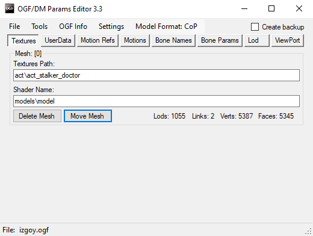

# OGF Editor by Valerok
## Program Developer: Valerok

## About
Modified tool for working with [.ogf](../../main-folders-and-files/file-formats/README.md) format

## Features

- Editing textures and model shaders
- Editing Userdata
- Editing Motion Refs
- Editing Bone Names
- Bone materials editing
- Editing Bone weights
- Editing center of mass of bones
- Editing model description
- View complete list of bones
- Integration with OGF Viewer (WIP)
- Saving [.ogf](../../main-folders-and-files/file-formats/README.md) in [.object](../../main-folders-and-files/file-formats/object.md), [.skl](../../main-folders-and-files/file-formats/README.md), [.skls](../../main-folders-and-files/file-formats/README.md), [.bones](../../main-folders-and-files/file-formats/README.md) formats
- Viewing the list of embedded animations
- Hotkeys
- Ability to write UserData and MotionRefs chunks (even if the model did not have them before)
- Editing the position and rotation of the bones
- Ability to remove unneeded Motion refs and Userdata chunks
- Fix Gunslinger models (models are fixed automatically when you save them)
- Tools for working with embedded animations
- Integration with [OMF Editor](omf-editor-by-valerok.md) for editing parameters of embedded animations

## Functionality

### Hotkeys

- F3 - Reload file
- F4 - Open file
- F5 or Ctrl+S - Save file
- F6 - Save as

### Buttons

- #### File Button

| Button | Description |
---|---|
| Load | Loads the selected .ogf |
| Save | Save .ogf |
| Save As | Save as .object, .skls, .skl or .bones |
| Reload | Reloads the program |
| Exit | Exits the program |

- #### OGF Info Button

Display information about the loaded OGF 

| Field | Description |
---|---|
| OGF Version | The .ogf version |
| Model Type | Model type |
| Source File | Source file |
| Converter |  |
| Creator | Creator |
| Editor | Editor |
| Export Time | Export Time |
| Creation Time | Creation Time |
| Modified Time | Modified Time |

- #### View Button

Opens the OGF View with the selected model

- #### Motion Tools Button

Becomes active only after switching to the Motions section.

| Button | Description |
---|---|
| Delete Motions\Return Last Motions | Deletes the list of animations\returns the last list of animations |
| Edit in OMF Editor | Editing Animations via OMF Editor (First, you must specify the path to the OMF Editor .exe) |
| Replace Motions | Replaces the list of animations with another |

### Checkboxes

| Field | Description |
---|---|
| Create Backup | Creates a backup file |

### Sections

- #### Textures

Section with texture and shader path editing

##### Set: [Texture number]

| Field | Description |
---|---|
| Texture Path: | Path to texture |
| Shader Name: | Shader |

- #### User Data

File with userdata

- #### Motion Refs

A field with paths for animation

- #### Motions

Displays animations that are built into the model

- #### Bone Names

Displays a list of bones and their number

- #### Bone Params

Editing the bone parameter

##### Bone id: [Bone number]

| Field | Description |
---|---|
| Bone Name | Bone Name |
| Parent Bone | Parent Bone |
| Material | Material |
| Mass | Mass |
| Center Of Mass | Center of mass |
| Position | Bone position |
| Rotation | Bone rotation |

## Sources
[Source Code](https://github.com/VaIeroK/OGF-tool)