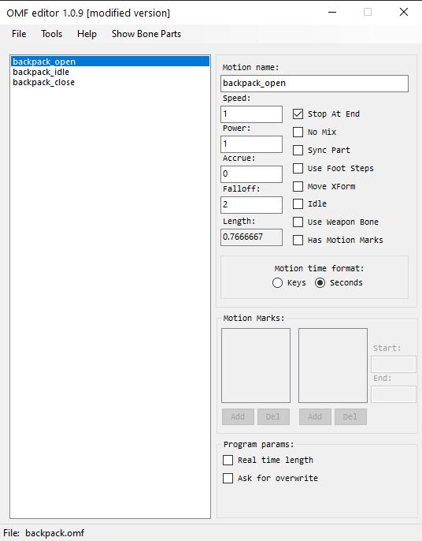

# Omf Editor by Valerok

## About:
Modified tool for working with [.omf](../main-folders-and-files/file-formats/omf.md) format.

## Features

- Multiple omf files
- Clone, delete, save selected animations
- Working with motion marks
- Working with flags
- Ability to save in skls, skl via
- Fix Gunslinger mod animations
- Displaying of bone parts animation, possibility to convert into ltx format for import into SDK
- Hotkeys
- A lot of bug fixes and crashes from the original version.
- Changing of name of bones
- Viewing of Bone parts

## Functionality

### Hotkeys

- F4 - Open file
- F5 and Ctrl+S - Save file
- F6 - Save as
- Delete - deletes selected animations

### Buttons

- #### File Button

| Button | Description |
---|---|
| Load | Loads the selected .omf |
| Save | Save .omf |
| Save As | Save as .omf or .skls or .skl |

- #### Tools Button

| Button | Description |
---|---|
| Merge With | Merge the file with another .omf |
| Add Anims From | Add animations from other .omf (need to know the name of the animation to be added) |
| Try Repair | Trying to fix an animation file (for example, the animation from Gunslinger Mod) |
| Swap Anim Marks | Open the .omf file, make it the main file and transfer all the motion marks from the old file to the new one in the animation with the same names |
| Rename Bones | Allows you to change the name of the bones |
| Show Bone Parts | Ability to view Bone Parts |

- #### Help Button

| Button | Description |
---|---|
| Open Source Code | It will take you to the source code site |

### Animation options

- #### Animation parameters

| Parameters | Description |
---|---|
| Motion Name | Animation name |
| Speed | Animation speed |
| Power | The power of animation |
| Accrue |  |
| Falloff |  |
| Length | Animation length |

- #### SDK Flags

| Parameters | Description |
---|---|
| Stop at End | Animation will stop after playback |
| No Mix | Does not mix animation when switching to other animations |
| Sync Part |  |
| Use Foot Steps |  |
| Move XForm |  |
| Idle |  |
| Use Weapon Bone |  |
| Has Motion Marks | Adds the ability to use Motion Marks |

- #### Motion Time Format
| Format | Description |
---|---|
| Keys |  |
| Seconds |  |

- #### Motion Marks

### Program parameters
| Parameter | Description |
---|---|
| Real Time Lenght | Multiplies all visual timers by animation speed |
| Ask for Overwrite | When merging animations will ask to overwrite each animation |

## Sources
[Source code](https://github.com/VaIeroK/Omf-Editor)