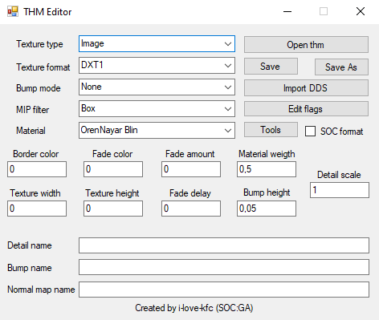

# THM Editor
- Program Developer: 
    - i-love-kfc
- The version described in the article: [1.4](https://gitlab.com/i-love-kfc/thm-editor/-/releases/1.4)
- [Ap-pro forum topic](https://ap-pro.ru/forums/topic/3543-thm-editor)

___

## About:

Utility for editing .thm files without the need to use the SDK

## Features

- Changing any available information stored in a .thm file
- Ability to fix incorrectly displayed textures when transferring .thm files from CS/COP
- Ability to create a file from scratch (without loading another .thm file)

## Functionality

### Fields

- #### Texture type

| Field | Description |
---|---|
| Image |  |
| Cube Map |  |
| Bump Map |  |
| Normal Map |  |
| Terrain |  |

- #### Texture format

| Field | Description |
---|---|
| DXT1 |  |
| ADXT1 |  |
| DXT5 |  |
| 4444 |  |
| 1555 |  |
| 565 |  |
| RGB |  |
| RGBA |  |
| NVHS |  |
| NVHU |  |
| A8 |  |
| L8 |  |
| A8L8 |  |

- #### Bump Mode

| Field | Description |
---|---|
| Autogen (S.T.A.L.K.E.R. Builds) |  |
| None |  |
| Use |  |
| Use Parallax |  |

- #### MIP Filter

| Field | Description |
---|---|
| Box |  |
| Cubic |  |
| Point |  |
| Triangle |  |
| Quadratic |  |
| Advanced |  |
| Catrom |  |
| Mitchell |  |
| Gaussian |  |
| Sinc |  |
| Bessel |  |
| Hanning |  |
| Hamming |  |
| Blackman |  |
| Kaiser |  |

- #### Material

| Field | Description |
---|---|
| OrenNayar Blin |  |
| Blin Phong |  |
| Phong Metal |  |
| Metal OrenNayar |  |

### Buttons

- #### Open thm

Opens a .thm file

- #### Save

Save file

- #### Save As

- #### Import DDS

Imports .dds texture

- #### Edit flags

| Checkbox | Description |
---|---|
| Generate Mip Maps |  |
| Has Alpha |  |
| Binary Alpha |  |
| Alpha Border |  |
| Color Border |  |
| Fade To Color |  |
| Fade To Alpha |  |
| Dither Color |  |
| Dither Each MIP Level |  |
| Diffuse Detail |  |
| Implicit Lighted |  |
| Detail Bump |  |
| Grey Scale (S.T.A.L.K.E.R. builds) |  |

- #### Tools

| Button | Description |
---|---|
| Generate thms by .dds |  |
| Fix invalid chunks in thms |  |
| Validate thms with dds |  |
| Convert thms format (SOC/COP) |  |

- ### Chechboxes

- SOC format

- #### Border Color

- #### Fade Color

- #### Fade Amout

- #### Material Weight

- #### Detail Scale

- #### Texture Width

- #### Texture Height

- #### Fade Delay

- #### Bump Height

- #### Detail name

- #### Bump name

- #### Normal Map name

___

## Sources

[Source Code](https://gitlab.com/i-love-kfc/thm-editor/)