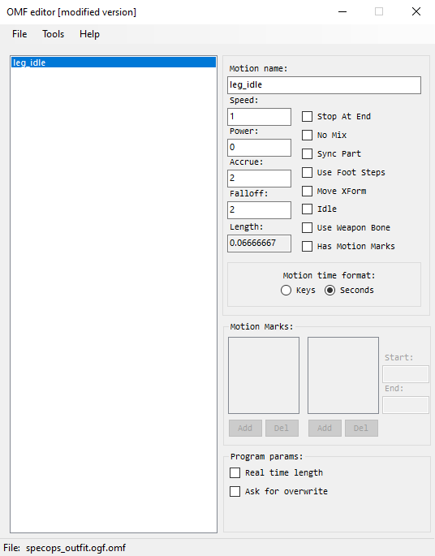

# Modified Omf Editor by ValeroK

___

- Program Developers:
  - Mortany (Original Author)
  - ValeroK
- Described Version: [1.2](https://github.com/VaIeroK/Omf-Editor/releases/tag/1.2)
- [Ap-pro forum topic](https://ap-pro.ru/forums/topic/3550-omf-editor-v12)

___

## About

Modified tool for working with [*.omf](../../reference/file-formats/animations/omf.md) format.

## Features

- Merge multiple [*.omf](../../reference/file-formats/animations/omf.md) files
- Clone, delete, save selected animations
- Working with motion marks
- Working with flags
- Ability to save in [*.skls](../../reference/file-formats/animations/skl-skls.md), [*.skl](../../reference/file-formats/animations/skl-skls.md)
- Fix Gunslinger mod animations
- Displaying of bone parts animation, possibility to convert into [*.ltx](../../reference/file-formats/conf-script/ltx.md) format for import into SDK
- A lot of bug fixes and crashes from the original version.
- Changing of name of bones
- Viewing Bone Parts

## Functionality

### Hotkeys

- F4 - Open file
- F5 or Ctrl+S - Save file
- F6 - Save as
- Delete - Deletes selected animations

### Buttons

- #### File Button

| Button | Description |
|---|---|
| Load | Loads the selected *.omf |
| Save | Save *.omf |
| Save As | Save as *.omf or \*.skls or \*.skl |
| Exit | Exits the program |

- #### Tools Button

| Button | Description |
|---|---|
| Merge With | Merge the file with another *.omf |
| Add Anims From | Add animations from other *.omf (need to know the name of the animation to be added) |
| Try Repair | Trying to fix an animation file (for example, the animation from Gunslinger Mod) |
| Swap Anim Marks | Open the *.omf file, make it the main file and transfer all the motion marks from the old file to the new one in the animation with the same names |
| Rename Bones | Allows you to change the name of the bones |
| Show Bone Parts | Ability to view Bone Parts |

- #### Help Button

| Button | Description |
|---|---|
| Open Source Code | It will take you to the source code site |

### Animation options

- #### Animation parameters

| Parameters | Description | Note |
|---|---|---|
| Motion Name | Animation name | - |
| Speed | Animation speed | - |
| Power | The power of animation | <abbr title="Unconfirmed">*.anm</abbr> only |
| Accrue | Blend In | - |
| Falloff | Blend Out | - |
| Length | Animation length | - |

- #### SDK Flags

| Parameters | Description | Note |
|---|---|---|
| Stop at End | Animation will stop after playback | For HUD and NPC's |
| No Mix | Does not mix animations | NPC only |
| Sync Part | Used to synchronize body parts (Bone Parts) in different animations. For example, when walking, the NPC will simultaneously play different animations of legs, body and head | NPC only |
| Use Foot Steps | Needed to activate IK legs | NPC only |
| Move XForm | ? | ? |
| Idle | Idle animation | NPC only |
| Use Weapon Bone | ? | ? |
| Has Motion Marks | Adds the ability to use Motion Marks | For HUD and NPC's |

- #### Motion Time Format

| Format | Description |
|---|---|
| Keys | Keys Motion Time Format |
| Seconds | Seconds Motion Time Format |

- #### Motion Marks

### Program parameters

| Parameter | Description |
|---|---|
| Real Time Lenght | Multiplies all visual timers by animation speed |
| Ask for Overwrite | When merging animations will ask to overwrite each animation |

___

## Sources

[Source code of Original Omf Editor by Mortany](https://github.com/mortany/omf_editor)

[Source code of Modified Omf Editor by ValeroK](https://github.com/VaIeroK/Omf-Editor)
