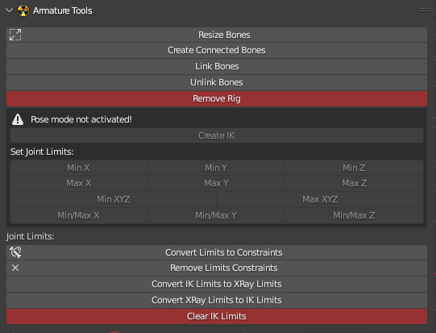

# Armature Tools

___

## About

Allows to modify and edit various properties of bones and armatures

## Operators

- [Resize Bones](../addon-operators/operator-resize-bones.md)
- [Create Connected Bones](../addon-operators/operator-create-connected-bones.md)
- [Link Bones](../addon-operators/operator-link-bones.md)
- [Unlink Bones](../addon-operators/operator-unlink-bones.md)
- [Remove Rig](../addon-operators/operator-remove-rig.md)
- [Create IK](../addon-operators/operator-create-ik.md)
- [Set Joint Limits](../addon-operators/operator-set-joint-limits.md)
-  [Convert Limits to Constraints](../addon-operators/operator-convert-limits-to-constraints.md)
-  [Remove Limits Constraints](../addon-operators/operator-remove-limits-constraints.md)
- [Convert IK Limits to XRay Limits](../addon-operators/operator-convert-ik-limits-to-x-ray-limits.md)
- [Convert XRay Limits to IK Limits](../addon-operators/operator-convert-x-ray-limits-to-ik-limits.md)
- [Clear IK Limits](../addon-operators/operator-clear-ik-limits.md)

___

## Sources

[Source](https://github.com/PavelBlend/blender-xray/wiki/Panel-Armature-Tools)
