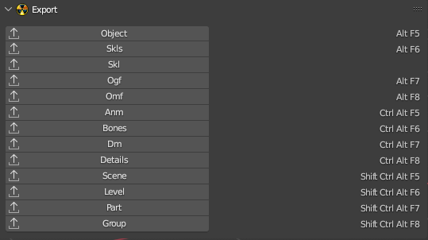

# Export

___

## About

Import and Export panels display import/export operators. The keyboard shortcut used to invoke the operator is displayed next to the operators. The key combination can be changed in the addon settings, in the [Keymap](../addon-preference-panels/preference-panel-keymap.md) category. Operators can be hidden using the addon settings in the [Formats](../addon-preference-panels/preference-panel-formats.md) category

___

## Sources

[Blender X-Ray Addon Wiki on GitHub](https://github.com/PavelBlend/blender-xray/wiki/Panel-Import-Export)
